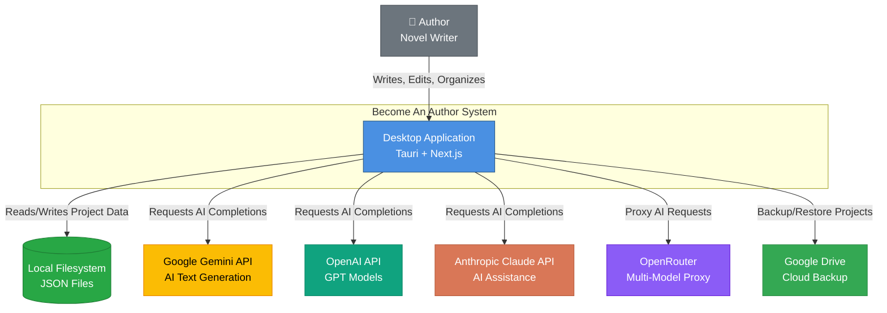

# System Overview

## System Name
**Become An Author** — Local-first AI-assisted Novel Writing Application

## Business Domain & Purpose
A desktop application designed for novelists to write, organize, and manage long-form fiction projects with AI assistance. The system provides a comprehensive writing environment with manuscript structuring (acts, chapters, scenes), world-building codex management, AI chat integration for writing assistance, and story analysis capabilities. All data is stored locally with optional Google Drive backup, ensuring privacy and offline-first functionality.

## Quick Facts

- **Total Code Files**: ~325 TypeScript/Rust files
- **Frontend Components**: 15 feature modules, 26 UI components, 36+ custom hooks
- **Backend Commands**: 12 Tauri command modules, 80+ IPC commands
- **Repository Interfaces**: 12 repository interfaces (Node, Project, Codex, Chat, etc.)
- **Data Entities**: 20+ domain entities (Project, Scene, CodexEntry, ChatThread, etc.)
- **Lines of Code**: ~25,000+ lines (estimated)
- **Architecture**: Clean/Hexagonal (Domain-Driven Design inspired)
- **Test Coverage**: Vitest test suite with unit tests for hooks and services

---

## Architecture Classification

### **Desktop Application** (Tauri-based)
- **Frontend**: Next.js + React SPA (static export)
- **Backend**: Rust (Tauri)
- **Deployment**: Packaged desktop app (macOS, Windows)

---

## Technology Stack

### **Frontend** (`/frontend`, `/app`)
- **Framework**: Next.js 16 (App Router, static export mode)
- **Language**: TypeScript 5 (strict mode)
- **UI Framework**: React 19
- **Styling**: Tailwind CSS 4, Shadcn/UI components
- **State Management**: Zustand
- **Rich Text Editor**: Tiptap (headless, ProseMirror-based)
- **AI Integration**: `ai` SDK (OpenRouter proxy)
- **Testing**: Vitest, Testing Library
- **Build Tools**: Next.js, ESLint, Dependency Cruiser, Madge

### **Backend** (`/backend`)
- **Language**: Rust (edition 2021, v1.77.2+)
- **Framework**: Tauri 2
- **Plugins**: 
  - `tauri-plugin-fs` (filesystem operations)
  - `tauri-plugin-dialog` (native dialogs)
  - `tauri-plugin-notification` (system notifications)
  - `tauri-plugin-shell` (shell commands)
  - `tauri-plugin-log` (logging)
- **Data Format**: JSON files (filesystem-based storage)
- **Serialization**: Serde, Serde JSON, Serde YAML
- **Markdown Parsing**: gray_matter (frontmatter)

### **Development Tools**
- **Package Manager**: npm
- **Linting**: ESLint 9 (with Next.js config)
  - `eslint-plugin-boundaries`: Enforces architectural boundaries
  - `eslint-plugin-import`: Import/export best practices
- **Pre-commit Hooks**: Husky 9 + lint-staged (runs ESLint and Prettier)
- **Dependency Analysis**: 
  - `dependency-cruiser`: Detects circular dependencies, orphan modules
  - `madge`: Visualizes dependency graphs
- **Testing**: Vitest 4, Testing Library, happy-dom/jsdom
- **Code Quality**: 
  - TypeScript strict mode
  - Architectural boundaries enforced via ESLint
  - No circular dependencies policy

### **Build Configuration**
- **Next.js**: Static export mode (`output: 'export'`)
- **Image Optimization**: Disabled (for Tauri compatibility)
- **Trailing Slash**: Enabled (for `file://` URLs)
- **PostCSS**: Tailwind CSS 4 preprocessor
- **TypeScript**: Target ES2020, JSX preserve
- **Tauri Build**: 
  - `beforeDevCommand`: `npm run dev`
  - `beforeBuildCommand`: `npm run build`
  - Bundle targets: all platforms (macOS, Windows, Linux)

---

## System Components

### **1. Frontend Application** (`/frontend`, `/app`)
**Type**: React SPA (Single Page Application)  
**Responsibilities**:
- User interface rendering and interaction
- Real-time editing experience (WYSIWYG editor)
- State management for UI components
- Communication with Tauri backend via IPC
- AI chat interface and context assembly
- Export/import UI workflows

**Key Sub-modules**:

#### **`/app`** - Next.js App Router Pages
- **Route**: `/` → Dashboard (project list)
- **Route**: `/project/[id]` → Workspace with manuscript editor, codex, chat
  - `layout.tsx`: Workspace layout wrapper
  - `client.tsx`: Main workspace client component
  - `page.tsx`: Workspace page entry
- **Route**: `/(workspace)/review` → Story analysis dashboard
- **Route**: `/auth/callback` → Google OAuth callback handler
- **Core Files**:
  - `layout.tsx`: Root layout with theme provider, error boundary, app context
  - `globals.css`: Global Tailwind styles and custom CSS
  - `not-found.tsx`: 404 page

#### **`/frontend/features`** - Feature-Sliced Modules (15 features)
Each feature contains `components/`, `hooks/` (if needed), and `index.ts`:
- **`ai`**: AI integration, prompt configuration, model selection
- **`chat`**: Chat interface, message threads, context selection
- **`codex`**: World-building database (characters, locations, items, lore, subplots)
  - Character/location/item/lore editors
  - Tag manager, template system
  - Relation graph visualization
- **`dashboard`**: Project grid, empty states, project cards
- **`data-management`**: Import/export, backup/restore workflows
- **`editor`**: Scene editor (Tiptap-based)
  - Bubble menu, slash commands
  - Autosave, word count tracking
  - Section annotations, codex mentions
- **`google-drive`**: Google Drive OAuth and backup sync
- **`navigation`**: App-wide navigation components
- **`plan`**: Manuscript structure tree (acts → chapters → scenes)
  - Drag-and-drop reordering
  - Node creation/deletion/renaming
- **`project`**: Project CRUD, metadata editing
- **`review`**: Story analysis dashboard
  - Timeline view, contradiction detection
  - Character arc analysis, plot thread tracking
- **`search`**: Full-text search across manuscript and codex
  - Fuzzy search, filtering by type
- **`settings`**: App settings (AI models, API keys, preferences)
- **`shared`**: Cross-feature shared UI components (theme provider, error boundary)
- **`snippets`**: Reusable text snippet management

#### **`/frontend/domain`** - Domain Layer (DDD-Inspired)
- **`entities/`**: Core domain types
  - `types.ts`: All entity interfaces (Project, Scene, CodexEntry, ChatThread, etc.)
- **`repositories/`**: Repository interfaces (12 interfaces)
  - `INodeRepository.ts`, `IProjectRepository.ts`, `ICodexRepository.ts`
  - `IChatRepository.ts`, `ISnippetRepository.ts`, `IAnalysisRepository.ts`
  - `ICodexRelationRepository.ts`, `ICodexTagRepository.ts`, `ICodexTemplateRepository.ts`
  - `ICodexRelationTypeRepository.ts`, `ISceneCodexLinkRepository.ts`, `ISeriesRepository.ts`
- **`services/`**: Service interfaces
  - `IChatService.ts`: Chat context assembly
  - `IExportService.ts`: Document export (DOCX, text)
  - `IAnalysisService.ts`: AI-powered story analysis
  - `NodeDeletionService.ts`: Cascade deletion logic

#### **`/frontend/infrastructure`** - Infrastructure Layer
- **`di/`**: Dependency Injection
  - `AppContext.tsx`: React Context provider for all repositories and services
- **`repositories/`**: Tauri-based implementations (12 repositories)
  - `TauriNodeRepository.ts`, `TauriProjectRepository.ts`, `TauriCodexRepository.ts`
  - `TauriChatRepository.ts`, `TauriSnippetRepository.ts`, `TauriAnalysisRepository.ts`
  - `TauriCodexRelationRepository.ts`, `TauriCodexTagRepository.ts`
  - `TauriCodexTemplateRepository.ts`, `TauriCodexRelationTypeRepository.ts`
  - `TauriSceneCodexLinkRepository.ts`, `TauriSeriesRepository.ts`
- **`services/`**: Service implementations
  - `ChatService.ts`: Context assembly for AI chat
  - `DocumentExportService.ts`: DOCX and text export
  - `AnalysisService.ts`: Story analysis coordination

#### **`/frontend/core`** - Core Infrastructure Utilities
- **`api/`**: API client wrappers
- **`config/`**: Configuration management
- **`storage/`**: Storage abstractions
- **`tauri/`**: Tauri-specific utilities (IPC helpers)
- **`logger.ts`**: Application-wide logging
- **`tab-coordinator.ts`**: Multi-tab state coordination

#### **`/frontend/hooks`** - Custom React Hooks (36+ hooks)
Organized by domain:
- **Repository Hooks**: `useRepository`, `useNodeRepository`, `useCodexRepository`, etc.
- **Service Hooks**: `useChatService`, `useExportService`, `useDocumentExport`
- **UI Hooks**: `useDialogState`, `useConfirmation`, `useErrorHandler`, `useMobile`
- **Data Hooks**: `useLiveQuery`, `useAutoSave`, `useDebounce`
- **Feature Hooks**: `useContextAssembly`, `usePrompt`, `useAI`
- **Integration Hooks**: `useGoogleAuth`, `useGoogleDrive`, `useStorageQuota`, `useTabLeader`

#### **`/frontend/lib`** - Shared Libraries
- **`config/`**: AI vendor config, model specs, constants
- **`core/`**: AI client, save coordinator
- **`integrations/`**: External service integrations
  - AI rate limiter, emergency backup, Google auth/drive
  - Storage quota, tab leader, trash service
- **`prompts/`**: AI prompt templates (analysis prompts)
- **`services/`**: Utility services (duplicated from integrations)
- **`tiptap-extensions/`**: Custom Tiptap extensions
  - Section node, slash commands
- **`utils/`**: Editor utilities
- **`search-service.ts`**: Full-text search implementation

#### **`/frontend/components`** - Reusable UI Components
- **`ui/`**: Shadcn/UI components (26 components)
  - Alert, Badge, Button, Card, Checkbox, Command, Dialog
  - Dropdown Menu, Input, Label, Popover, Radio Group
  - Resizable, Scroll Area, Select, Separator, Sheet, Sidebar
  - Skeleton, Slider, Switch, Tabs, Textarea, Tooltip
- **`data-management/`**: Data import/export UI
- **Root Components**: App cleanup, client toaster, error boundary, multi-tab warning, theme provider

#### **`/frontend/shared`** - Cross-Feature Shared Code
- **`constants/`**: App-wide constants
- **`prompts/`**: Analysis prompts, prompt templates
- **`schemas/`**: Validation schemas (import schema)
- **`seed-data/`**: Built-in templates and sample data
- **`types/`**: Shared type definitions
- **`utils/`**: Shared utilities
  - AI utils, context assembler, context engine
  - Editor utils, retry utils, toast service
  - Token counter, type guards
- **`validations.ts`**: Zod validation schemas

#### **`/frontend/store`** - Zustand State Stores
- `editor-ui-store.ts`: Editor UI state (sidebar, panel visibility)
- `use-chat-store.ts`: Chat UI state
- `use-format-store.ts`: Text formatting state
- `use-project-store.ts`: Active project state

#### **`/frontend/test`** - Test Infrastructure
- `setup.ts`: Vitest setup
- `test-utils.tsx`: Testing utilities (render helpers, mock providers)

---

### **2. Backend (Tauri Application)** (`/backend`)
**Type**: Rust native application layer  
**Language**: Rust (edition 2021, v1.77.2+)  
**Responsibilities**:
- Filesystem-based data persistence (JSON files)
- Native OS integrations (dialogs, notifications, shell)
- Command execution from frontend (IPC via Tauri)
- File system security and sandboxing
- Project/scene/codex CRUD operations
- Backup and restore operations
- Search indexing

**Key Sub-modules**:

#### **`/backend/src/commands`** - Tauri Command Handlers (12 modules)
All commands are exposed via IPC to frontend:
- **`project.rs`**: Project lifecycle
  - `get_projects_path`, `list_projects`, `create_project`
  - `delete_project`, `update_project`, `archive_project`
  - `get_structure`, `save_structure`
  - `create_node`, `rename_node`, `delete_node`
- **`scene.rs`**: Scene content persistence
  - `load_scene`, `save_scene`, `save_scene_by_id`, `delete_scene`
- **`codex.rs`**: Codex entry management
  - `list_codex_entries`, `save_codex_entry`, `delete_codex_entry`
  - Codex relations, tags, templates, relation types
  - Scene-codex links
- **`chat.rs`**: Chat thread and message persistence
  - `list_chat_threads`, `get_chat_thread`, `create_chat_thread`
  - `update_chat_thread`, `delete_chat_thread`
  - `get_chat_messages`, `create_chat_message`, `delete_chat_message`
- **`snippet.rs`**: Snippet CRUD
  - `list_snippets`, `save_snippet`, `delete_snippet`
- **`analysis.rs`**: Story analysis persistence
  - `list_analyses`, `save_analysis`, `delete_analysis`
- **`search.rs`**: Full-text search
  - `search_project` (searches across scenes, codex, snippets)
- **`backup.rs`**: Emergency backup and export
  - `save_emergency_backup`, `get_emergency_backup`
  - `delete_emergency_backup`, `cleanup_emergency_backups`
  - `export_manuscript_text`, `export_project_backup`, `import_project_backup`
- **`trash.rs`**: Soft delete and recovery
  - `move_to_trash`, `restore_from_trash`, `list_trash`
  - `permanent_delete`, `empty_trash`
- **`series.rs`**: Multi-book series management
  - `list_series`, `create_series`, `update_series`, `delete_series`
- **`seed.rs`**: Sample data generation (dev/demo purposes)
- **`mod.rs`**: Command module aggregator

#### **`/backend/src/models`** - Rust Data Structures (7 modules)
Mirror frontend TypeScript types:
- `project.rs`: Project, Series models
- `scene.rs`: Scene, Act, Chapter, Beat models
- `codex.rs`: CodexEntry, CodexRelation, CodexTag, CodexTemplate, etc.
- `chat.rs`: ChatThread, ChatMessage models
- `snippet.rs`: Snippet model
- `analysis.rs`: StoryAnalysis, AnalysisInsight models
- `mod.rs`: Model module aggregator

#### **`/backend/src/utils`** - Utility Functions (5 modules)
- **`io.rs`**: File I/O operations (read/write JSON)
- **`paths.rs`**: Path resolution and validation
- **`security.rs`**: Input sanitization, path traversal prevention
- **`text.rs`**: Text processing utilities
- **`mod.rs`**: Utility module aggregator

#### **`/backend/src/`** - Core Files
- **`lib.rs`**: Main library entry point, command registration
- **`main.rs`**: Application entry point

#### **`/backend/`** - Configuration & Assets
- **`Cargo.toml`**: Rust dependencies and metadata
- **`Cargo.lock`**: Dependency lock file
- **`tauri.conf.json`**: Tauri configuration (window size, bundle settings)
- **`build.rs`**: Build script
- **`capabilities/default.json`**: Tauri security capabilities
- **`icons/`**: Application icons (16 icon files for all platforms)

---

### **3. Data Layer** (Filesystem-based)
**Type**: Local file storage  
**Format**: JSON files  
**Location**: User's file system (managed by Tauri)  
**Responsibilities**:
- Persistent storage of all application data
- Project isolation (each project = separate directory)
- Backup and export support

**Data Entities**:
- **Projects**: Metadata, settings, series linkage
- **Manuscripts**: Hierarchical structure (acts → chapters → scenes)
- **Scenes**: Rich text content (Tiptap JSON), metadata, status
- **Codex Entries**: Characters, locations, items, lore, subplots
- **Codex Relations**: Entity relationships (parent-child, typed)
- **Codex Tags**: Categorization and filtering
- **Codex Templates**: Custom field templates for entries
- **Scene-Codex Links**: Mentions and appearances in scenes
- **Chat Threads**: AI conversation history
- **Chat Messages**: User/assistant message pairs with context tracking
- **Snippets**: Reusable text blocks
- **Story Analyses**: AI-generated insights (synopsis, plot threads, contradictions, etc.)
- **Series**: Multi-book series metadata

---

### **4. External Integrations** (Optional)
**Type**: Third-party API clients  
**Responsibilities**:
- AI model access for writing assistance
- Cloud backup storage

**Integrations**:
- **AI Services** (via `ai` SDK):
  - Google Gemini (primary)
  - OpenAI GPT-4/GPT-3.5
  - Anthropic Claude
  - OpenRouter (aggregator)
- **Google Drive** (optional):
  - OAuth 2.0 authentication
  - Project backup and restore
  - Auto-backup scheduling

---

## User Roles

1. **Author (Primary User)**
   - Creates and manages novel projects
   - Writes and edits scenes
   - Organizes manuscript structure (acts, chapters, scenes)
   - Maintains world-building database (codex)
   - Interacts with AI for writing assistance
   - Reviews AI-generated story analyses
   - Exports manuscripts

2. **System (Automated)**
   - Performs autosave operations
   - Runs emergency backups
   - Detects codex mentions in manuscript
   - Tracks word counts and statistics
   - Coordinates multi-tab state (if applicable)

---

## C4 Context Diagram



---

## Key System Characteristics

### **Local-First Architecture**
- All data stored locally on user's machine
- No server-side database or backend
- Privacy-focused (user data never leaves device except for AI calls and optional backups)
- Offline-capable (AI features require internet)

### **Desktop-Only**
- Packaged as native desktop application (Tauri)
- No web browser version
- OS integration (native dialogs, notifications, file system)

### **AI-Augmented**
- Optional AI assistance (not required for core functionality)
- Context assembly from manuscript and codex
- Multiple AI provider support
- Token usage tracking and optimization

### **Hierarchical Manuscript Structure**
- Three-tier hierarchy: Act → Chapter → Scene
- Drag-and-drop reordering
- Rich metadata (POV, labels, status)
- Word count and beat tracking

### **Comprehensive World-Building**
- Codex system for characters, locations, items, lore, subplots
- Entity relationships (typed, directional)
- Tag and template systems
- Automatic mention detection in manuscript
- Scene-codex linking

### **Strict Architectural Boundaries**
- Feature-sliced architecture
- Domain/Infrastructure separation (DDD-inspired)
- Dependency injection via React Context
- Repository pattern for data access
- Enforced via ESLint boundaries plugin

---

## Non-Functional Characteristics

- **Performance**: Autosave debouncing (1000ms), lazy loading of repositories
- **Testability**: Vitest test suite, dependency injection for mocking
- **Code Quality**: TypeScript strict mode, ESLint, architectural constraints
- **Security**: Tauri sandboxing, no inline scripts, CSP (future)
- **Accessibility**: Keyboard navigation, ARIA labels (in progress)
- **Maintainability**: Feature-sliced design, clear separation of concerns

---

## Development Workflow

### **Available NPM Scripts**

#### **Development**
- `npm run dev` - Start Next.js dev server (localhost:3000)
- `npm run tauri:dev` - Start Tauri app in dev mode (runs frontend + Rust backend)

#### **Building**
- `npm run build` - Build Next.js static export (to `/out`)
- `npm run tauri:build` - Build production Tauri app (creates installable package)

#### **Testing**
- `npm run test` - Run Vitest tests
- `npm run test:ui` - Open Vitest UI dashboard
- `npm run test:coverage` - Generate test coverage report
- `npm run test:watch` - Run tests in watch mode

#### **Code Quality**
- `npm run lint` - Run ESLint
- `npm run deps:check` - Check for circular dependencies (dependency-cruiser)
- `npm run deps:circular` - Detect circular dependencies (madge)
- `npm run deps:graph` - Generate dependency graph visualization

#### **Git Hooks**
- Pre-commit: Automatically runs `lint-staged` (ESLint + Prettier on staged files)

### **Project Structure Rules**

From `.cursorrules`:
- **Local-First**: All data persists in filesystem via Tauri, no API routes for storage
- **Client-Side AI**: Use `ai` SDK directly in components/hooks, proxy through OpenRouter
- **Type Safety**: Define all interfaces in `domain/entities/types.ts` before implementing logic
- **Performance**: Use Tauri IPC for DB operations, debounce writes by 1000ms
- **Code Style**: 
  - Functional components only
  - Use `lucide-react` for icons
  - Abstract complex logic into custom hooks
  - Prefer `const` over `let`
  - Use `async/await` for async operations

### **Architectural Constraints**

From `dependency-cruiser` config:
- ❌ **No circular dependencies** (enforced, severity: error)
- ⚠️ **No orphan modules** (warning)
- ❌ **Production code cannot depend on dev dependencies** (error)
- ❌ **No deprecated Node.js core modules** (warning)

### **Common Development Tasks**

1. **Create a new feature**:
   - Add feature folder in `/frontend/features/[feature-name]`
   - Create `components/`, `hooks/` subdirectories
   - Export from `index.ts`
   - Update ESLint boundaries if needed

2. **Add a new repository**:
   - Define interface in `/frontend/domain/repositories/I[Name]Repository.ts`
   - Implement in `/frontend/infrastructure/repositories/Tauri[Name]Repository.ts`
   - Register in `/frontend/infrastructure/di/AppContext.tsx`
   - Create Tauri command in `/backend/src/commands/[name].rs`

3. **Add a new entity type**:
   - Add TypeScript interface in `/frontend/domain/entities/types.ts`
   - Create corresponding Rust struct in `/backend/src/models/[name].rs`
   - Ensure fields match exactly (TypeScript ↔ Rust)

4. **Run the app**:
   ```bash
   npm run tauri:dev
   ```
   This will:
   - Start Next.js dev server
   - Compile Rust backend
   - Open Tauri window
   - Enable hot reload for frontend changes

---

## Future Considerations

- PWA or web version (would require IndexedDB migration)
- Mobile companion app (read-only)
- Multi-user collaboration (conflicts with local-first design)
- Plugin/extension system
- Advanced timeline visualization
- Export to publishing formats (ePub, PDF)
