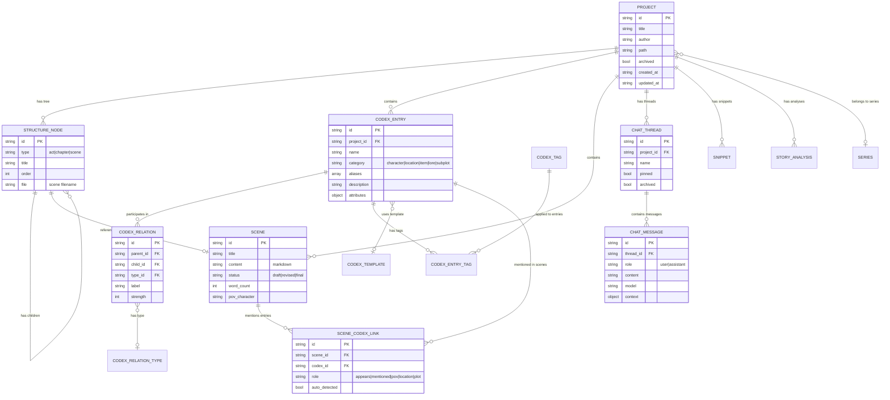

# Backend Architecture

## System Name
**Become An Author - Rust/Tauri Backend**

---

## Technology Stack

### **Core Technologies**
- **Language**: Rust 1.77.2+ (Edition 2021)
- **Framework**: Tauri 2.0 (Desktop application framework)
- **IPC Protocol**: Tauri's built-in IPC (Inter-Process Communication)
- **Database**: File-based storage (JSON files on filesystem)
- **Serialization**: Serde + Serde JSON + Serde YAML

### **Key Dependencies**

| Dependency | Version | Purpose |
|-----------|---------|---------|
| `tauri` | 2.0 | Desktop app framework, IPC handler |
| `tauri-plugin-fs` | 2.0 | Filesystem operations (**scoped access**) |
| `tauri-plugin-dialog` | 2.0 | Native file/folder dialogs |
| `tauri-plugin-notification` | 2.0 | System notifications |
| `tauri-plugin-shell` | 2.0 | Shell command execution |
| `tauri-plugin-log` | 2.0 | Logging infrastructure |
| `serde` | 1.0 | Serialization framework |
| `serde_json` | 1.0 | JSON encoding/decoding |
| `serde_yaml` | 0.9 | YAML frontmatter parsing |
| `uuid` | 1.0 | UUID generation (v4) |
| `chrono` |  0.4 | Date/time handling (RFC3339 format) |
| `dirs` | 5.0 | Cross-platform directory paths |
| `walkdir` | 2.0 | Recursive directory traversal |
| `gray_matter` | 0.2 | Markdown frontmatter extraction |
| `log` | 0.4 | Logging API |

### **Storage Architecture**
- **Type**: Document-oriented file storage
- **Format**: JSON (data), Markdown with YAML frontmatter (scenes)
- **Location**: User's filesystem (`~/BecomeAnAuthor/`)
- **No database**: No SQL/NoSQL database - pure filesystem
- **No ORM**: Direct file I/O operations
- **No caching layer**: Read-through from disk on every request
- **No message queues**: Synchronous IPC calls

---

## Architectural Style

### **Classification**
**Stateless Service Layer with File-Based Persistence**

- **Not MVC**: No continuous server process, no Model-View separation in backend
- **Not Clean Architecture**: No strict use cases or entities layers (simpler structure)
- **Monolith**: Single Rust binary compiled into the Tauri app
- **Stateless Commands**: Each IPC call is independent (no session state)
- **CRUD Command Pattern**: Commands map 1:1 to frontend repository calls

### **Design Characteristics**
1. **Thin Backend**: Minimal business logic - mostly file I/O orchestration
2. **Frontend-Heavy**: Business logic resides in TypeScript (frontend)
3. **Command-Based**: 80+ IPC commands exposed to frontend
4. **Project Isolation**: Each project is a self-contained directory
5. **Registry-Based Discovery**: Central registry tracks all project locations

---

## Module Structure

### **Directory Hierarchy**

```
backend/src/
├── lib.rs                  # Main entry point, command registration
├── main.rs                 # Binary entry point
├── commands/               # IPC command handlers (12 modules)
│   ├── mod.rs
│   ├── project.rs          # Project lifecycle commands
│   ├── scene.rs            # Scene content persistence
│   ├── codex.rs            # Codex entry management
│   ├── chat.rs             # Chat thread/message commands
│   ├── snippet.rs          # Snippet CRUD
│   ├── analysis.rs         # Story analysis persistence
│   ├── search.rs           # Full-text search
│   ├── backup.rs           # Emergency backup + export
│   ├── trash.rs            # Soft delete system
│   ├── series.rs           # Multi-book series
│   └── seed.rs             # Built-in data seeding
├── models/                 # Rust data structures (7 modules)
│   ├── mod.rs
│   ├── project.rs          # ProjectMeta, StructureNode, Series
│   ├── scene.rs            # SceneMeta, Scene
│   ├── codex.rs            # CodexEntry, Relations, Tags, Templates
│   ├── chat.rs             # ChatThread, ChatMessage
│   ├── snippet.rs          # Snippet
│   └── analysis.rs         # StoryAnalysis, AnalysisInsight
└── utils/                  # Utility functions (5 modules)
    ├── mod.rs
    ├── io.rs               # File I/O (atomic writes)
    ├── paths.rs            # Path resolution, app directories
    ├── security.rs         # Path validation, file size checks
    └── text.rs             # Text processing (slugify, etc.)
```

### **Module Responsibility Table**

| Module/Path | Responsibility | Dependencies | Notes |
|------------|---------------|--------------|-------|
| **`lib.rs`** | Application entry, command registration | All command modules | Registers 80+ IPC commands |
| **`commands/project.rs`** | Project CRUD, structure tree, node management | `models::ProjectMeta`, `utils::paths` | 11 commands |
| **`commands/scene.rs`** | Scene file I/O, markdown frontmatter parsing | `gray_matter`, `models::Scene` | YAML frontmatter + content |
| **`commands/codex.rs`** | Codex entries + relations + tags + templates | `models::codex` | 15+ commands |
| **`commands/chat.rs`** | Chat thread + message persistence | `models::chat` | 7 commands |
| **`commands/snippet.rs`** | Snippet CRUD | `models::snippet` | 3 commands |
| **`commands/analysis.rs`** | Story analysis persistence | `models::analysis` | 3 commands |
| **`commands/search.rs`** | Full-text search (scenes + codex) | `walkdir` | Case-insensitive substring match |
| **`commands/backup.rs`** | Emergency backup, export, import | All models | JSON export/import |
| **`commands/trash.rs`** | Soft delete, restore, permanent delete | `utils::paths` | Trash folder management |
| **`commands/series.rs`** | Series CRUD | `models::Series` | Global series registry |
| **`commands/seed.rs`** | Seed built-in templates & relation types | `models::codex` | Called on project creation |
| **`models/*`** | Serde-serializable data structures | `serde`, `serde_json` | Mirror TypeScript types |
| **`utils/io.rs`** | Atomic write operations | `std::fs` | Prevents corruption |
| **`utils/paths.rs`** | App directory resolution | `dirs` | `~/BecomeAnAuthor/` |
| **`utils/security.rs`** | Path traversal prevention, size limits |`utils::paths` | Registry-based validation |
| **`utils/text.rs`** | Slugify, text sanitization | - | URL-safe strings |

---

## API Endpoints (IPC Commands)

All commands are exposed via Tauri IPC. They are **synchronous** and return `Result<T, String>`.

### **Project Management** (11 commands)

| Command | Parameters | Returns | Description |
|---------|-----------|---------|-------------|
| `get_projects_path` | - | `String` | Get default projects directory path |
| `list_projects` | - | `Vec<ProjectMeta>` | List all projects from registry |
| `create_project` | `title`, `author`, `custom_path` | `ProjectMeta` | Create new project at custom location |
| `delete_project` | `project_path` | `()` | Move project to Trash |
| `update_project` | `project_path`, `updates` | `ProjectMeta` | Update project metadata |
| `archive_project` | `project_path` | `ProjectMeta` | Mark project as archived |
| `get_structure` | `project_path` | `Vec<StructureNode>` | Get manuscript tree structure |
| `save_structure` | `project_path`, `structure` | `()` | Save manuscript tree |
| `create_node` | `project_path`, `node_type`, `title`, `parent_id` | `StructureNode` | Create act/chapter/scene |
| `rename_node` | `project_path`, `node_id`, `new_title` | `()` | Rename node |
| `delete_node` | `project_path`, `node_id` | `()` | Delete node + cascade children |

### **Scene Management** (4 commands)

| Command | Parameters | Returns | Description |
|---------|-----------|---------|-------------|
| `load_scene` | `project_path`, `scene_id` | `Scene` | Load scene with markdown content |
| `save_scene` | `project_path`, `scene` | `()` | Save scene (frontmatter + content) |
| `save_scene_by_id` | `project_path`, `scene_id`, `updates` | `()` | Partial update scene |
| `delete_scene` | `project_path`, `scene_id` | `()` | Delete scene file |

### **Codex Management** (18 commands)

| Command | Parameters | Returns | Description |
|---------|-----------|---------|-------------|
| `list_codex_entries` | `project_path` | `Vec<CodexEntry>` | List all codex entries |
| `save_codex_entry` | `project_path`, `entry` | `()` | Save codex entry (character/location/etc) |
| `delete_codex_entry` | `project_path`, `entry_id` | `()` | Delete codex entry |
| `list_codex_relations` | `project_path` | `Vec<CodexRelation>` | List all relationships |
| `save_codex_relation` | `project_path`, `relation` | `()` | Save relationship |
| `delete_codex_relation` | `project_path`, `relation_id` | `()` | Delete relationship |
| `list_codex_tags` | `project_path` | `Vec<CodexTag>` | List tags |
| `save_codex_tag` | `project_path`, `tag` | `()` | Save tag |
| `delete_codex_tag` | `project_path`, `tag_id` | `()` | Delete tag |
| `list_codex_entry_tags` | `project_path` | `Vec<CodexEntryTag>` | List entry-tag links |
| `save_codex_entry_tag` | `project_path`, `entry_tag` | `()` | Link tag to entry |
| `delete_codex_entry_tag` | `project_path`, `entry_tag_id` | `()` | Unlink tag from entry |
| `list_codex_templates` | `project_path` | `Vec<CodexTemplate>` | List templates |
| `save_codex_template` | `project_path`, `template` | `()` | Save template |
| `delete_codex_template` | `project_path`, `template_id` | `()` | Delete template |
| `list_codex_relation_types` | `project_path` | `Vec<CodexRelationType>` | List relation types |
| `save_codex_relation_type` | `project_path`, `rel_type` | `()` | Save relation type |
| `delete_codex_relation_type` | `project_path`, `type_id` | `()` | Delete relation type |
| `list_scene_codex_links` | `project_path` | `Vec<SceneCodexLink>` | List scene-codex mentions |
| `save_scene_codex_link` | `project_path`, `link` | `()` | Save scene-codex link |
| `delete_scene_codex_link` | `project_path`, `link_id` | `()` | Delete scene-codex link |

### **Chat Management** (7 commands)

| Command | Parameters | Returns | Description |
|---------|-----------|---------|-------------|
| `list_chat_threads` | `project_path` | `Vec<ChatThread>` | List all chat threads |
| `get_chat_thread` | `project_path`, `thread_id` | `ChatThread` | Get single thread |
| `create_chat_thread` | `project_path`, `thread` | `ChatThread` | Create new chat thread |
| `update_chat_thread` | `project_path`, `thread_id`, `updates` | `ChatThread` | Update thread metadata |
| `delete_chat_thread` | `project_path`, `thread_id` | `()` | Delete thread + messages |
| `get_chat_messages` | `project_path`, `thread_id` | `Vec<ChatMessage>` | Get all messages in thread |
| `create_chat_message` | `project_path`, `message` | `ChatMessage` | Create new message |
| `delete_chat_message` | `project_path`, `message_id` | `()` | Delete message |

### **Snippet Management** (3 commands)

| Command | Parameters | Returns | Description |
|---------|-----------|---------|-------------|
| `list_snippets` | `project_path` | `Vec<Snippet>` | List all snippets |
| `save_snippet` | `project_path`, `snippet` | `()` | Save snippet |
| `delete_snippet` | `project_path`, `snippet_id` | `()` | Delete snippet |

### **Analysis Management** (3 commands)

| Command | Parameters | Returns | Description |
|---------|-----------|---------|-------------|
| `list_analyses` | `project_path` | `Vec<StoryAnalysis>` | List all analyses |
| `save_analysis` | `project_path`, `analysis` | `()` | Save analysis result |
| `delete_analysis` | `project_path`, `analysis_id` | `()` | Delete analysis |

### **Backup & Export** (7 commands)

| Command | Parameters | Returns | Description |
|---------|-----------|---------|-------------|
| `save_emergency_backup` | `backup` | `()` | Save emergency backup (scene crash recovery) |
| `get_emergency_backup` | `scene_id` | `Option<EmergencyBackup>` | Retrieve emergency backup |
| `delete_emergency_backup` | `backup_id` | `()` | Delete emergency backup |
| `cleanup_emergency_backups` | - | `i32` | Delete expired backups, return count |
| `export_manuscript_text` | `project_path` | `String` | Export full manuscript as plaintext |
| `export_project_backup` | `project_path`, `output_path` | `String` | Export project as JSON backup |
| `import_project_backup` | `backup_json` | `ProjectMeta` | Import project from JSON backup |

### **Trash Management** (5 commands)

| Command | Parameters | Returns | Description |
|---------|-----------|---------|-------------|
| `move_to_trash` | `project_path`, `item_type`, `item_id` | `()` | Soft delete item |
| `restore_from_trash` | `trash_id` | `()` | Restore trashed item |
| `list_trash` | `project_path` | `Vec<TrashItem>` | List trashed items |
| `permanent_delete` | `trash_id` | `()` | Permanently delete from trash |
| `empty_trash` | `project_path` | `()` | Empty all trash |

### **Search** (1 command)

| Command | Parameters | Returns | Description |
|---------|-----------|---------|-------------|
| `search_project` | `project_path`, `query` | `Vec<SearchResult>` | Search scenes + codex (case-insensitive) |

### **Series Management** (4 commands)

| Command | Parameters | Returns | Description |
|---------|-----------|---------|-------------|
| `list_series` | - | `Vec<Series>` | List all series (global) |
| `create_series` | `series` | `Series` | Create new series |
| `update_series` | `series_id`, `updates` | `Series` | Update series |
| `delete_series` | `series_id` | `()` | Delete series |

### **Utility** (1 command)

| Command | Parameters | Returns | Description |
|---------|-----------|---------|-------------|
| `get_app_info` | - | `JSON` | Get app name, version, platform, arch |

---

## Data Model & Relationships

### **Filesystem Structure**

```
~/BecomeAnAuthor/
├── project_registry.json              # Central project registry
├── .meta/
│   └── series.json                    # Global series list
├── .emergency_backups/                # Emergency scene backups
│   └── <backup-id>.json
├── Trash/                             # Soft-deleted projects
│   └── <project-slug>_<timestamp>/
└── Projects/                          # Default project location
    └── <project-slug>/                # User can choose custom location
        ├── .meta/
        │   ├── project.json           # Project metadata
        │   ├── structure.json         # Manuscript tree
        │   └── chat/
        │       ├── threads/
        │       │   └── <thread-id>.json
        │       └── messages/
        │           └── <msg-id>.json
        ├── manuscript/
        │   └── <scene-id>.md          # Scene files (YAML frontmatter + markdown)
        ├── codex/
        │   ├── characters/
        │   │   └── <entry-id>.json
        │   ├── locations/
        │   │   └── <entry-id>.json
        │   ├── items/
        │   │   └── <entry-id>.json
        │   ├── lore/
        │   │   └── <entry-id>.json
        │   ├── subplots/
        │   │   └── <entry-id>.json
        │   ├── relations.json         # All codex relationships
        │   ├── tags.json              # All tags
        │   ├── entry-tags.json        # Entry-tag links
        │   ├── templates.json         # Custom + built-in templates
        │   ├── relation-types.json    # Relationship types
        │   └── scene-links.json       # Scene-codex mentions
        ├── snippets/
        │   └── <snippet-id>.json
        ├── analyses/
        │   └── <analysis-id>.json
        └── exports/
            └── backups/
```

### **Entity-Relationship Model**



### **Key Relationships**

1. **Project → Structure Nodes**: Hierarchical tree (acts → chapters → scenes)
2. **Structure Node → Scene File**: Scenes reference `.md` files via `file` property
3. **Project → Codex Entries**: One-to-many (all codex data scoped to project)
4.. **Codex Entry ↔ Codex Entry**: Many-to-many via `CodexRelation` (typed, directional)
5. **Scene ↔ Codex Entry**: Many-to-many via `SceneCodexLink` (mentions tracking)
6. **Codex Entry → Tags**: Many-to-many via `CodexEntryTag` junction
7. **Codex Entry → Template**: Many-to-one (optional template usage)
8. **Project → Series**: Many-to-one (optional series membership)

---

## Key Flows

### **1. Create New Project Flow**

```
Frontend calls create_project(title, author, custom_path)
  ↓
Backend:
  1. Validate custom_path exists
  2. Generate slug from title (slugify)
  3. Create directory: custom_path/<slug>/
  4. Create subdirectories:
     - .meta/, manuscript/, codex/, snippets/, analyses/, exports/
     - codex/<category>/ for each category
  5. Generate UUID for project
  6. Create .meta/project.json with metadata
  7. Create .meta/structure.json with empty array
  8. Seed built-in templates and relation types (seed_built_in_data)
  9. Add project path to ~/BecomeAnAuthor/project_registry.json
  ↓
Return ProjectMeta to frontend
```

### **2. Load Project Workspace Flow**

```
Frontend loads project by path
  ↓
1. Call get_structure(project_path)
   → Backend reads .meta/structure.json
   → Returns hierarchical tree
  ↓
2. Call list_codex_entries(project_path)
   → Backend scans codex/<category>/*.json
   → Returns all codex entries
  ↓
3. Call list_chat_threads(project_path)
   → Backend reads .meta/chat/threads/*.json
   → Returns thread metadata
  ↓
4. Call list_snippets(project_path)
   → Backend scans snippets/*.json
   → Returns all snippets
  ↓
Frontend assembles workspace UI
```

### **3. Save Scene Flow**

```
Frontend calls save_scene(project_path, scene)
  ↓
Backend:
  1. Extract scene.id to determine filename (id.md)
  2. Construct file path: project_path/manuscript/<id>.md
  3. Build YAML frontmatter:
     ---
     id: <id>
     title: <title>
     order: <order>
     status: <status>
     wordCount: <count>
     povCharacter: <pov>
     createdAt: <timestamp>
     updatedAt: <timestamp>
     ---
  4. Append markdown content below frontmatter
  5. Write to file (potentially using atomic_write)
  ↓
Return success
```

### **4. Search Flow**

```
Frontend calls search_project(project_path, query)
  ↓
Backend:
  1. Convert query to lowercase
  2. Walk manuscript/ directory (*.md files)
     - Read each file
     - Check if content contains query (case-insensitive)
     - If match: add {type: "scene", file, path} to results
  3. Walk codex/ subdirectories (*.json files)
     - Read each file
     - Check if JSON contains query
     - If match: add {type: "codex", file, path} to results
  ↓
Return Vec<SearchResult>
```

### **5. Export Project Backup Flow**

```
Frontend calls export_project_backup(project_path, output_path)
  ↓
Backend:
  1. Read .meta/project.json → ProjectMeta
  2. Call get_structure(project_path) → nodes
  3. Call list_codex_entries(project_path) → codex
  4. Call list_snippets(project_path) → snippets
  5. Assemble JSON object:
     {
       version: 1,
       exportedAt: <timestamp>,
       project: {...},
       nodes: [...],
       codex: [...],
       snippets: [...]
     }
  6. Serialize to pretty JSON
  7. Write to output_path (or project_path/exports/<slug>_backup_<timestamp>.json)
  ↓
Return file path
```

### **6. Import Project Backup Flow**

```
Frontend calls import_project_backup(backup_json)
  ↓
Backend:
  1. Parse backup_json to serde_json::Value
  2. Extract project.title, project.author, project.description
  3. Generate new UUID and timestamp
  4. Create new project directory in ~/BecomeAnAuthor/Projects/
  5. Create directory structure (same as create_project)
  6. Write .meta/project.json with new ID
  7. Import nodes (update projectId to new ID)
  8. Import codex entries (update projectId, write to codex/<category>/)
  9. Import snippets (update projectId)
  10. Seed built-in data
  11. Add to project registry
  ↓
Return ProjectMeta
```

---

## Implementation Details

### **1. Word Counting Logic** (`utils/text.rs`)

**Purpose**: Calculate word count for scenes to track writing progress.

```rust
pub fn count_words(text: &str) -> i32 {
    text.split_whitespace().count() as i32
}
```

**Usage**:
- Called automatically in `scene.rs` when loading/saving scenes
- Updates `wordCount` field in YAML frontmatter
- Simple whitespace-based tokenization (fast, reasonably accurate)

**Integration**:
- `load_scene`: Counts words from markdown body after frontmatter
- `save_scene`: Recalculates count on every save
- Frontend displays in editor status bar and timeline

---

### **2. Soft-Delete Trash System** (`commands/trash.rs` - 141 lines)

**Architecture**: Non-destructive deletion with metadata preservation

**Storage Structure**:
```
project_path/
  .meta/
    trash/
      <item-id>/
        <original-file>.md  or  <original-file>.json
        meta.json          # Deletion timestamp, type, category
```

**Commands**:
1. `move_to_trash(project_path, item_id, item_type, trash_meta)`
   - Copies file to `.meta/trash/<item_id>/`
   - Stores metadata (deletedAt, category, title)
   - Deletes original file
   - Supports: scenes, codex entries, snippets

2. `restore_from_trash(project_path, item_id, item_type)`
   - Reads category from meta.json
   - Copies file back to original location
   - Removes trash folder

3. `list_trash(project_path)` → Returns all trashed items with metadata

4. `permanent_delete(project_path, item_id)` → Removes from trash (no undo)

5. `empty_trash(project_path)` → Clears entire trash folder

**Key Features**:
- Metadata preservation ensures correct restore path for codex (category-specific)
- Multi-type support (scenes, codex, snippets)
- Frontend UI shows trash browser with restore/permanent delete options

---

### **3. Chat Threads vs Messages Separation** (`commands/chat.rs` - 116 lines)

**Architecture**: Thread metadata separate from message data for performance

**Storage**:
```
project_path/
  .meta/
    chat/
      threads.json                 # Thread metadata (id, name, pinned, archived)
      messages/
        <thread-id>.json          # Messages for specific thread
```

**Rationale**:
- List threads quickly without loading all messages
- Messages grouped by thread (easier to manage)
- Deleting thread cascades to messages file

**Commands**:
- **Thread Management**: `list`, `get`, `create`, `update`, `delete`
- **Message Management**: `get_messages`, `create_message`, `delete_message`

**Delete Thread Flow**:
1. Remove thread from `threads.json`
2. Delete corresponding `messages/<thread-id>.json` file
3. Cascading delete (all messages removed)

---

### **4. Emergency Backup System** (`commands/backup.rs`)

**Purpose**: Crash recovery for unsaved scene content

**Storage Location**: `~/BecomeAnAuthor/.emergency_backups/`

**Backup Structure**:
```json
{
  "id": "backup-uuid",
  "sceneId": "scene-uuid",
  "projectId": "project-uuid",
  "content": "markdown content",
  "createdAt": 1234567890,
  "expiresAt": 1234567890  // 24 hours later
}
```

**Commands**:
1. `save_emergency_backup(backup)` - Stores backup with expiration
2. `get_emergency_backup(scene_id)` - Retrieves most recent non-expired backup
3. `delete_emergency_backup(backup_id)` - Removes backup after successful save
4. `cleanup_emergency_backups()` - Removes expired backups, returns count

**Frontend Integration**:
- Saves backup every 10 seconds while typing
- On scene load, checks for emergency backup
- If found, prompts user to restore or discard
- Deletes backup after normal save succeeds

**Expiration Logic**:
- Backups expire after 24 hours
- Cleanup runs on app startup
- Prevents unlimited storage growth

---

### **5. Scene-Codex Linking System** (`commands/codex.rs`)

**Purpose**: Track which codex entries appear in which scenes

**Storage**: `.meta/scene_codex_links.json` (single file per project)

**Link Structure**:
```rust
struct SceneCodexLink {
    id: String,
    scene_id: String,
    codex_id: String,
    project_id: String,
    role: String,  // "appears", "mentioned", "pov", "location", "plot"
    auto_detected: Option<bool>,  // Manual vs AI-detected
    created_at: i64,
    updated_at: i64,
}
```

**Commands**:
- `list_scene_codex_links(project_path)` - Get all links
- `save_scene_codex_link(project_path, link)` - Create/update link
- `delete_scene_codex_link(project_path, link_id)` - Remove link

**Frontend Usage**:
- Timeline view shows character appearances per scene
- Plan view filters scenes by codex entry
- Editor suggests mentions based on context
- Matrix view shows codex-scene relationships

**Link Types** (`role` field):
- `appears` - Character physically present
- `mentioned` - Referred to but not present
- `pov` - Point-of-view character
- `location` - Scene setting
- `plot` - Related to subplot

---

### **6. Atomic Writes with Temp Files** (`utils/io.rs`)

**Purpose**: Prevent file corruption on crash/power loss

```rust
pub fn atomic_write(path: &Path, content: &str) -> Result<(), String> {
    let temp_path = path.with_extension("tmp");
    
    // Write to temp file
    fs::write(&temp_path, content)
        .map_err(|e| format!("Failed to write temp file: {}", e))?;
    
    // Atomically rename to target (POSIX guarantees atomicity)
    fs::rename(&temp_path, path)
        .map_err(|e| format!("Failed to rename file: {}", e))?;
    
    Ok(())
}
```

**How It Works**:
1. Write content to `<filename>.tmp`
2. If crash occurs during write, original file untouched
3. Once write succeeds, rename temp → target (atomic operation)
4. If crash during rename, either old or new file exists (never corrupted)

**Used In**:
- `scene.rs`: `save_scene` uses atomic write pattern
- All critical metadata files
- Prevents partial writes from app crashes

**POSIX Atomicity**:
- `fs::rename()` is atomic on POSIX systems (macOS, Linux)
- Windows: atomic with `ReplaceFile` (Rust handles this)

---

### **7. Path Validation & Security** (`utils/security.rs` - 64 lines)

**Purpose**: Prevent path traversal attacks and unauthorized file access

**validate_project_path(path: &str)**:
```rust
pub fn validate_project_path(path: &str) -> Result<PathBuf, String> {
    let project_path = PathBuf::from(path);
    
    // Check if path exists
    if !project_path.exists() {
        return Err("Project path does not exist".to_string());
    }
    
    // Check if it's a valid project (has .meta/project.json)
    let meta_file = project_path.join(".meta/project.json");
    if !meta_file.exists() {
        return Err("Invalid project: missing project metadata".to_string());
    }
    
    // Verify it's in the registry (security: only allow tracked projects)
    let app_dir = get_app_dir()?;
    let registry_path = app_dir.join("project_registry.json");
    
    if registry_path.exists() {
        let content = fs::read_to_string(&registry_path)?;
        let project_paths: Vec<String> = serde_json::from_str(&content).unwrap_or_default();
        
        let path_str = project_path.to_string_lossy().to_string();
        if !project_paths.contains(&path_str) {
            return Err("Access denied: project not in registry".to_string());
        }
    }
    
    Ok(project_path)
}
```

**Security Features**:
1. **Registry Whitelist**: Only projects in `project_registry.json` can be accessed
2. **Metadata Validation**: Must have `.meta/project.json` to be valid
3. **Path Exists Check**: Prevents access to non-existent paths
4. **Prevents Traversal**: Even with `../../` in path, registry check catches it

**File Size Limits**:
```rust
pub const MAX_SCENE_SIZE: u64 = 10 * 1024 * 1024;  // 10MB
pub const MAX_CODEX_SIZE: u64 = 1024 * 1024;        // 1MB
pub const MAX_GENERAL_SIZE: u64 = 5 * 1024 * 1024;  // 5MB
```

**check_file_size(path, max_size)**:
- Called before reading files
- Prevents memory exhaustion attacks
- Returns error if file exceeds limit

---

### **8. Built-in Template Seeding** (`commands/seed.rs` - 73 lines)

**Purpose**: Provide default codex templates and relation types on project creation

**Triggered**: Automatically called by `create_project()` and `import_project_backup()`

**Seeded Data**:

**Codex Templates** (saved to `.meta/codex_templates.json`):
```json
[
  {
    "id": "built-in-character",
    "name": "Character",
    "category": "characters",
    "isBuiltIn": true,
    "fields": [
      {"id": "1", "name": "Age", "fieldType": "text"},
      {"id": "2", "name": "Occupation", "fieldType": "text"},
      {"id": "3", "name": "Personality", "fieldType": "textarea"},
      {"id": "4", "name": "Motivation", "fieldType": "textarea"}
    ]
  },
  // ... location, item, lore templates
]
```

**Relation Types** (saved to `.meta/codex_relation_types.json`):
```json
[
  {"id": "family", "name": "Family", "category": "characters", "color": "#e11d48", "isBuiltIn": true},
  {"id": "ally", "name": "Ally", "category": "characters", "color": "#10b981", "isBuiltIn": true},
  {"id": "enemy", "name": "Enemy", "category": "characters", "color": "#f59e0b", "isBuiltIn": true},
  {"id": "location", "name": "Located At", "category": "locations", "color": "#3b82f6", "isBuiltIn": true}
]
```

**Why Seed?**:
- New users get started faster (no empty state)
- Consistent baseline across projects
- Templates are customizable (not locked)
- `isBuiltIn: true` prevents accidental deletion in UI

**Implementation**:
- Hardcoded in Rust (no external files)
- Idempotent (can be called multiple times safely)
- Frontend can add custom templates on top

---

## Cross-Cutting Concerns

### **1. Authentication & Authorization**
- **None**: Desktop app runs as user - no auth layer
- **File Permissions**: Relies on OS-level file permissions
- **Path Validation**: `validate_project_path()` ensures projects are in registry (prevents arbitrary file access)

### **2. Validation**
- **Type Safety**: Serde enforces type contracts during deserialization
- **Path Validation**: 
  - `security::validate_project_path()` checks project registry
  - Prevents path traversal (e.g., `../../etc/passwd`)
- **File Size Limits**:
  - `MAX_SCENE_SIZE`: 10MB
  - `MAX_CODEX_SIZE`: 1MB
  - `MAX_GENERAL_SIZE`: 5MB
- **No Input Sanitization**: Trusts frontend (desktop app, same-origin)

### **3. Error Handling**
- **Result Type**: All IPC commands return `Result<T, String>`
- **Error Messages**: String-based errors propagated to frontend
- **No Structured Errors**: No error codes or enums (simple strings)
- **Graceful Degradation**:
  - Missing files → return empty collections
  - Corrupted JSON → log and skip (or return error)
- **No Retry Logic**: Frontend responsible for retries

### **4. Logging**
- **Framework**: `log` crate + `tauri-plugin-log`
- **Log Levels**: `log::info!()`, `log::warn!()`, `log::error!()`
- **Log Location**: Platform-specific (managed by Tauri plugin)
- **No Structured Logging**: Plain text logs

### **5. Configuration Management**
- **Hardcoded Paths**:
  - `~/BecomeAnAuthor/` (app root)
  - `~/BecomeAnAuthor/Projects/` (default projects dir)
- **No Config Files**: No `.env` or config.toml in backend
- **Frontend Config**: API keys, AI settings managed in frontend
- **Tauri Config**: `tauri.conf.json` for window settings, plugins

### **6. Concurrency & Locking**
- **Single-Threaded IPC**: Tauri IPC is inherently serial
- **No File Locking**: Potential race condition if multiple processes
- **Assumption**: Single instance of app per project
- **Emergency Backups**: Prevent data loss during crashes

### **7. Data Integrity**
- **Atomic Writes**: `utils::io::atomic_write()` uses temp file + rename
  - Prevents corruption on crash/power loss
- **No Transactions**: File-based storage has no ACID guarantees
- **Manual Cascade Deletes**: `delete_node()` manually collects and deletes child scene files
- **Referential Integrity**: Not enforced (frontend responsible)

### **8. Performance Optimizations**
- **None**: No caching, no indexing
- **Read-Through**: Every IPC call reads from disk
- **Write-Through**: Every save writes immediately to disk
- **Directory Scanning**: `WalkDir` for search (no index)
- **Trade-off**: Simplicity over performance (acceptable for desktop app)

### **9. Security**
- **Project Registry**: Only allow access to registered projects
- **Path Traversal Prevention**: Validate all paths
- **Tauri Sandboxing**: Filesystem plugin uses scoped access
- **No Network Access**: Backend doesn't make HTTP requests
- **No Shell Injection**: Commands don't execute user-provided shell commands (safe)

---

## Risks & Technical Debt

### **High Priority Risks**

1. **No File Locking** ⚠️
   - **Risk**: Multi-instance corruption (if user opens same project twice)
   - **Mitigation**: Add file-based lock (e.g., `.lock` file)

2. **No Data Migration Strategy** ⚠️
   - **Risk**: Breaking changes to JSON schema cause data loss
   - **Mitigation**: Add version numbers to all JSON files + migration scripts

3. **No Referential Integrity** ⚠️
   - **Risk**: Orphaned references (e.g., scene links to deleted codex entry)
   - **Mitigation**: Add validation layer or garbage collection

4. **Unbounded File Sizes** ⚠️
   - **Risk**: Users could create massive projects (GB-scale)
   - **Mitigation**: Enforce size limits per-project (not just per-file)

5. **No Backup Verification** ⚠️
   - **Risk**: Corrupt backups not detected until restore
   - **Mitigation**: Add checksum validation on export/import

### **Medium Priority Tech Debt**

6. **String-Based Errors** 📝
   - **Debt**: Hard to handle specific errors in frontend
   - **Fix**: Define error enums with Serde serialization

7. **No Indexing for Search** 📝
   - **Debt**: Search is O(n) on all files (slow for large projects)
   - **Fix**: Add inverted index (e.g., Tantivy) or use SQLite FTS

8. **Hardcoded Directory Paths** 📝
   - **Debt**: `~/BecomeAnAuthor/` not configurable
   - **Fix**: Add settings file for custom app directory

9. **Duplicate Code in Commands** 📝
   - **Debt**: Many commands repeat file I/O patterns
   - **Fix**: Extract common file CRUD traits/functions

10. **No Telemetry** 📝
    - **Debt**: Can't diagnose crashes or performance issues
    - **Fix**: Add opt-in crash reporting + performance metrics

### **Low Priority Tech Debt**

11. **No Incremental Backups** 💡
    - **Debt**: Full project export on every backup (slow/wasteful)
    - **Fix**: Implement delta backups (track changed files)

12. **Markdown Parsing Fragility** 💡
    - **Debt**: Frontmatter parsing assumes `---` delimiters (could break)
    - **Fix**: Use robust parser (e.g., `pulldown-cmark`)

13. **No Analytics on Command Usage** 💡
    - **Debt**: Don't know which commands are bottlenecks
    - **Fix**: Add timing metrics per command

14. **Registry-Only Project Discovery** 💡
    - **Debt**: If registry.json corrupted, all projects lost
    - **Fix**: Add fallback to scan directories

15. **No Multi-Language Support** 💡
    - **Debt**: Error messages hardcoded in English
    - **Fix**: Add i18n for error strings

---

## Design Decisions & Rationale

### **Why File-Based Storage?**
- **Simplicity**: No database server, no migrations
- **Portability**: Projects are just folders (easy to backup/move)
- **Version Control**: Projects can be Git-tracked
- **Transparency**: Users can inspect/edit JSON files directly

### **Why No Caching?**
- **Desktop App**: Disk I/O fast enough for small datasets
- **Simplicity**: No cache invalidation complexity
- **Assumption**: Projects are <100MB (scenes + codex + chat)

### **Why Rust/Tauri?**
- **Performance**: Faster than Electron
- **Memory**: Lower memory footprint
- **Security**: Rust's memory safety prevents buffer overflows
- **Cross-Platform**: Single codebase for macOS/Windows/Linux

### **Why Synchronous IPC?**
- **Simplicity**: No async state management in backend
- **UI Responsiveness**: Frontend handles async with promises
- **File I/O**: Fast enough to block (< 100ms for most operations)

### **Why No ORM?**
- **No Database**: File-based storage doesn't fit ORM model
- **Direct Control**: Explicit file paths and JSON serialization
- **Simplicity**: Avoid abstraction overhead

---

## Future Improvements

1. **Add SQLite for Metadata** (performance)
   - Store project registry, structure, codex in SQLite
   - Keep scene content in markdown files
   - Benefit: Fast queries, indexing, transactions

2. **Implement Full-Text Search Index** (performance)
   - Use Tantivy or similar for scene content indexing
   - Benefit: Sub-second search across 1M+ words

3. **Add File Locking** (correctness)
   - Prevent multi-instance corruption
   - Benefit: Safe concurrent access

4. **Implement Schema Versioning** (maintainability)
   - Add `version` field to all JSON files
   - Auto-migrate on load
   - Benefit: Safe schema evolution

5. **Add Structured Errors** (developer experience)
   - Define error enums (NotFound, PermissionDenied, etc.)
   - Benefit: Better error handling in frontend

6. **Implement Incremental Export** (performance)
   - Track changed files since last backup
   - Only export deltas
   - Benefit: Faster backups for large projects

---

## Summary

**Become An Author** uses a **stateless, file-based backend** with:
- **80+ IPC commands** for CRUD operations
- **JSON + Markdown storage** (no database)
- **Project isolation** (each project = self-contained folder)
- **Simple architecture** (commands → models → file I/O)
- **Rust/Tauri** for performance and security

**Strengths**:
- Simple, transparent, portable
- Fast development iteration
- Easy backup and version control

**Weaknesses**:
- No referential integrity
- No advanced querying
- Potential concurrency issues
- Limited scalability (assumes small projects)

**Ideal For**: Solo novelists managing <1000 scenes, <500 codex entries per project.
