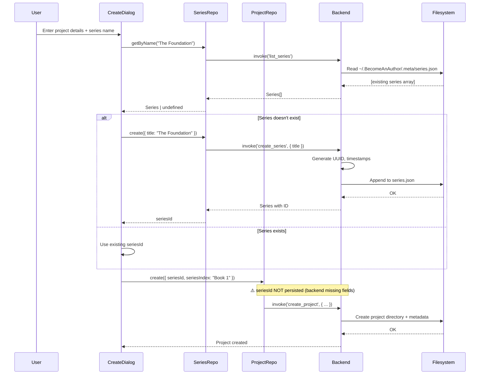

# Project-Series Relationship

## Overview

**Become An Author** supports organizing multiple projects (novels) into series (e.g., trilogies, book series). This document explains the architecture, implementation, and data flow of the project-series relationship.

---

## Conceptual Model

### What is a Series?

A **Series** is a grouping mechanism for multiple related projects (novels). Examples:
- **The Lord of the Rings** (trilogy)
- **Harry Potter** (7 books)
- **The Expanse** (9 books)

### Relationship Type

**Many-to-One**: Multiple projects can belong to one series
- ✅ A project can belong to zero or one series (`Project.seriesId?: string`)
- ✅ A series can contain multiple projects
- ❌ A project cannot belong to multiple series

---

## Data Model

### Series Entity

```typescript
// Frontend: frontend/domain/entities/types.ts
export interface Series {
    id: string;           // UUID
    title: string;        // Series name (e.g., "The Lord of the Rings")
    createdAt: number;    // Timestamp (milliseconds)
    updatedAt: number;    // Timestamp (milliseconds)
}
```

```rust
// Backend: backend/src/models/project.rs
pub struct Series {
    pub id: String,
    pub title: String,
    #[serde(rename = "createdAt")]
    pub created_at: i64,
    #[serde(rename = "updatedAt")]
    pub updated_at: i64,
}
```

**Key Characteristics**:
- **Global scope**: Series are NOT project-scoped (stored separately from projects)
- **Minimal metadata**: Only id, title, and timestamps (no description, author, etc.)
- **Deferred expansion**: Intentionally simple for Phase 1; can be enhanced later

---

### Project Entity (Series Fields)

```typescript
// Frontend: frontend/domain/entities/types.ts
export interface Project {
    id: string;
    title: string;
    author?: string;
    seriesId?: string;       // ← Optional FK to Series
    seriesIndex?: string;    // ← Display order (e.g., "Book 1", "Volume 2")
    language?: string;
    coverImage?: string;
    archived?: boolean;
    createdAt: number;
    updatedAt: number;
}
```

**Backend Note**: The Rust `ProjectMeta` struct currently does NOT include `seriesId` or `seriesIndex` fields. This is a **partial implementation** — frontend types include these fields, but backend doesn't persist them yet.

---

## Storage Architecture

### Series Storage

**Location**: `~/BecomeAnAuthor/.meta/series.json`

**Format**: JSON array of all series (global)

```json
[
  {
    "id": "series-uuid-1",
    "title": "The Foundation Trilogy",
    "createdAt": 1701234567890,
    "updatedAt": 1701234567890
  },
  {
    "id": "series-uuid-2",
    "title": "The Expanse",
    "createdAt": 1701234567890,
    "updatedAt": 1701234567890
  }
]
```

**Path Function**:
```rust
// backend/src/utils/paths.rs
pub fn get_series_path() -> Result<PathBuf, String> {
    let app_dir = get_app_dir()?;  // ~/BecomeAnAuthor
    let series_path = app_dir.join(".meta").join("series.json");
    fs::create_dir_all(app_dir.join(".meta")).map_err(|e| e.to_string())?;
    Ok(series_path)
}
```

**Key Insight**: Series storage is **independent** of projects — not stored within project directories.

---

### Project Storage (Series Reference)

**Location**: `{project_path}/.meta/project.json` (per-project)

**Current State**: **Partial implementation**
- Frontend types define `seriesId` and `seriesIndex`
- Backend Rust struct does NOT include these fields yet
- When saved, these fields are likely **dropped** during serialization

**Expected Format (once fully implemented)**:
```json
{
  "id": "project-uuid-1",
  "title": "Foundation",
  "author": "Isaac Asimov",
  "seriesId": "series-uuid-1",    // ← Missing in backend
  "seriesIndex": "Book 1",        // ← Missing in backend
  "archived": false,
  "created_at": "2024-01-01T00:00:00Z",
  "updated_at": "2024-01-01T00:00:00Z"
}
```

---

## Backend Implementation

### Commands

**Module**: `backend/src/commands/series.rs`

#### 1. `list_series`

**Purpose**: Get all series (global list)

```rust
#[tauri::command]
pub fn list_series() -> Result<Vec<Series>, String>
```

**Implementation**:
1. Read `~/.BecomeAnAuthor/.meta/series.json`
2. Deserialize into `Vec<Series>`
3. Return empty vec if file doesn't exist

**Frontend Call**:
```typescript
const series = await invoke<Series[]>('list_series');
```

---

#### 2. `create_series`

**Purpose**: Create a new series

```rust
#[tauri::command]
pub fn create_series(title: String) -> Result<Series, String>
```

**Implementation**:
1. Generate UUID for new series
2. Get current timestamp (milliseconds)
3. Create `Series` object
4. Read existing series list
5. Append new series
6. Write to `series.json` (pretty-printed JSON)
7. Return created series

**Side Effects**:
- Creates `.meta/` directory if missing
- Overwrites `series.json` with updated array

---

#### 3. `update_series`

**Purpose**: Update series metadata (currently only `title`)

```rust
#[tauri::command]
pub fn update_series(series_id: String, updates: serde_json::Value) -> Result<(), String>
```

**Implementation**:
1. Read all series
2. Find series by ID (error if not found)
3. Update title from `updates.title` (if present)
4. Update `updated_at` timestamp
5. Write back to `series.json`

**Frontend Call**:
```typescript
await invoke('update_series', {
  seriesId: 'uuid',
  updates: { title: 'New Title' }
});
```

---

#### 4. `delete_series`

**Purpose**: Delete a series

```rust
#[tauri::command]
pub fn delete_series(series_id: String) -> Result<(), String>
```

**Implementation**:
1. Read all series
2. Filter out series with matching ID
3. Write filtered list back to `series.json`

**⚠️ WARNING**: **No referential integrity**
- Does NOT check if projects reference this series
- Does NOT update projects to remove `seriesId` (when implemented)
- Projects referencing deleted series will have **orphaned FK**

---

## Frontend Implementation

### Repository Interface

**Path**: `frontend/domain/repositories/ISeriesRepository.ts`

```typescript
export interface ISeriesRepository {
    list(): Promise<Series[]>;
    get(id: string): Promise<Series | undefined>;
    getByName(name: string): Promise<Series | undefined>;
    create(series: Omit<Series, 'id' | 'createdAt' | 'updatedAt'>): Promise<string>;
    update(id: string, updates: Partial<Series>): Promise<void>;
    delete(id: string): Promise<void>;
}
```

**Methods**:
- `list()` — Get all series
- `get(id)` — Find by UUID
- `getByName(name)` — Find by title (case-insensitive)
- `create(series)` — Create new series, return ID
- `update(id, updates)` — Partial update
- `delete(id)` — Remove series

---

### Repository Implementation

**Path**: `frontend/infrastructure/repositories/TauriSeriesRepository.ts`

**Storage**: `~/.BecomeAnAuthor/.meta/series.json` (via Tauri IPC)

**Key Methods**:
- All methods call corresponding Tauri commands
- `get()` and `getByName()` implemented **client-side** (no dedicated backend commands)
- Error handling: Logs errors, returns empty arrays or undefined

**Example**:
```typescript
async list(): Promise<Series[]> {
    try {
        return await listSeries() as unknown as Series[];
    } catch (error) {
        console.error('Failed to list series:', error);
        return [];
    }
}
```

---

### Usage Example: Create Project Dialog

**Path**: `frontend/features/project/components/CreateProjectDialog.tsx`

**Flow**:
1. User enters series name in dialog
2. Check if series already exists:
   ```typescript
   const existingSeries = await seriesRepo.getByName(data.seriesName);
   ```
3. If exists, use existing ID:
   ```typescript
   seriesId = existingSeries.id;
   ```
4. If new, create series:
   ```typescript
   seriesId = await seriesRepo.create({
       title: data.seriesName
   });
   ```
5. Create project with `seriesId`:
   ```typescript
   await projectRepo.create({
       title: data.title,
       author: data.author,
       seriesId,
       seriesIndex: data.seriesIndex  // e.g., "Book 1"
   });
   ```

---

## Data Flow

### Creating a Project in a Series



---

## Dependencies

### Backend Dependencies

**Module**: `backend/src/commands/series.rs`

| Dependency | Purpose |
|------------|---------|
| `std::fs` | File I/O for `series.json` |
| `uuid` | Generate UUIDs for new series |
| `chrono` | Generate timestamps (`Utc::now().timestamp_millis()`) |
| `serde_json` | Serialize/deserialize `Series` struct |
| `crate::models::Series` | Series data structure |
| `crate::utils::get_series_path` | Path to `series.json` |

**Filesystem Dependencies**:
- Requires `~/.BecomeAnAuthor/.meta/` directory (auto-created)
- Requires read/write permissions in home directory

---

### Frontend Dependencies

**Repository**: `frontend/infrastructure/repositories/TauriSeriesRepository.ts`

| Dependency | Purpose |
|------------|---------|
| `@/core/tauri` | Tauri IPC wrapper functions (`listSeries`, `createSeries`, etc.) |
| `@/domain/repositories/ISeriesRepository` | Interface definition |
| `@/domain/entities/types` | `Series` type |

**IPC Commands Used**:
- `list_series`
- `create_series`
- `update_series`
- `delete_series`

---

## Current Limitations & Known Issues

### 1. **Partial Backend Implementation**

**Issue**: Backend `ProjectMeta` struct missing `seriesId` and `seriesIndex` fields

**Impact**:
- Frontend can set these fields, but backend doesn't persist them
- Projects lose series association on save
- Series-project relationship is **one-way** (series exist, but projects don't reference them)

**Fix Required**:
```rust
// backend/src/models/project.rs
pub struct ProjectMeta {
    // ... existing fields ...
    #[serde(skip_serializing_if = "Option::is_none")]
    pub series_id: Option<String>,
    #[serde(skip_serializing_if = "Option::is_none")]
    pub series_index: Option<String>,
}
```

---

### 2. **No Referential Integrity**

**Issue**: Deleting a series doesn't update or warn about projects in that series

**Scenarios**:
- User deletes series → projects still have `seriesId` pointing to non-existent series
- No cascade delete
- No validation on series deletion

**Recommended Fix**:
1. Before deleting series, query all projects
2. If any project has `seriesId` matching deleted series:
   - Option A: Block deletion (show warning)
   - Option B: Remove `seriesId` from affected projects
   - Option C: Move projects to "Uncategorized" series

---

### 3. **No Series Order/Sequence Tracking**

**Issue**: Series doesn't track book order — relies on `Project.seriesIndex` (string)

**Implications**:
- Can't auto-sort projects by series order
- User must manually enter "Book 1", "Book 2", etc.
- No validation (user could enter "Part III" or "Volume 2.5")

**Alternative Design**:
```typescript
export interface Series {
    id: string;
    title: string;
    projectIds: string[];  // ← Ordered array of project IDs
    createdAt: number;
    updatedAt: number;
}
```

---

### 4. **Global Series Scope**

**Issue**: All series are global (not user-scoped)

**Implications**:
- Multi-user systems would share series list
- No per-user series privacy
- Acceptable for desktop app (single user), but limits future multi-user support

---

### 5. **No Series Metadata**

**Issue**: Series only has `title` — no description, genre, author, cover image, etc.

**Impact**:
- Can't display rich series info in UI
- Can't filter/search by series attributes
- Acceptable for MVP, but limits discoverability

**Future Enhancement**:
```typescript
export interface Series {
    id: string;
    title: string;
    description?: string;
    author?: string;      // Main series author
    genre?: string;
    coverImage?: string;
    status?: 'planned' | 'in-progress' | 'completed';
    projectIds?: string[]; // Explicit project ordering
    createdAt: number;
    updatedAt: number;
}
```

---

## Testing Scenarios

### Test 1: Create Series + Project

**Steps**:
1. Create series "The Expanse"
2. Create project "Leviathan Wakes" with seriesId
3. Verify project shows "The Expanse" as series
4. Check `series.json` contains series

**Expected**:
- ✅ Series created in `~/.BecomeAnAuthor/.meta/series.json`
- ❌ Project does NOT have `seriesId` after save (backend limitation)

---

### Test 2: Delete Series with Projects

**Steps**:
1. Create series "Test Series"
2. Create project in series
3. Delete series

**Expected**:
- ✅ Series removed from `series.json`
- ⚠️ Project still references deleted series (orphaned FK)
- ⚠️ No warning shown to user

**Recommended Behavior**: Block deletion or remove series from projects

---

### Test 3: Update Series Title

**Steps**:
1. Create series "Old Name"
2. Update to "New Name"

**Expected**:
- ✅ Series title updated in `series.json`
- ✅ `updatedAt` timestamp refreshed

---

## Future Enhancements

### Phase 2: Fully Implement Project-Series Link

1. **Backend**: Add `series_id` and `series_index` to `ProjectMeta`
2. **Validation**: Verify `seriesId` exists before creating project
3. **Referential Integrity**: Block series deletion if projects reference it

---

### Phase 3: Series Dashboard UI

1. **Series List View**: Show all series with project count
2. **Series Detail Page**: List all projects in series (ordered)
3. **Drag-and-Drop Reordering**: Reorder books within series
4. **Series Metadata**: Add description, author, cover image

---

### Phase 4: Cross-Series Features

1. **Shared Codex**: Global characters/locations across series
2. **Series-Level Analytics**: Track total word count, completion %
3. **Export Entire Series**: Generate multi-book export

---

## Summary

| Aspect | Status | Notes |
|--------|--------|-------|
| **Backend Model** | ✅ Implemented | `Series` struct with id, title, timestamps |
| **Backend Commands** | ✅ Implemented | 4 commands (list, create, update, delete) |
| **Frontend Model** | ✅ Implemented | `Series` type matches backend |
| **Frontend Repository** | ✅ Implemented | `ISeriesRepository` + Tauri implementation |
| **Project-Series Link** | ⚠️ Partial | Frontend has fields, backend missing |
| **Storage** | ✅ Working | Global `series.json` in `~/.BecomeAnAuthor/.meta/` |
| **Referential Integrity** | ❌ Missing | No cascade deletes or validation |
| **UI Integration** | ⚠️ Partial | CreateProjectDialog uses series, no dashboard |

**Next Steps**:
1. Add `series_id` and `series_index` to backend `ProjectMeta`
2. Implement referential integrity checks
3. Build Series Dashboard UI
