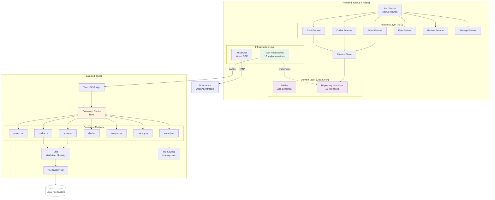
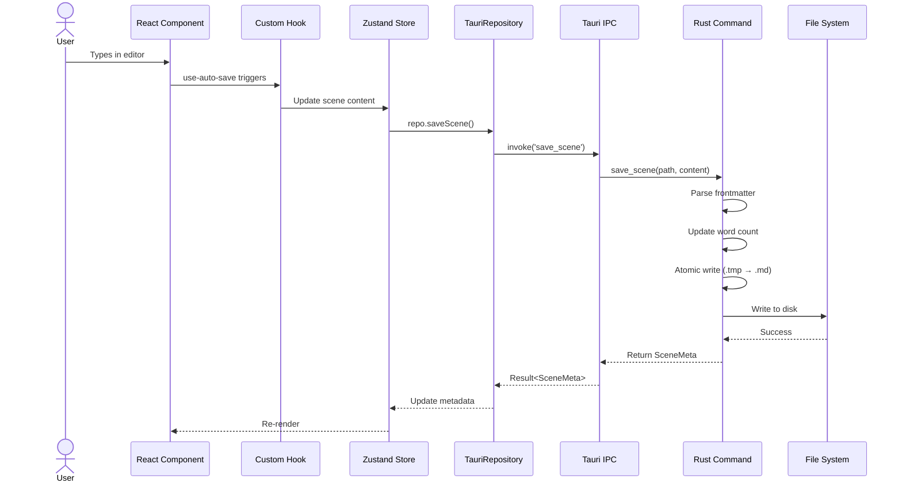
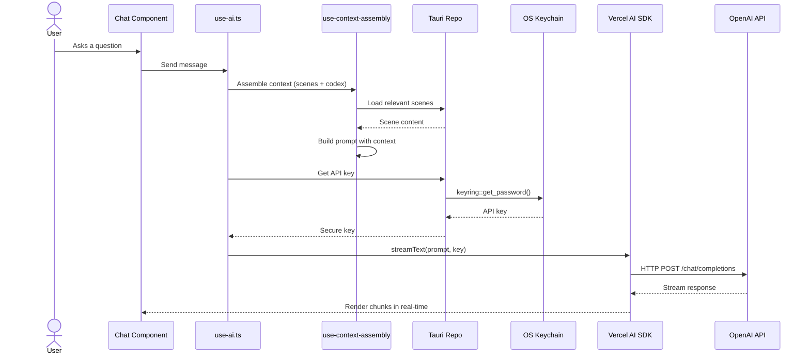
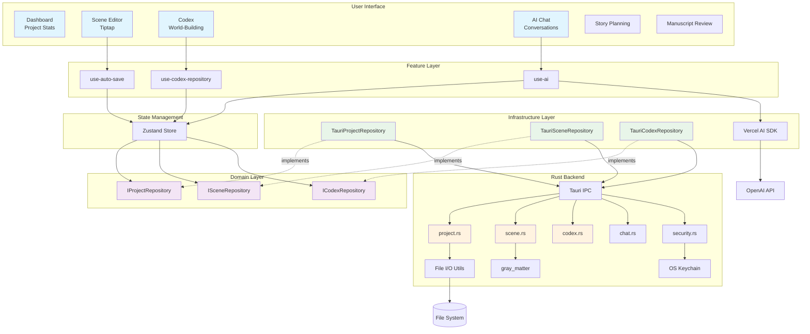

# AI Context & Source of Truth

> [!IMPORTANT]
> **This is the single source of truth for all AI agents working on "Become An Author".**  
> Read this file completely before generating code. It defines strict architectural boundaries, technology choices, and the complete feature set.

---

## 1. Project Goal

**"Become An Author"** is a **local-first, AI-assisted desktop application** for novelists to write, organize, and publish their manuscripts.

### Philosophy
- **Data Ownership**: All data lives on the local file system in open formats (Markdown + YAML, JSON). Zero vendor lock-in.
- **Privacy First**: AI integration is client-side. API keys stored securely in OS Keychain (via Rust `keyring` crate).
- **Structure as First-Class Citizen**: Treats novels as structured projects with hierarchical organization (Acts → Chapters → Scenes).
- **World-Building Support**: Full codex/wiki system for characters, locations, items, lore, and subplots with relationship graphs.

### Core Problem Solved
Replaces fragmented workflows (Google Docs + Notion + ChatGPT + Sticky Notes) with a unified, private, AI-enhanced writing studio.

---

## 2. Tech Stack

### 2.1 Frontend ("The Brain")
Handles **all business logic**, UI state management, and AI orchestration.

#### Core Framework
- **Framework**: [Next.js 16](https://nextjs.org/) (App Router)
- **Build Mode**: Static Export (`output: 'export'`)
- **Language**: TypeScript 5 (Strict Mode + Extra Strict Options)
- **UI Library**: [React 19](https://react.dev/)

#### Styling & UI
- **CSS Framework**: [Tailwind CSS v4](https://tailwindcss.com/)
- **Animations**: `tailwindcss-animate`
- **Component Library**: [Radix UI](https://www.radix-ui.com/) (Headless, WAI-ARIA compliant)
- **Icons**: [Lucide React](https://lucide.dev/)
- **Tooltips**: [Tippy.js](https://atomiks.github.io/tippyjs/)
- **Theming**: `next-themes` (Dark mode support)

#### State & Data Management
- **Global State**: [Zustand](https://github.com/pmndrs/zustand)
- **Form Handling**: `react-hook-form` + `zod` (Schema validation)
- **Search**: `fuse.js` (Client-side fuzzy search)

#### Rich Text Editing
- **Editor**: [Tiptap](https://tiptap.dev/) (ProseMirror wrapper)
- **Extensions**: 
  - `@tiptap/starter-kit`
  - `@tiptap/extension-typography`
  - `@tiptap/extension-mention`
  - `@tiptap/extension-character-count`
  - `@tiptap/extension-placeholder`
  - Custom mention system for Codex entries

#### AI Integration
- **SDK**: [Vercel AI SDK](https://sdk.vercel.ai/) v6 (December 2025)
- **Core Functions**: `streamText`, `generateText` from `ai` package
- **Official Providers** (v3.x - all @ai-sdk/* packages):
  - `@ai-sdk/google` - Google Gemini 3 (Flash, Pro, Deep Think)
  - `@ai-sdk/anthropic` - Claude 4.5 (Opus, Sonnet, Haiku)
  - `@ai-sdk/openai` - GPT-5.2 (Instant, Thinking, Pro, Codex)
  - `@ai-sdk/mistral` - Mistral Large 2.0
  - `@ai-sdk/deepseek` - DeepSeek R1, Chat
  - `@ai-sdk/groq` - Groq (fast inference on Llama, Mixtral)
  - `@ai-sdk/cohere` - Command R+
  - `@ai-sdk/xai` - Grok 2.5
  - `@ai-sdk/azure` - Azure OpenAI
  - `@ai-sdk/togetherai` - Together.ai hosted models
  - `@ai-sdk/fireworks` - Fireworks fine-tuned models
  - `@ai-sdk/perplexity` - Perplexity Sonar (search-augmented)
- **Community Providers**: `@openrouter/ai-sdk-provider`
- **Token Counting**: `@dqbd/tiktoken` (WebAssembly)
- **Model Discovery**: Dynamic model fetching from provider APIs (no hardcoded lists)
- **Pattern**: Provider Factory → Unified `streamText`/`generateText` API


#### UI Feedback
- **Notifications**: `sonner` (wrapped via `@/shared/utils/toast-service` - always use wrapper)
- **Alerts**: `react-hot-toast`

#### Drag & Drop
- **Library**: `@dnd-kit/core` + `@dnd-kit/sortable`
- **Use Case**: Reordering scenes/chapters in structure panel

#### Document Export
- **Format**: Microsoft Word (`.docx`)
- **Library**: `docx` package

#### Resizable Panels
- **Library**: `react-resizable-panels`

### 2.2 Backend ("The System")
Rust backend focused on **secure file I/O** and OS integration.

#### Runtime & Core
- **Framework**: [Tauri v2.1](https://tauri.app/)
- **Language**: Rust (Edition 2021, v1.77.2+)
- **Build System**: Cargo

#### Tauri Plugins
- `tauri-plugin-fs` (File system access)
- `tauri-plugin-dialog` (Native dialogs)
- `tauri-plugin-log` (Logging)
- `tauri-plugin-notification` (System notifications)
- `tauri-plugin-shell` (Shell commands)

#### Key Rust Dependencies
- **Serialization**: `serde` v1, `serde_json` v1
- **Markdown**: `gray_matter` v0.2 (YAML frontmatter parsing)
- **YAML**: `serde_yaml` v0.9
- **Date/Time**: `chrono` v0.4
- **Security**: `keyring` v2.3 (OS keychain integration)
- **UUID**: `uuid` v1 (v4 generation)
- **File System**: `walkdir` v2, `dirs` v5
- **Logging**: `log` v0.4

### 2.3 Testing & Quality
- **Test Framework**: [Vitest](https://vitest.dev/) v4
- **Environment**: `happy-dom` (Fast DOM simulation)
- **Testing Library**: `@testing-library/react` v16
- **Coverage**: V8 Provider
- **Test Files**: 39 test files across hooks and features
- **Linting**: ESLint v9 + `eslint-config-next`
- **Code Quality**: `dependency-cruiser`, `madge` (circular dependency detection)
- **Git Hooks**: Husky + lint-staged

### 2.4 Build & Development
- **Package Manager**: npm
- **Module Bundler**: Next.js Webpack (WebAssembly enabled)
- **Dev Server**: Next.js Dev + Tauri Dev (Port 3000)
- **Build Output**: Static HTML/CSS/JS exported to `out/`
- **Desktop Bundling**: Tauri CLI (DMG, AppImage, MSI)

---

## 3. Architecture Pattern

### 3.1 Architectural Overview

The application uses a **Dual-Brain Hybrid Architecture**:

1. **Frontend**: Feature-Sliced Design + Clean Architecture
2. **Backend**: Command Pattern + File-Based Persistence



### 3.2 Frontend Architecture (Detailed)

#### Directory Structure
```
frontend/
├── core/                    # Core infrastructure
│   ├── api/                 # Generic API utilities
│   ├── storage/             # API key management (safe-storage.ts)
│   ├── tauri/               # Tauri type wrappers
│   ├── logger.ts            # Logging service
│   └── tab-coordinator.ts   # Multi-tab synchronization
├── domain/                  # Clean Architecture - Domain Layer
│   ├── entities/            # Zod schemas, TypeScript types
│   │   └── types.ts         # All domain entities (9959 bytes)
│   ├── repositories/        # 19 Repository Interfaces
│   │   ├── IProjectRepository.ts
│   │   ├── INodeRepository.ts
│   │   ├── ICodexRepository.ts
│   │   ├── IChatRepository.ts
│   │   ├── IAnalysisRepository.ts
│   │   ├── ISnippetRepository.ts
│   │   ├── ISeriesRepository.ts
│   │   ├── ICodexTagRepository.ts
│   │   ├── ICodexTemplateRepository.ts
│   │   ├── ICodexRelationRepository.ts
│   │   ├── ICodexRelationTypeRepository.ts
│   │   ├── ISceneCodexLinkRepository.ts
│   │   ├── ICollaborationRepository.ts
│   │   ├── IMentionRepository.ts
│   │   ├── IIdeaRepository.ts
│   │   ├── IMapRepository.ts
│   │   ├── ISceneNoteRepository.ts
│   │   └── IWorldTimelineRepository.ts
│   └── services/            # Domain services (6 interfaces)
│       ├── IAnalysisService.ts
│       ├── IChatService.ts
│       ├── IExportService.ts
│       ├── IModelDiscoveryService.ts
│       └── INodeDeletionService.ts
├── infrastructure/          # Implementation Layer
│   ├── repositories/        # 18 Tauri Repository Implementations
│   │   ├── TauriProjectRepository.ts
│   │   ├── TauriNodeRepository.ts
│   │   ├── TauriCodexRepository.ts
│   │   ├── TauriCodexTagRepository.ts
│   │   ├── TauriCodexTemplateRepository.ts
│   │   ├── TauriCodexRelationRepository.ts
│   │   ├── TauriCodexRelationTypeRepository.ts
│   │   ├── TauriSceneCodexLinkRepository.ts
│   │   └── ... (10 more)
│   ├── services/            # 10 Concrete service implementations
│   └── migrations/          # Data migration scripts
├── features/                # Feature-Sliced Design (18 features)
│   ├── editor/              # Scene editor (30 files)
│   ├── codex/               # World-building wiki (19 files)
│   ├── chat/                # AI chat interface (17 files)
│   ├── plan/                # Story planning tools (19 files)
│   ├── review/              # Manuscript review (15 files)
│   ├── ai/                  # AI integration components (2 files)
│   ├── search/              # Global search (8 files)
│   ├── settings/            # User preferences (11 files)
│   ├── google-drive/        # Google Drive integration (5 files)
│   ├── migration/           # Data migration UI (4 files)
│   ├── snippets/            # Reusable text snippets (4 files)
│   ├── series/              # Multi-book series management (6 files)
│   ├── dashboard/           # Project dashboard (7 files)
│   ├── navigation/          # Tree navigation (5 files)
│   ├── project/             # Project CRUD (3 files)
│   ├── export/              # Document export (6 files)
│   ├── collaboration/       # Real-time collaboration (2 files)
│   ├── data-management/     # Import/export flows (4 files)
│   └── shared/              # Shared feature utilities (6 files)
├── hooks/                   # 42+ Custom React Hooks
│   ├── use-ai.ts            # AI interaction hook
│   ├── use-auto-save.ts     # Auto-save coordinator
│   ├── use-context-assembly.ts  # AI context builder
│   ├── use-confirmation.tsx # Confirmation dialogs
│   ├── use-dialog-state.ts  # Dialog state management
│   ├── use-model-discovery.ts # Dynamic model fetching
│   ├── use-collaboration.ts # Real-time collaboration
│   ├── use-mentions.ts      # Codex mention tracking
│   └── ... (34+ more)
├── lib/                     # Shared libraries
│   ├── services/            # Business logic services
│   ├── integrations/        # External integrations (Google Drive)
│   ├── prompts/             # AI prompt templates
│   ├── tiptap-extensions/   # Custom Tiptap extensions
│   └── search-service.ts    # Fuse.js wrapper
├── components/              # Shared UI components
├── store/                   # Zustand stores
└── shared/                  # Shared utilities
```

### 3.3 Backend Architecture (Detailed)

#### Command Modules (19 Total)

| Module | File | Purpose | Key Commands |
|--------|------|---------|--------------|
| **Project** | `project.rs` | Project CRUD, structure management | `create_project`, `list_projects`, `get_structure`, `save_structure`, `create_node` |
| **Scene** | `scene.rs` | Scene file I/O (Markdown + YAML) | `load_scene`, `save_scene`, `save_scene_by_id`, `delete_scene` |
| **Codex** | `codex.rs` | World-building entries, relations, tags | `list_codex_entries`, `save_codex_entry`, `list_codex_relations`, `save_codex_tag` |
| **Chat** | `chat.rs` | AI chat thread persistence | `create_chat_thread`, `get_chat_messages`, `create_chat_message` |
| **Snippet** | `snippet.rs` | Reusable text snippets | `list_snippets`, `save_snippet`, `delete_snippet` |
| **Analysis** | `analysis.rs` | AI analysis results storage | `list_analyses`, `save_analysis`, `delete_analysis` |
| **Backup** | `backup.rs` | Emergency backups, export/import | `save_emergency_backup`, `export_manuscript_text`, `export_project_backup`, `import_project_backup` |
| **Search** | `search.rs` | Full-text project search | `search_project` |
| **Trash** | `trash.rs` | Soft-delete system | `move_to_trash`, `restore_from_trash`, `empty_trash` |
| **Series** | `series.rs` | Multi-book series management | `list_series`, `create_series`, `update_series` |
| **Security** | `security.rs` | API key storage (OS Keychain) | `store_api_key`, `get_api_key`, `delete_api_key` |
| **Idea** | `idea.rs` | Brainstorming storage | `list_ideas`, `create_idea`, `update_idea`, `delete_idea` |
| **Mention** | `mention.rs` | Cross-reference tracking | `find_mentions`, `count_mentions` |
| **Collaboration** | `collaboration.rs` | Yjs real-time sync state | `save_yjs_state`, `load_yjs_state`, `has_yjs_state`, `delete_yjs_state` |
| **Scene Note** | `scene_note.rs` | Scene annotations | `get_scene_note`, `save_scene_note`, `delete_scene_note` |
| **World Map** | `world_map.rs` | Story world maps | `list_maps`, `save_map`, `delete_map`, `upload_map_image` |
| **World Timeline** | `world_timeline.rs` | Timeline events | `list_world_events`, `save_world_event`, `delete_world_event` |
| **Preset** | `preset.rs` | Custom export presets | `list_custom_presets`, `save_custom_preset`, `delete_custom_preset` |
| **Core** | `lib.rs` | App entry point, command registry | `get_app_info` |

#### Data Models (Rust Structs)

| Model | File | Description |
|-------|------|-------------|
| `ProjectMeta` | `project.rs` | Project metadata (title, author, path) |
| `StructureNode` | `project.rs` | Hierarchical tree (act/chapter/scene) |
| `Series` | `project.rs` | Multi-book series |
| `Scene` + `SceneMeta` | `scene.rs` | Scene content + YAML metadata |
| `CodexEntry` | `codex.rs` | Character/Location/Item/Lore/Subplot |
| `CodexRelation` | `codex.rs` | Parent-child relationships |
| `CodexTag` | `codex.rs` | Organizational tags |
| `CodexTemplate` | `codex.rs` | Custom entry templates |
| `CodexRelationType` | `codex.rs` | Relationship type definitions |
| `SceneCodexLink` | `codex.rs` | Scene ↔ Codex connections |
| `ChatThread` | `chat.rs` | AI chat conversation |
| `ChatMessage` | `chat.rs` | Individual chat messages |
| `Snippet` | `snippet.rs` | Reusable text blocks |
| `Analysis` | `analysis.rs` | AI-generated analysis results |
| `Idea` | `idea.rs` | Brainstorming ideas |
| `SceneNote` | `scene_note.rs` | Scene annotations |
| `WorldMap` + `MapMarker` | `world_map.rs` | Story world maps |
| `WorldEvent` | `world_timeline.rs` | Timeline events |
| `EmergencyBackup` | `backup.rs` | Auto-saved draft backups |

---

## 4. Data Persistence (File System Structure)

### 4.1 Project Directory Structure

Each novel project is a **readable folder** on the user's file system:

```
MyNovel/
├── .meta/                       # Hidden metadata (JSON)
│   ├── project.json             # Project metadata (title, author, timestamps)
│   ├── structure.json           # Hierarchical outline (acts/chapters/scenes)
│   ├── settings.json            # Project-specific settings
│   └── chat/                    # AI chat history
│       ├── threads.json         # Chat thread list
│       └── messages/            # Message files
│           └── {thread-id}.json
├── manuscript/                  # Core content (Markdown)
│   ├── {scene-uuid}.md          # Scene files (YAML frontmatter + content)
│   └── ...
├── codex/                       # World-building (JSON) - ⚠️ DEPRECATED (see series-first below)
│   ├── characters/
│   │   └── {entry-id}.json
│   ├── locations/
│   ├── items/
│   ├── lore/
│   └── subplots/
├── snippets/                    # Reusable text (JSON)
│   └── {snippet-id}.json
├── analyses/                    # AI analysis results (JSON)
│   └── {analysis-id}.json
├── exports/                     # Exported manuscripts
│   └── MyNovel_backup_20250120.json
└── backups/                     # Emergency backups (future)
```

### 4.2 Scene File Format (Markdown + YAML)

```markdown
---
id: "550e8400-e29b-41d4-a716-446655440000"
title: "The Awakening"
order: 0
status: "draft"
wordCount: 1247
povCharacter: "John Doe"
createdAt: "2025-01-20T10:30:00Z"
updatedAt: "2025-01-20T12:45:00Z"
---

John woke to the sound of thunder...
```

### 4.3 Global App Data

Stored in OS-specific directories (via Rust `dirs` crate):

```
~/.local/share/com.becomeauthor.app/  (Linux)
~/Library/Application Support/com.becomeauthor.app/  (macOS)
%APPDATA%\com.becomeauthor.app\  (Windows)
```

**Contents**:
- `project_registry.json`: List of project paths (for discovering projects)
- `.emergency_backups/`: Auto-saved drafts (expires after 24h)
- `Trash/`: Deleted projects (soft-delete)

**Secure Storage** (OS Keychain):
- API keys stored via `keyring` crate
- Service name: `com.becomeauthor.app`
- Accessible via `security::store_api_key`, `security::get_api_key`

---

## 5. Feature Inventory (Complete)

### 5.1 Core Features

| Feature | Frontend Module | Backend Commands | Description |
|---------|-----------------|------------------|-------------|
| **Project Management** | `features/project` | `project.rs` | Create, list, archive, delete projects |
| **Manuscript Structure** | `features/navigation` | `project.rs` | Acts → Chapters → Scenes hierarchy |
| **Scene Editor** | `features/editor` | `scene.rs` | Tiptap-based rich text editor with auto-save |
| **Codex (Wiki)** | `features/codex` | `codex.rs` | Characters, Locations, Items, Lore, Subplots |
| **Codex Relations** | `features/codex` | `codex.rs` | Graph-based relationships between entries |
| **Codex Tags** | `features/codex` | `codex.rs` | Tagging and filtering system |
| **Codex Templates** | `features/codex` | `codex.rs` | Custom entry templates per category |
| **Scene-Codex Links** | `features/codex` | `codex.rs` | Tag scenes with relevant codex entries |
| **Snippets** | `features/snippets` | `snippet.rs` | Reusable text blocks (descriptions, phrases) |
| **AI Chat** | `features/chat` | `chat.rs` | Persistent AI conversations |
| **AI Analysis** | `features/review` | `analysis.rs` | Character arcs, plot holes, pacing analysis |
| **Story Planning** | `features/plan` | N/A (client-side) | Plot beats, character arcs, worldbuilding |
| **Search** | `features/search` | `search.rs` | Full-text search across scenes and codex |
| **Series Management** | `features/series` | `series.rs` | Multi-book series tracking |
| **Export** | `features/data-management` | `backup.rs` | Export to .docx or JSON backup |
| **Import** | `features/migration` | `backup.rs` | Import from JSON backup |
| **Google Drive Sync** | `features/google-drive` | N/A (OAuth client-side) | Cloud backup integration |
| **Settings** | `features/settings` | N/A (localStorage) | Theme, auto-save, AI preferences |
| **Dashboard** | `features/dashboard` | N/A | Project overview, word count stats |

### 5.2 AI Capabilities

| Capability | Implementation | Provider Support |
|------------|----------------|------------------|
| **Context Assembly** | `use-context-assembly.ts` | Assembles scenes + codex for AI prompts |
| **Token Counting** | `@dqbd/tiktoken` | Prevents exceeding model limits |
| **Streaming Responses** | `use-ai.ts` + Vercel AI SDK | Real-time AI output |
| **Model Selection** | `features/settings` | OpenAI, Anthropic, Google |
| **Custom Prompts** | `lib/prompts` | System prompts for different tasks |
| **Chat History** | `features/chat` | Persistent threads in `.meta/chat/` |

### 5.3 Developer Features

| Feature | Purpose |
|---------|---------|
| **Auto-Save** | `use-auto-save.ts` debounces edits, saves to Rust |
| **Multi-Tab Sync** | `tab-coordinator.ts` prevents concurrent edit conflicts |
| **Emergency Backups** | Auto-saves drafts every N minutes (expires 24h) |
| **Trash System** | Soft-delete with restore capability |
| **Migration System** | Handles schema changes across app versions |
| **Dependency Boundaries** | ESLint plugin enforces clean architecture |
| **Circular Dependency Check** | `madge` prevents import cycles |

---

## 6. Communication Flow (Dual-Brain Pattern)

### 6.1 Data Write Flow



### 6.2 AI Interaction Flow



---

## 7. Configuration Files

### 7.1 TypeScript Configuration (`tsconfig.json`)

```json
{
  "compilerOptions": {
    "strict": true,
    "noUncheckedIndexedAccess": true,
    "noImplicitReturns": true,
    "noFallthroughCasesInSwitch": true,
    "exactOptionalPropertyTypes": true,
    "paths": {
      "@/*": ["./frontend/*"]
    }
  }
}
```

**Key Points**:
- Extra strict mode for 10/10 maintainability
- Path alias `@/*` maps to `frontend/*`

### 7.2 Next.js Configuration (`next.config.ts`)

```typescript
{
  output: 'export',           // Static HTML export for Tauri
  images: { unoptimized: true },  // No image optimization
  trailingSlash: true,        // Better for file:// URLs
  webpack: {
    experiments: {
      asyncWebAssembly: true  // For tiktoken WASM
    }
  }
}
```

### 7.3 Tauri Configuration (`backend/tauri.conf.json`)

```json
{
  "identifier": "com.becomeauthor.app",
  "build": {
    "frontendDist": "../out",
    "devUrl": "http://localhost:3000"
  },
  "app": {
    "windows": [{
      "width": 1400,
      "height": 900,
      "minWidth": 900,
      "minHeight": 600
    }]
  },
  "bundle": {
    "macOS": {
      "minimumSystemVersion": "10.15"
    }
  }
}
```

### 7.4 Environment Variables (`.env.local`)

```bash
# Google OAuth (for Drive integration)
NEXT_PUBLIC_GOOGLE_CLIENT_ID=xxx.apps.googleusercontent.com
NEXT_PUBLIC_GOOGLE_CLIENT_SECRET=xxx
```

**Note**: API keys for AI providers are **NOT** in `.env`. They're stored in OS Keychain via Rust.

---

## 8. Testing Strategy

### 8.1 Test Configuration (`vitest.config.ts`)

```typescript
{
  test: {
    environment: 'happy-dom',  // Lightweight DOM
    setupFiles: './frontend/vitest.setup.ts',
    coverage: {
      provider: 'v8',
      exclude: ['node_modules/', 'frontend/test/', '**/*.config.*']
    }
  }
}
```

### 8.2 Test Coverage

- **39 test files** across `frontend/hooks/`
- **Example tests**:
  - `use-ai.test.ts`: AI interaction mocking
  - `use-auto-save.test.ts`: Debounce logic
  - `use-context-assembly.test.ts`: Context building
  - `use-dialog-state.test.ts`: Dialog state machine
  - `use-error-handler.test.ts`: Error boundaries

### 8.3 E2E Testing

- **Framework**: (Not yet implemented, but `e2e/` folder exists)
- **Potential**: Playwright or Tauri WebDriver

---

## 9. Build & Deployment

### 9.1 Development

```bash
npm run dev           # Next.js dev server (localhost:3000)
npm run tauri:dev     # Tauri dev mode (opens desktop window)
```

### 9.2 Production Build

```bash
npm run build         # Next.js static export → out/
npm run tauri:build   # Compile Rust + bundle app (DMG/AppImage/MSI)
```

### 9.3 Scripts (package.json)

| Script | Command | Purpose |
|--------|---------|---------|
| `dev` | `next dev` | Start Next.js dev server |
| `tauri:dev` | `tauri dev` | Launch Tauri desktop app (dev) |
| `build` | `next build` | Static export |
| `tauri:build` | `tauri build` | Production desktop build |
| `test` | `vitest` | Run tests |
| `test:coverage` | `vitest --coverage` | Generate coverage report |
| `lint` | `next lint` | ESLint check |
| `deps:check` | `depcruise` | Check dependency rules |
| `deps:circular` | `madge --circular` | Find circular dependencies |

---

## 10. Key Design Decisions

### 10.1 Why File-Based Storage?

- **Portability**: Users can move projects via file explorer
- **No Database**: Simpler architecture, no schema migrations
- **Git-Friendly**: Scenes are Markdown (diff-able, version-controllable)
- **Transparency**: Users can inspect/edit files manually

### 10.2 Why Tauri Over Electron?

- **Performance**: 10x smaller binary, 50% less RAM
- **Security**: Rust's memory safety prevents RCE vulnerabilities
- **Native Feel**: True native OS integration (keychain, dialogs)

### 10.3 Why Clean Architecture in Frontend?

- **Testability**: Repositories are interfaces (easily mocked)
- **Flexibility**: Can swap Tauri for HTTP API without changing features
- **Boundaries**: Domain logic never imports from UI

### 10.4 Why Static Export (Not SSR)?

- **Desktop-First**: No server to deploy
- **Speed**: All assets are local (instant load)
- **Simplicity**: No API routes, no backend deployment

---

## 11. Common Patterns

### 11.1 Creating a New Feature

1. **Create Feature Module**: `frontend/features/{feature-name}/`
2. **Define Entities**: Add types to `domain/entities/types.ts`
3. **Define Repository**: Create `IFeatureRepository.ts` in `domain/repositories/`
4. **Implement Repository**: Create `TauriFeatureRepository.ts` in `infrastructure/repositories/`
5. **Create Rust Commands**: Add `{feature}.rs` to `backend/src/commands/`
6. **Register Commands**: Update `backend/src/lib.rs` `invoke_handler![]`
7. **Create Custom Hook**: `frontend/hooks/use-{feature}.ts`
8. **Build UI**: Feature components in `features/{feature-name}/components/`

### 11.2 Adding a Tauri Command

```rust
// backend/src/commands/example.rs
#[tauri::command]
pub fn my_command(arg: String) -> Result<String, String> {
    // Logic here
    Ok("success".to_string())
}

// backend/src/lib.rs
invoke_handler![
    my_command,  // Add here
]
```

### 11.3 Calling from Frontend

```typescript
// frontend/infrastructure/repositories/TauriExampleRepository.ts
import { invoke } from '@tauri-apps/api/core';

export class TauriExampleRepository {
  async doSomething(arg: string): Promise<string> {
    return await invoke<string>('my_command', { arg });
  }
}
```

---

## 12. Data Flow Diagram (Complete)



---

## 13. Anti-Patterns to Avoid

> [!CAUTION]
> The following patterns are **forbidden** in this codebase:

1. **UI Components Calling Tauri Directly**: Always go through Repositories
2. **Business Logic in Rust**: Rust is for File I/O only. Logic lives in TypeScript.
3. **Storing API Keys in `.env`**: Use OS Keychain via `security.rs`
4. **Hardcoded File Paths**: Always use `dirs` crate for OS paths
5. **Importing Features from Other Features**: Features are isolated (use shared utilities)
6. **Mutating State Outside Zustand**: All state changes must go through stores
7. **Not Validating User Input**: Always validate in both frontend (Zod) and backend (Rust)

---

## 14. Glossary

| Term | Definition |
|------|------------|
| **Scene** | A single writing unit (Markdown file). The smallest editable piece. |
| **Node** | Generic term for Act, Chapter, or Scene in the hierarchy. |
| **Structure** | The hierarchical outline (stored in `.meta/structure.json`). |
| **Codex** | World-building wiki (characters, locations, items, lore, subplots). |
| **Codex Entry** | A single entry in the Codex (e.g., "John Doe" character). |
| **Relation** | A connection between two Codex entries (e.g., "John" → "Mary" = "sibling"). |
| **Snippet** | Reusable text block (e.g., standard description of a location). |
| **Analysis** | AI-generated insights (e.g., character arc analysis). |
| **Emergency Backup** | Auto-saved draft that expires after 24h (failsafe). |
| **Repository** | Abstraction layer for data access (implements interface). |
| **Tauri Command** | Rust function callable from JavaScript via `invoke()`. |
| **FSD** | Feature-Sliced Design (architecture pattern). |

---

**Last Updated**: 2026-01-05  
**Document Version**: 2.2

