# Architecture Document v1.0 – Become An Author

> **This is Architecture Document v1.0 and will be treated as the source of truth for all future technical discussions.**

---

## 1. Architecture Overview

### System Goals

**Become An Author** is a local-first, browser-based novel writing application designed to provide:
- **Offline-first authoring environment** with zero server dependencies
- **AI-assisted writing** with user-controlled API connections
- **Rich manuscript management** (hierarchical structure: Acts → Chapters → Scenes)
- **World-building tools** (Codex for characters, locations, lore)
- **Planning and outlining** capabilities
- **Privacy-first design** (all data stays on user's device)

### Key Constraints

1. **Frontend-only architecture** – No backend server (except optional Google Drive integration)
2. **Browser-based persistence** – All data stored in IndexedDB (via Dexie)
3. **Single-device scope** – No cross-device sync (except via manual Google Drive backup)
4. **User-controlled AI** – Users bring their own API keys (OpenAI, Anthropic, etc.)

### Non-Functional Requirements

#### Maintainability
- Domain-driven folder structure for clear boundaries
- Repository pattern for data access abstraction
- Zustand for predictable state management
- TypeScript for type safety

#### Performance
- IndexedDB for fast local queries
- Live queries with `dexie-react-hooks` for reactivity
- Debounced auto-save to minimize DB writes
- Save Coordinator to prevent race conditions

#### Offline-First Behavior
- 100% offline-capable (no network required except for AI features)
- Emergency backup to `localStorage` on DB failure
- Export/import capabilities for data portability

#### Scalability (Single-Device)
- IndexedDB can handle large manuscripts (millions of words)
- Hierarchical navigation to manage complexity
- Efficient querying with indexed fields

---

## 2. High-Level Architecture Diagram

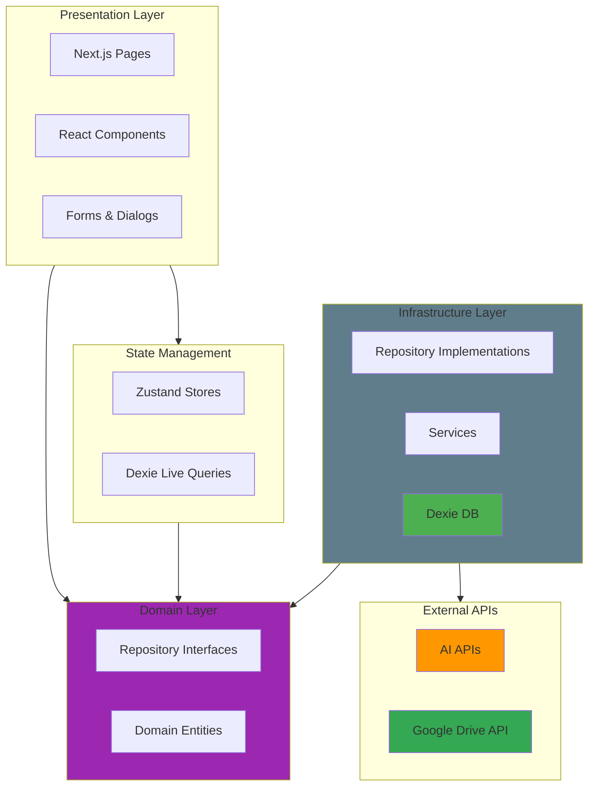

---

## 3. Layered Architecture Breakdown

### Layer 1: Presentation Layer

**Location:** `src/app/`, `src/features/*/components/`, `src/components/`

**Responsibilities:**
- Render UI components
- Handle user interactions
- Trigger state updates via hooks/stores
- Display data from live queries or Zustand stores

**Contains:**
- Next.js pages (`page.tsx`, `layout.tsx`)
- Feature-specific components (Editor, Chat, Codex, etc.)
- Shared UI components (Button, Dialog, Input, etc.)

**Should NEVER contain:**
- Direct database calls
- Business logic
- Data transformation logic
- API key storage

### Layer 2: State Management Layer

**Location:** `src/store/`, `src/hooks/use-*-repository.ts`

**Responsibilities:**
- Manage transient UI state (Zustand)
- Provide reactive data subscriptions (Dexie Live Queries)
- Expose state to components via hooks

**Contains:**
- **Zustand stores:**
  - `use-project-store.ts` – Active project, scene, view mode
  - `use-chat-store.ts` – Active chat thread
  - `use-format-store.ts` – Editor formatting preferences
- **Live Query hooks:**
  - `useLiveQuery(() => db.projects.toArray())`
  - Real-time reactivity to DB changes

**Should NEVER contain:**
- Complex business logic
- Direct DOM manipulation
- External API calls

### Layer 3: Domain Layer (New)

**Location:** `src/domain/`

**Responsibilities:**
- Define core business entities and interfaces
- Enforce dependency inversion (Infrastructure depends on Domain)
- Pure TypeScript, no framework dependencies

**Contains:**
- **Repositories (Interfaces):**
  - `INodeRepository.ts`
  - `ICodexRepository.ts`
  - `IChatRepository.ts`
- **Services (Interfaces):**
  - `IAIService.ts`

**Should NEVER contain:**
- Database implementation details (Dexie)
- UI components
- External API calls

### Layer 4: Infrastructure Layer (Refactored)

**Location:** `src/infrastructure/`, `src/lib/`

**Responsibilities:**
- Implement domain interfaces
- Handle external communication (DB, API)
- Manage technical concerns (Logging, Storage)

**Contains:**
- **Repository Implementations:**
  - `DexieNodeRepository.ts` (implements `INodeRepository`)
  - `DexieProjectRepository.ts`
- **External Services:**
  - `GoogleDriveService` (`src/lib/services/`)
  - `GoogleAuthService`
  - `AIService`
- **Database:**
  - `database.ts` (Dexie schema)

**Should NEVER contain:**
- Business rules that belong in Domain
- UI rendering logic

> **📝 Note:** See [security.md](./security.md) for comprehensive documentation on security fixes, error handling patterns, and toast notification system.

### Layer 5: Utility / Core Modules

**Location:** `src/lib/`, `src/hooks/`

**Responsibilities:**
- Provide reusable utilities
- Extract common patterns

**Contains:**
- `use-debounce.ts` – Debouncing hook
- `prompt-templates.ts` – AI prompt library
- `ai-vendors.ts` – AI provider configurations
- `search-service.ts` – Fuzzy search utility (Fuse.js)
- `logger.ts` – Structured logging service
- `context-assembler.ts` – AI context token management
- `tab-coordinator.ts` – Multi-tab synchronization

---

## 4. Low-Level Architecture (LLD)

### 4.1 Module Breakdown

#### Editor Module (`src/features/editor/`)

**Components:**
- `EditorContainer.tsx` – Orchestrates editor layout (panels, timeline, snippets)
- `TiptapEditor.tsx` – Core Tiptap editor instance
- `EditorToolbar.tsx` – Formatting controls
- `FormatMenu.tsx` – Typography settings popover
- AI Components:
  - `ContinueWritingMenu.tsx`
  - `RewriteMenu.tsx`
  - `TextSelectionMenu.tsx`
  - `TextReplaceDialog.tsx`
  - `TinkerMode.tsx`
- `StoryTimeline.tsx` – Visual scene progression
- `SceneActionMenu.tsx` – Scene-level actions

**Data Flow:**
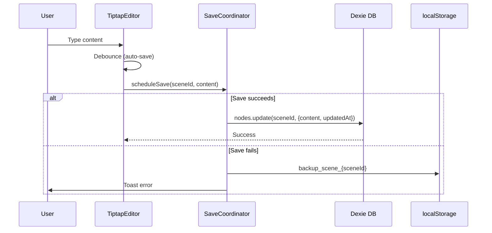

#### Chat Module (`src/features/chat/`)

**Components:**
- `ChatInterface.tsx` – Thread list + active thread view
- `ChatThread.tsx` – Message display and input
- `ContextSelector.tsx` – Select manuscript/codex for context
- `PromptSelector.tsx` – Choose system prompt
- `ModelSelector.tsx` – Choose AI model
- `ChatSettingsDialog.tsx` – Temperature, max tokens, etc.

**Services:**
- `use-chat-service.ts` – Handles AI generation with context assembly

**Data Flow:**
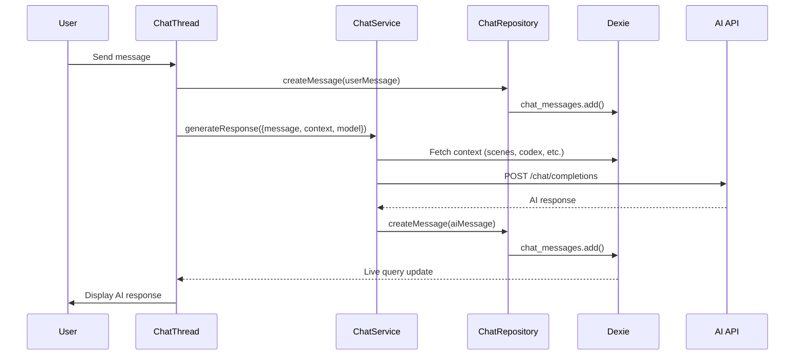

#### Codex Module (`src/features/codex/`)

**Components:**
- `CodexList.tsx` – Entity browser
- `EntityEditor.tsx` – Full entity editor with tabs
- Tabs:
  - `DetailsTab.tsx`
  - `ResearchTab.tsx`
  - `RelationsTab.tsx`
  - `MentionsTab.tsx`
  - `TrackingTab.tsx`

**Repository:**
- `use-codex-repository.ts` – CRUD operations

**Data Flow:**
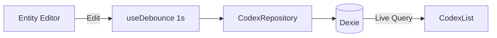

#### Search Module (`src/features/search/`)

**Components:**
- `SearchPalette.tsx` – Main modal dialog
- `SearchInput.tsx` – Input field
- `SearchResults.tsx` – Grouped results list

**Services:**
- `search-service.ts` – Singleton wrapper around Fuse.js
- `use-search.ts` – Hook for search state and index management

**Data Flow:**
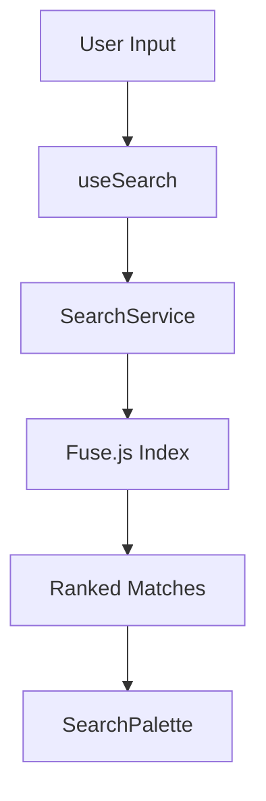

#### Google Drive Module (`src/features/google-drive/`)

**Components:**
- `DriveBackupBrowser.tsx` – List and restore backups
- `InlineGoogleAuth.tsx` – Sign-in/out button

**Services:**
- `google-drive-service.ts` – Drive API wrapper (Upload, List, Download)
- `google-auth-service.ts` – OAuth 2.0 PKCE flow

**Data Flow:**
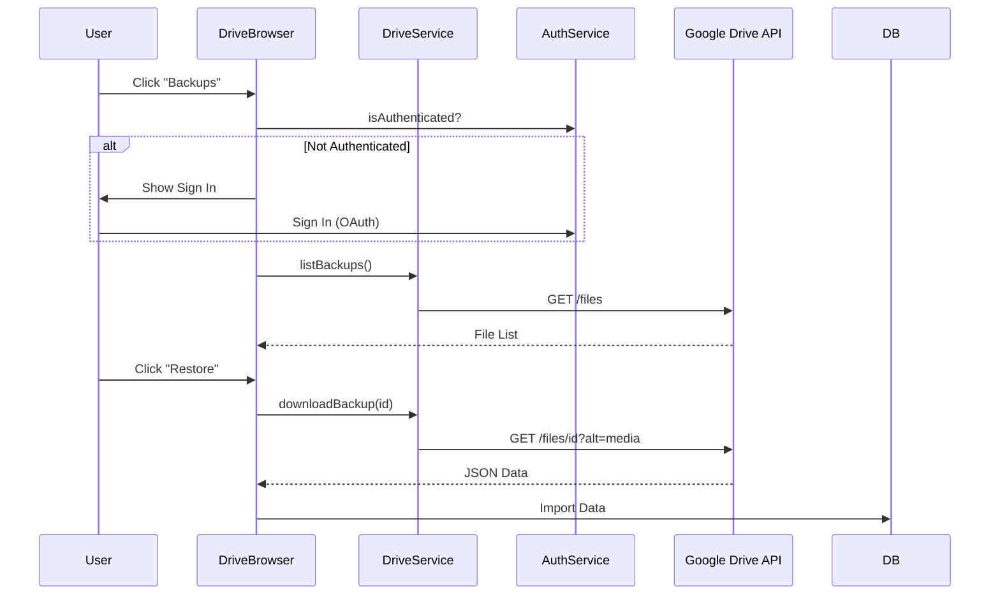

### 4.2 Cross-Cutting Concerns

#### Save Coordination

**Problem:** Race conditions between auto-save and AI-generated saves.

**Solution:** `SaveCoordinator` singleton with per-scene queues.

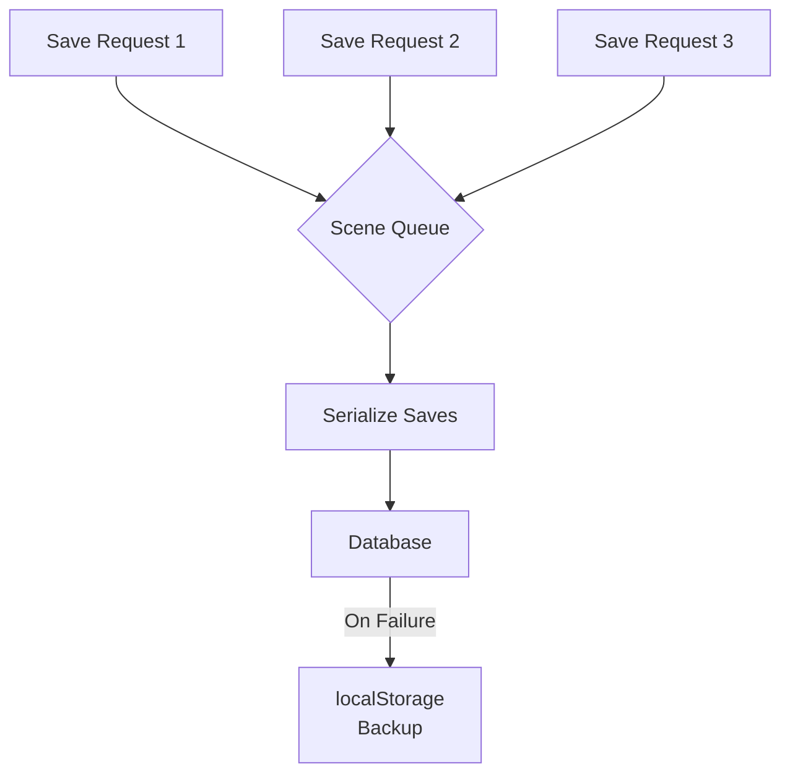

**Implementation:**
```typescript
class SaveCoordinator {
  private saveQueue = new Map<string, Promise<void>>();
  
  async scheduleSave(sceneId: string, getContent: () => any): Promise<void> {
    // Wait for existing save to complete
    // Then execute new save
    // On failure, backup to localStorage
  }
}
```

#### AI Integration Architecture

**Design:** Provider-agnostic AI client with user-managed connections.

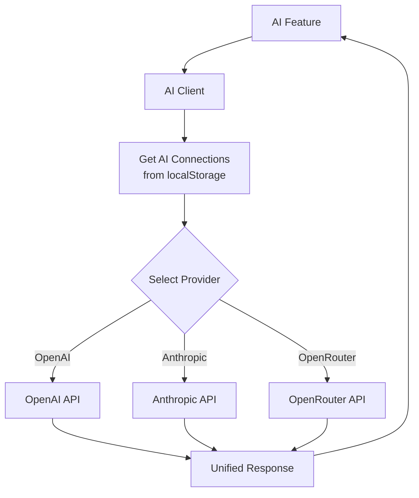

**Key Points:**
- No API keys stored server-side (impossible, no server)
- User manages connections in Settings
- Connections stored in `localStorage` as JSON
- `fetchModelsForConnection()` validates and loads available models
- Last used model cached for convenience

---

## 5. Data Flow Architecture

### 5.1 Data Origins

1. **User Input:**
   - Text typed in TiptapEditor
   - Metadata in forms (project title, entity name, etc.)
   - Selections in dropdowns and dialogs

2. **AI Generation:**
   - Text from AI APIs
   - Streaming responses assembled into messages

3. **File Import:**
   - Project JSON files
   - Full database backup files

### 5.2 Data Transformations

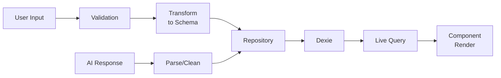

**Transformation Points:**
1. **Form to Entity:** Dialog forms → TypeScript types → Dexie schema
2. **Tiptap to DB:** ProseMirror JSON → `nodes.content` field
3. **AI to Editor:** Text response → Tiptap commands (`insertContent`)
4. **Export:** Dexie records → JSON → Blob → Download

### 5.3 Data Storage Locations

| Data Type | Storage | Rationale |
|-----------|---------|-----------|
| Projects, Nodes, Codex, Snippets | IndexedDB (Dexie) | Large datasets, queryable, persistent |
| Chat Threads, Messages | IndexedDB (Dexie) | Large conversation history |
| AI Connections | `localStorage` | Small config, simple key-value |
| User Preferences (theme, formatting) | Zustand + `localStorage` | Small, frequently accessed |
| Emergency Backups | `localStorage` | Fallback only, temporary |
| Cloud Backups | **Google Drive** | Optional off-site backup, user-controlled |
| Exports | File downloads | User-controlled portability |

### 5.4 Complete Data Flow Diagram

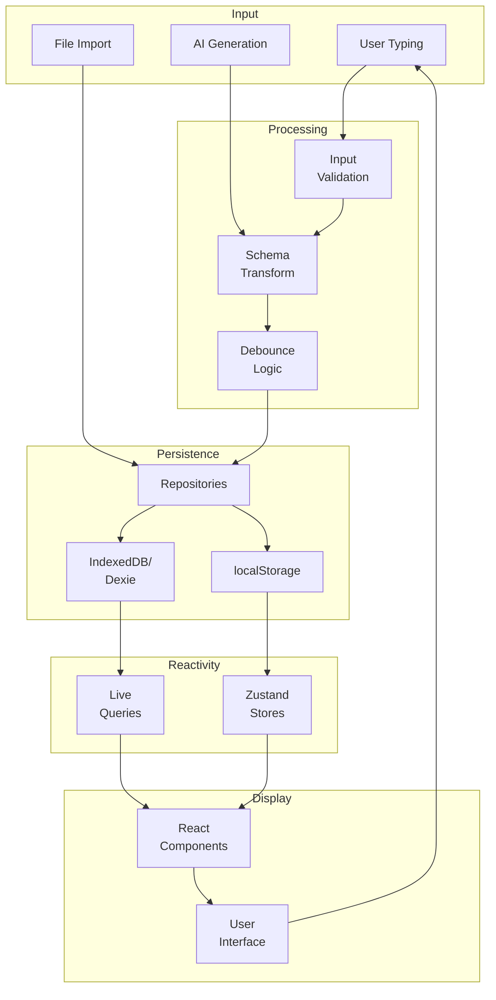

---

## 6. State Management Strategy

### 6.1 State Categories

#### Global UI State (Zustand)

**Stores:**
1. **`use-project-store.ts`**
   - `activeProjectId`
   - `activeSceneId`
   - `viewMode` (plan, write, chat)
   
2. **`use-chat-store.ts`**
   - `activeThreadId`

3. **`use-format-store.ts`**
   - `fontFamily`, `fontSize`, `lineHeight`
   - `typewriterMode`, `showWordCount`
   - Persisted to `localStorage`

**Pattern:**
```typescript
export const useProjectStore = create<ProjectStore>()(
  persist(
    (set) => ({
      activeProjectId: null,
      setActiveProjectId: (id) => set({ activeProjectId: id }),
      // ...
    }),
    { name: 'project-store' }
  )
);
```

#### Persistent Data State (Dexie Live Queries)

**Pattern:**
```typescript
const projects = useLiveQuery(() => db.projects.toArray());
const scenes = useLiveQuery(() => 
  db.nodes
    .where('projectId').equals(projectId)
    .and(n => n.type === 'scene')
    .toArray()
);
```

**Reactivity:**
- Any DB mutation triggers live query re-execution
- Components automatically re-render with fresh data
- No manual state synchronization needed

#### Component-Local State (useState)

**Used for:**
- Form inputs before submission
- Transient UI (dialogs open/closed, tabs)
- Loading states (isGenerating, isSaving)

### 6.2 State Consistency Mechanisms

1. **Single Source of Truth:**
   - DB is truth for persistent data
   - Zustand is truth for UI state
   - Never duplicate data across stores

2. **Debouncing:**
   - Editor: 1-2s debounce before DB write
   - Forms: `useDebounce` hook for auto-save

3. **Save Coordination:**
   - `SaveCoordinator` ensures serialized writes per scene
   - Prevents "last write wins" data loss

4. **Emergency Backup:**
   - If DB write fails, backup to `localStorage`
   - User alerted via toast

### 6.3 State Update Propagation

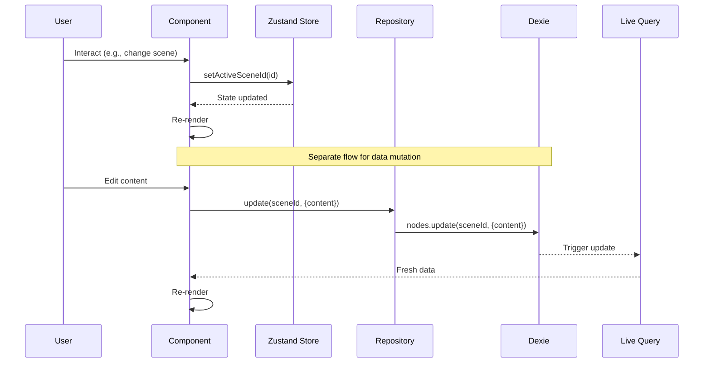

---

## 7. Dependency & Module Interaction Map

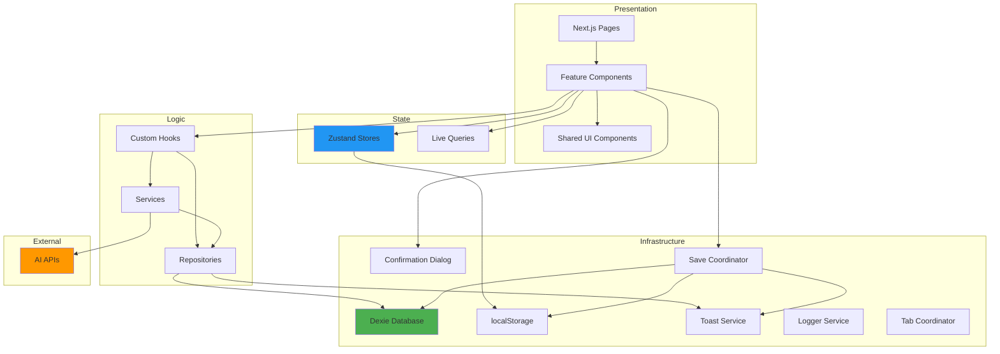

### Coupling Analysis

| Module Pair | Coupling Level | Notes |
|-------------|---------------|-------|
| Components ↔ Repositories | **Loose** | Via hooks, mockable for testing |
| Components ↔ Dexie | **None** | Always go through repositories |
| Repositories ↔ Dexie | **Tight** | Intentional, encapsulates all DB logic |
| Services ↔ AI APIs | **Loose** | Provider-agnostic interface |
| Components ↔ Zustand | **Medium** | Direct hook calls, but stores are modular |

---

## 8. Architectural Decisions & Rationale

### ADR-001: Frontend-Only Architecture

**Context:**
Need for a privacy-focused, offline-first novel writing app.

**Decision:**
Build as a client-side-only web application with no backend server.

**Rationale:**
- **Privacy:** All data stays on user's device
- **Cost:** Zero server/hosting costs
- **Simplicity:** No auth, no server deployment, no API versioning
- **Offline:** Works without internet (except AI features)

**Consequences:**
- ✅ Maximum privacy
- ✅ Zero operational cost
- ✅ Simple deployment (static hosting)
- ❌ No cross-device sync
- ❌ No collaborative editing
- ❌ Limited by browser storage (~1GB typical quota)

---

### ADR-002: IndexedDB (via Dexie) for Storage

**Context:**
Need persistent storage for large manuscripts (hundreds of scenes, thousands of words).

**Decision:**
Use Dexie.js (wrapper for IndexedDB) as primary storage.

**Rationale:**
- **Capacity:** Much larger than `localStorage` (5MB limit)
- **Queryability:** Indexed queries for fast lookups
- **Reactivity:** `dexie-react-hooks` for live queries
- **Schema versioning:** Migration support as schema evolves

**Consequences:**
- ✅ Can handle large projects (millions of words)
- ✅ Fast queries with indexes
- ✅ Automatic UI updates via live queries
- ❌ More complex than `localStorage`
- ❌ Browser compatibility (though wide support now)

---

### ADR-003: Domain-Driven Folder Structure

**Context:**
As features grow, need clear module boundaries.

**Decision:**
Organize by domain/feature, not by technical layer:
```
src/
  features/
    editor/
    chat/
    codex/
    navigation/
    plan/
    snippets/
  lib/core/
  lib/config/
  components/ui/
```

**Rationale:**
- **Cohesion:** All related code (components, hooks, types) in one place
- **Discoverability:** Easy to find feature-specific code
- **Scalability:** Can add features without sprawling file trees

**Consequences:**
- ✅ High feature cohesion
- ✅ Easier to understand feature scope
- ❌ Some code duplication vs. strict layering
- ❌ Risk of circular dependencies if not careful

---

### ADR-004: Repository Pattern for Data Access

**Context:**
Components should not directly call Dexie; need abstraction layer.

**Decision:**
Refine Repository Pattern to separate Interface from Implementation (Clean Architecture).
- `src/domain/repositories/` -> Interfaces (e.g., `INodeRepository`)
- `src/infrastructure/repositories/` -> Implementations (e.g., `DexieNodeRepository`)

**Rationale:**
- **Testability:** Can easily mock repositories for unit tests
- **Flexibility:** Can swap Dexie for another DB if needed (unlikely but good practice)
- **Clarity:** Defines clear contract for data access

**Consequences:**
- ✅ Better separation of concerns
- ✅ Easier testing
- ❌ More boilerplate (Interface + Class + DI)

---

### ADR-005: Google Drive Integration

**Context:**
Users need off-site backup without a dedicated backend server.

**Decision:**
Implement client-side Google Drive integration using OAuth 2.0 PKCE flow.

**Rationale:**
- **Privacy:** User owns the storage and credentials
- **Cost:** Free for us (uses user's Drive quota)
- **Reliability:** Google's infrastructure is reliable

**Consequences:**
- ✅ Cloud backup without server costs
- ✅ User retains control
- ❌ Requires Google Cloud Console setup (Client ID)
- ❌ User must have Google account

**Decision:**
Implement repository pattern as custom hooks:
```typescript
export function useProjectRepository() {
  return {
    getAll: () => db.projects.toArray(),
    get: (id) => db.projects.get(id),
    create: (project) => db.projects.add(project),
    update: (id, changes) => db.projects.update(id, changes),
    delete: (id) => db.projects.delete(id),
  };
}
```

**Rationale:**
- **Abstraction:** Could swap Dexie for another DB without changing components
- **Testability:** Easy to mock repositories in tests
- **Consistency:** Standardized data access patterns

**Consequences:**
- ✅ Decoupled from storage implementation
- ✅ Easier to test
- ❌ Slight verbosity (extra layer)

---

### ADR-005: Zustand for Global UI State

**Context:**
Need lightweight, predictable global state for:
- Active project/scene
- View mode (plan/write/chat)
- User preferences

**Decision:**
Use Zustand instead of Redux or Context API.

**Rationale:**
- **Simplicity:** Less boilerplate than Redux
- **Performance:** Avoids Context re-render issues
- **Persistence:** Built-in `persist` middleware for `localStorage`
- **Hooks-first:** Idiomatic for React

**Consequences:**
- ✅ Clean, minimal API
- ✅ Good performance
- ✅ Easy persistence
- ❌ Less tooling than Redux (no DevTools time-travel)

---

### ADR-006: User-Managed AI Connections

**Context:**
Need AI features but can't afford server-side API proxy.

**Decision:**
Users bring their own API keys, stored in browser `localStorage`.

**Rationale:**
- **Cost:** Zero AI API costs for developer
- **Privacy:** API keys never leave user's device
- **Flexibility:** Users can use any provider (OpenAI, Anthropic, local models)

**Consequences:**
- ✅ Zero AI infrastructure cost
- ✅ Maximum user control
- ❌ Higher barrier to entry (users must get API keys)
- ❌ Risk of key exposure if user's device is compromised

---

### ADR-007: Save Coordinator for Race Condition Prevention

**Context:**
Auto-save and AI-save can conflict, causing data loss.

**Decision:**
Implement `SaveCoordinator` singleton to serialize saves per scene.

**Rationale:**
- **Safety:** Prevents "last write wins" data corruption
- **Reliability:** Queues saves, ensures order
- **Backup:** Fallback to `localStorage` on failure

**Consequences:**
- ✅ No race conditions
- ✅ Emergency backup on failure
- ❌ Adds complexity to save flow

---

## 9. Constraints & Non-Negotiables

### Hard Constraints

1. **No Backend Server**
   - Cannot be changed without fundamentally altering the product
   - All logic must run client-side

2. **Browser Storage Only**
   - IndexedDB + `localStorage` are the only storage options
   - No external databases

3. **User-Managed AI Keys**
   - No server-side API proxying
   - Users must provide their own keys

4. **Single-Device Scope**
   - No cross-device sync
   - No real-time collaboration

### Platform Limitations

1. **IndexedDB Quota:**
   - Varies by browser (~1GB typical, can request more)
   - User may hit quota with very large projects

2. **No Server-Side Processing:**
   - Cannot offload heavy computations
   - All AI processing is request/response (no server cache)

3. **Browser Compatibility:**
   - Must support IndexedDB (IE11 not supported)
   - Modern browsers only (ES6+)

### Performance Constraints

1. **Large Manuscripts:**
   - Loading hundreds of scenes at once may lag
   - Current implementation loads entire project tree (acceptable for most use cases)

2. **AI Response Time:**
   - Depends on user's API provider
   - No control over latency

---

## 10. Known Architectural Weaknesses

### Trade-Offs & Tech Debt

#### 1. No Cross-Device Sync

**Problem:**
Users cannot access their work across devices.

**Mitigation:**
- Export/import feature allows manual transfer
- Full database backup/restore

**Future Consideration:**
- Could add optional cloud sync (e.g., Dropbox, Google Drive)
- Would require significant architecture changes

---

#### 2. Limited Undo/Redo

**Problem:**
Tiptap provides editor-level undo, but no global undo across features.

**Mitigation:**
- Editor undo works within a scene
- Database changes are not undo-able

**Future Consideration:**
- Implement event sourcing or snapshot-based history

---

#### 3. No Conflict Resolution for Concurrent Edits

**Problem:**
If user opens same project in multiple tabs, race conditions possible.

**Mitigation:**
- `SaveCoordinator` helps within a single tab
- Live queries propagate changes, but last write wins

**Future Consideration:**
- Detect multi-tab usage and warn user
- Implement CRDT or OT for conflict-free merges

---

#### 4. AI Context Token Limits Not Enforced

**Problem:**
User can select massive context (entire novel + all codex), may exceed token limits.

**Mitigation:**
- UI hints about context size
- Errors are surfaced from AI API

**Future Consideration:**
- Calculate token counts client-side
- Warn user before submitting

---

#### 5. Search is Client-Side Only

**Problem:**
Full-text search across all scenes done in-memory (Dexie `where` clause).

**Mitigation:**
- Works fine for small-to-medium projects
- IndexedDB is fast locally

**Future Consideration:**
- Add full-text search indexing (e.g., Lunr.js)

---

#### 6. No Automated Backups

**Problem:**
If user clears browser data, everything is lost.

**Mitigation:**
- Export feature prominently placed
- Emergency backup to `localStorage` on save failure

**Future Consideration:**
- Auto-export to user's Downloads folder periodically
- Browser extension for automated cloud backup

---

#### 7. Tight Coupling Between Repositories and Dexie

**Problem:**
Repositories directly use Dexie, making it hard to swap storage.

**Mitigation:**
- Repository pattern provides abstraction layer
- Could theoretically swap Dexie, but would be significant work

**Future Consideration:**
- Define storage interface
- Implement multiple storage backends (IndexedDB, SQLite via WASM)

---

## 11. Extension Guidelines

### Adding a New Feature

1. **Create Feature Directory:**
   ```
   src/features/my-feature/
     components/
     hooks/
     types.ts
   ```

2. **Define Types:**
   - Add to `src/lib/config/types.ts` if shared
   - Or keep in `features/my-feature/types.ts` if local

3. **Create Repository (if needed):**
   ```typescript
   // src/hooks/use-my-feature-repository.ts
   export function useMyFeatureRepository() {
     return {
       getAll: () => db.myFeature.toArray(),
       // ...
     };
   }
   ```

4. **Add Dexie Table (if needed):**
   ```typescript
   // src/lib/core/database.ts
   export const db = new Dexie('BecomeAnAuthor') as BecomeAnAuthorDB;
   db.version(X).stores({
     // ... existing tables
     myFeature: '++id, projectId, createdAt',
   });
   ```

5. **Build UI Components:**
   - Use `useLiveQuery` for reactive data
   - Use Zustand if global UI state needed
   - Follow existing patterns (dialogs, toasts, confirmations)

6. **Test Manually:**
   - Verify IndexedDB schema migration
   - Test export/import includes new data
   - Ensure live queries update correctly

---

### Modifying Data Schema

1. **Increment Dexie Version:**
   ```typescript
   db.version(4).stores({
     nodes: '++id, projectId, parentId, type, order, createdAt',
     // New index added ↑
   });
   ```

2. **Add Migration (if needed):**
   ```typescript
   db.version(4).stores({...}).upgrade(tx => {
     return tx.table('nodes').toCollection().modify(node => {
       node.newField = 'default';
     });
   });
   ```

3. **Update TypeScript Types:**
   - Modify `src/lib/config/types.ts`

4. **Update Repositories:**
   - Adjust CRUD operations if schema changed

5. **Test Migration:**
   - Export data with old schema
   - Upgrade code
   - Verify migration runs on app load

---

### Integrating New AI Provider

1. **Add to AI Vendors Config:**
   ```typescript
   // src/lib/config/ai-vendors.ts
   export const AI_VENDORS: Record<string, AIVendor> = {
     // ... existing
     myProvider: {
       id: 'myProvider',
       name: 'My Provider',
       icon: '🤖',
       requiresAuth: true,
       apiKeyPlaceholder: 'my-api-key',
       setupUrl: 'https://myprovider.com/api-keys',
     },
   };
   ```

2. **Update AI Client:**
   ```typescript
   // src/lib/core/ai-client.ts
   export async function generateText(params) {
     // Add provider-specific logic
     if (connection.provider === 'myProvider') {
       // Call API
     }
   }
   ```

3. **Update Model Fetching:**
   ```typescript
   // src/lib/core/ai-client.ts
   export async function fetchModelsForConnection(conn) {
     if (conn.provider === 'myProvider') {
       // Fetch available models
     }
   }
   ```

4. **Test:**
   - Add connection in Settings
   - Verify models load
   - Test generation in Editor/Chat

---

## 12. Deployment & Build

### Build Process

```bash
npm run build
```

Produces static HTML/CSS/JS in `.next/` (Next.js static export).

### Hosting

**Recommended:**
- Vercel (automatic Next.js support)
- Netlify
- GitHub Pages
- Any static host

**Configuration:**
- No server-side rendering (SSR) – `output: 'export'` in `next.config.js`
- No API routes
- All routes must be static

### Environment Variables

**None required for core app.**

AI features use user-provided API keys (stored in browser).

---

## 13. Summary

**Become An Author** is a **frontend-only, local-first novel writing application** built with:

- **Next.js** for React framework
- **Dexie (IndexedDB)** for persistent storage
- **Zustand** for global UI state
- **Tiptap** for rich text editing
- **User-managed AI connections** for writing assistance

The architecture is designed for:
- **Privacy** (all data local)
- **Offline-first** usage
- **Maintainability** (domain-driven structure)
- **Extensibility** (repository pattern, modular features)

Key architectural decisions prioritize **user control** and **zero operational cost** over features requiring a backend (sync, collaboration).

---

> **This is Architecture Document v1.0 and will be treated as the source of truth for all future technical discussions.**
