# Architecture Document v2.0 – Become An Author

> **This is Architecture Document v2.0 and is the source of truth for all technical discussions.**

---

## 1. Architecture Overview

### System Goals

**Become An Author** is a local-first, browser-based novel writing application designed to provide:
- **Offline-first authoring environment** with zero server dependencies
- **AI-assisted writing** with user-controlled API connections (5 providers)
- **Rich manuscript management** (hierarchical structure: Acts → Chapters → Scenes)
- **World-building tools** (Codex for characters, locations, lore with templates, tags, and relations)
- **Planning and outlining** capabilities with story beats
- **AI-powered story analysis** (synopsis, plot threads, character arcs, timeline, contradictions)
- **Privacy-first design** (all data stays on user's device)

### Key Constraints

1. **Frontend-only architecture** – No backend server (except optional Google Drive integration)
2. **Browser-based persistence** – All data stored in IndexedDB (via Dexie, 16 tables)
3. **Single-device scope** – No cross-device sync (except via manual Google Drive backup)
4. **User-controlled AI** – Users bring their own API keys (OpenRouter, Google, Mistral, OpenAI, Kimi)

---

## 2. High-Level Architecture Diagram

```mermaid
flowchart TB
    subgraph UI["🖥️ Presentation Layer"]
        Pages["Next.js Pages"]
        Features["Feature Components"]
        Shared["Shared UI Components"]
    end
    
    subgraph State["📊 State Management"]
        Zustand["Zustand Stores (3)"]
        LiveQueries["Dexie Live Queries"]
    end
    
    subgraph Domain["🎯 Domain Layer"]
        RepoInterfaces["Repository Interfaces (10)"]
        ServiceInterfaces["Service Interfaces (4)"]
        Entities["Domain Entities (44 types)"]
    end

    subgraph Infrastructure["⚙️ Infrastructure Layer"]
        RepoImpl["Dexie Repositories (10)"]
        ServiceImpl["Services (4)"]
        DI["Dependency Injection"]
        DB["NovelDB (16 tables)"]
    end
    
    subgraph External["🌐 External APIs"]
        AI["AI APIs (5 providers)"]
        Drive["Google Drive API"]
    end
    
    UI --> State
    UI --> Domain
    
    State --> Domain
    
    Infrastructure --> Domain
    Infrastructure --> External
    
    style DB fill:#4CAF50
    style AI fill:#FF9800
    style Drive fill:#34A853
    style Domain fill:#9C27B0
    style Infrastructure fill:#607D8B
```



---

## 2.1 State Management Decision Tree

> **Use this decision tree to determine where to store application state.**

```mermaid
flowchart TD
    Q1{Is it persisted data?}
    Q1 -->|Yes| IndexedDB["💾 IndexedDB via Dexie"]
    Q1 -->|No| Q2{Does it need to survive refresh?}
    
    Q2 -->|Yes| Q3{Is it user preference?}
    Q2 -->|No| ZustandEphemeral["⚡ Zustand ephemeral"]
    
    Q3 -->|Yes| ZustandPersist["🔧 Zustand + localStorage"]
    Q3 -->|No| URL["🔗 URL params"]
    
    IndexedDB --> E1["Projects, Scenes, Codex, Chat"]
    ZustandEphemeral --> E2["isLoading, isGenerating"]
    ZustandPersist --> E3["selectedModel, formatSettings"]
    URL --> E4["projectId, sceneId, activeTab"]
```



### State Location Guide

| State Type | Storage | Example |
|------------|---------|---------|
| **Application data** | IndexedDB | Projects, scenes, codex entries |
| **UI loading states** | Zustand (ephemeral) | `isGenerating`, `isSaving` |
| **User preferences** | Zustand + localStorage | Selected AI model, theme |
| **Navigation state** | URL params | Current project, scene ID |
| **Form draft state** | Component state | Unsaved form inputs |

### Three Zustand Stores

| Store | Purpose | Persistence |
|-------|---------|-------------|
| `useProjectStore` | Current project/scene selection | None (URL drives this) |
| `useChatStore` | Chat UI state (selected thread) | None |
| `useFormatStore` | Editor formatting preferences | localStorage |

---

## 3. Complete Data Flow Architecture


---

## 4. Feature Deep Dives

### 4.1 Editor Feature

The Editor is the core writing interface with AI-assisted features and robust auto-save.

#### Component Architecture


#### Auto-Save Data Flow


#### Key Implementation Patterns

**SaveCoordinator (Singleton):**
```typescript
// Prevents race conditions between auto-save and AI-generated saves
class SaveCoordinator {
    private saveQueue: Map<string, Promise<void>> = new Map();
    
    async scheduleSave(sceneId: string, getContent: () => any) {
        // 1. Wait for existing save to complete
        const existing = this.saveQueue.get(sceneId);
        if (existing) await existing;
        
        // 2. Serialize content (removes Promises/non-serializable)
        const cleanContent = JSON.parse(JSON.stringify(getContent()));
        
        // 3. Save to IndexedDB
        await db.nodes.update(sceneId, { content: cleanContent });
    }
}
```

**useAutoSave Hook:**
```typescript
function useAutoSave(sceneId: string, editor: Editor | null) {
    // 1. Track unsaved changes
    const hasUnsavedChanges = useRef(false);
    
    // 2. Listen to editor updates
    editor.on('update', () => { hasUnsavedChanges.current = true; });
    
    // 3. Interval-based save (not debounce - more reliable)
    setInterval(() => {
        if (hasUnsavedChanges.current) {
            saveCoordinator.scheduleSave(sceneId, () => editor.getJSON());
        }
    }, 1000);
    
    // 4. Emergency backup on unload
    window.addEventListener('beforeunload', () => {
        localStorage.setItem(`emergency_backup_${sceneId}`, ...);
    });
}
```

---

### 4.2 Chat Feature

AI-powered conversation with full manuscript context support.

#### Component Architecture


#### Chat Generation Flow


#### Context Building Implementation


---

### 4.3 Codex Feature

World-building system with templates, tags, and entity relationships.

#### Component Architecture


#### Entity Editor Data Flow


#### Codex Data Model


---

### 4.4 Review/Analysis Feature

AI-powered story analysis with manuscript versioning.

#### Component Architecture


#### Analysis Execution Flow


#### Analysis Types

| Type | Purpose | Output |
|------|---------|--------|
| **Synopsis** | Story summary generation | Overall summary with key themes |
| **Plot Threads** | Track storylines | List of plot lines with status |
| **Character Arcs** | Character development | Arc stages per character |
| **Timeline** | Chronological consistency | Timeline events with potential conflicts |
| **Contradictions** | Logical conflicts | List of inconsistencies with scene refs |
| **Alpha/Beta Reader** | Reader feedback simulation | Simulated reader feedback |

#### Manuscript Version Tracking

```mermaid
flowchart LR
    subgraph Analysis["Stored Analysis"]
        ManuscriptVersion["manuscriptVersion: 12345678"]
        ScenesAnalyzed["scenesAnalyzedCount: 45"]
        WordCount["wordCountAtAnalysis: 25000"]
    end

    subgraph Current["Current Manuscript"]
        CalcVersion["Calculate current version hash"]
        Compare["Compare with stored"]
    end

    subgraph Status["Staleness Check"]
        Fresh["✅ Fresh - versions match"]
        Stale["⚠️ Stale - 5 scenes edited"]
    end

    Analysis --> Compare
    Current --> Compare
    Compare --> Status
```



---

### 4.5 Plan Feature

Visual manuscript planning with multiple view modes.

#### Components (5)

| Component | Purpose |
|-----------|---------|
| `PlanView` | Main planning view container |
| `OutlineView` | Hierarchical outline editor (13KB) |
| `GridView` | Card-based grid layout (11KB) |
| `MatrixView` | Matrix/timeline visualization (9KB) |
| `SceneCard` | Individual scene card component |

---

### 4.6 Settings Feature

Application configuration and AI connection management.

#### Components (4)

| Component | Purpose |
|-----------|---------|
| `SettingsDialog` | Main settings modal (19KB) |
| `AIConnectionsTab` | Manage AI provider connections (18KB) |
| `NewConnectionDialog` | Add new AI connection (10KB) |
| `GoogleDriveConnection` | Google Drive auth & backup settings |

---

### 4.7 Shared Components (`src/features/shared/`)

Cross-feature reusable components.

| Component | Purpose |
|-----------|---------|
| `ContextSelector` | Select manuscript/codex context for AI (11KB) |
| `CreateNodeDialog` | Create new acts/chapters/scenes |
| `ErrorBoundary` | React error boundary wrapper |
| `ThemeProvider` | Theme context provider |

---

### 4.8 Tiptap Editor Extensions (`src/lib/tiptap-extensions/`)

Custom editor capabilities.

| Extension | Purpose |
|-----------|---------|
| `section-node.ts` | Colored section blocks for story structure |
| `slash-commands.ts` | `/` command palette implementation |
| `slash-commands-list.tsx` | Command list UI rendering |

---

### 4.9 Google Integration Services (`src/lib/services/`)

External Google API integration.

| Service | Purpose |
|---------|---------|
| `GoogleAuthService` | OAuth 2.0 PKCE flow (9KB) |
| `GoogleDriveService` | Drive API for backup/restore (8KB) |

---

### 4.10 UI Component Library (`src/components/ui/`)

25 reusable Shadcn/UI primitives:

| Category | Components |
|----------|------------|
| **Dialogs** | `alert-dialog`, `dialog`, `sheet`, `popover` |
| **Forms** | `button`, `input`, `textarea`, `checkbox`, `switch`, `slider`, `radio-group`, `select`, `label` |
| **Layout** | `card`, `tabs`, `separator`, `resizable`, `scroll-area`, `sidebar` |
| **Feedback** | `alert`, `badge`, `skeleton`, `tooltip` |
| **Navigation** | `command`, `dropdown-menu` |

---

### 4.11 Application Components (`src/components/`)

Top-level application components:

| Component | Purpose |
|-----------|---------|
| `TopNavigation` | App-wide navigation bar |
| `ProjectTools` | Project-level toolbar |
| `ErrorBoundary` | Global error handling |
| `MultiTabWarning` | Multi-tab conflict detection |
| `ThemeProvider` | Dark/light mode |
| `ToastProvider` | Toast notification container |
| `ClientToaster` | Client-side toast renderer |
| `AppCleanup` | Cleanup on unmount |

---

## 5. AI Integration Deep Dive

### Provider Architecture


### useAI Hook Usage

```typescript
// Example: Using useAI in a component
const { generate, generateStream, isGenerating, model, setModel } = useAI({
    system: 'You are a creative writing assistant',
    operationName: 'ContinueWriting'
});

// Non-streaming generation
const result = await generate({
    prompt: 'Continue this story...',
    context: sceneContent,
    maxTokens: 500,
    temperature: 0.8
});

// Streaming generation
await generateStream(
    { prompt: 'Write a paragraph...' },
    {
        onChunk: (chunk) => setOutput(prev => prev + chunk),
        onComplete: (fullText) => saveToScene(fullText)
    }
);
```

### Connection Resolution Flow


---

## 6. State Management Patterns

### Zustand Stores


### Live Query Pattern


---

## 7. Hooks Reference

### Repository Hooks (10)

| Hook | Returns | Purpose |
|------|---------|---------|
| `useNodeRepository()` | `INodeRepository` | Manuscript CRUD (Acts, Chapters, Scenes) |
| `useProjectRepository()` | `IProjectRepository` | Project metadata CRUD |
| `useCodexRepository()` | `ICodexRepository` | World-building entity CRUD |
| `useChatRepository()` | `IChatRepository` | Chat threads/messages CRUD |
| `useSnippetRepository()` | `ISnippetRepository` | Text snippet CRUD |
| `useCodexTagRepository()` | `ICodexTagRepository` | Tag management |
| `useCodexTemplateRepository()` | `ICodexTemplateRepository` | Template management |
| `useCodexRelationTypeRepository()` | `ICodexRelationTypeRepository` | Relation type management |

### Utility Hooks (12)

| Hook | Purpose | Example Usage |
|------|---------|---------------|
| `useAutoSave(sceneId, editor)` | Auto-save with emergency backup | In TiptapEditor |
| `useDebounce(value, delay)` | Debounce any value | Form auto-save (1000ms) |
| `useAI(options)` | Unified AI generation | Editor AI features |
| `useConfirmation()` | Confirmation dialogs | Delete confirmations |
| `usePrompt()` | Input prompt dialogs | Rename dialogs |
| `useImportExport()` | Full backup/restore | Data management |
| `useDocumentExport()` | Export DOCX/TXT/MD | Manuscript export |
| `useExportService()` | Access export service | Uses generic factory |
| `useGoogleAuth()` | Google OAuth flow | Drive integration |
| `useGoogleDrive()` | Drive file operations | Backup/restore |
| `useMobile()` | Responsive breakpoint | Mobile detection |
| `useRepository<T>()` | Generic factory hook | Reduces duplication |

### Feature-Specific Hooks (6)

| Hook | Feature | Purpose |
|------|---------|---------|
| `useAnalysisRunner()` | Review | Execute AI analyses |
| `useAnalysisRepository()` | Review | Analysis CRUD |
| `useAnalysisDelete()` | Review | Delete with confirmation |
| `useManuscriptNodes()` | Review | Get manuscript tree |
| `useManuscriptVersion()` | Review | Staleness detection |
| `useSearch()` | Search | Fuzzy search across data |
| `useChatService()` | Chat | AI generation with context |
| `useNodeDeletion()` | Editor | Cascade delete with confirmation |

---

## 8. Database Schema (NovelDB v8)

### Table Overview


### All 16 Tables

| Table | Purpose | Key Indexes |
|-------|---------|-------------|
| `projects` | Project metadata | `id, title, seriesId, archived` |
| `nodes` | Manuscript structure | `id, projectId, parentId, type, order` |
| `codex` | World-building entries | `id, projectId, category, *tags` |
| `series` | Project groupings | `id, title` |
| `snippets` | Reusable text blocks | `id, projectId, pinned` |
| `codexRelations` | Entity relationships | `id, parentId, childId, type` |
| `codexAdditions` | Scene-entity references | `id, sceneId, codexEntryId` |
| `sections` | Colored content blocks | `id, sceneId` |
| `chatThreads` | AI conversation threads | `id, projectId, pinned, archived` |
| `chatMessages` | Individual chat messages | `id, threadId, timestamp` |
| `storyAnalyses` | AI story analyses | `id, projectId, analysisType, manuscriptVersion` |
| `codexTags` | Custom tags | `id, projectId, name, category` |
| `codexEntryTags` | Entry-tag associations | `id, entryId, tagId, [entryId+tagId]` |
| `codexTemplates` | Entity templates | `id, [name+category], isBuiltIn` |
| `codexRelationTypes` | Relationship type definitions | `id, [name+category], isBuiltIn` |

---

## 9. Dependency Injection

### DI Architecture


### Using DI in Components

```typescript
// In a feature hook
function useAnalysisRunner() {
    const { analysisService } = useAppServices();
    
    const runAnalysis = async (projectId, scope, types, model) => {
        return await analysisService.runAnalysis(projectId, scope, types, model);
    };
    
    return { runAnalysis };
}
```

---

## 10. Core Utilities (`src/lib/`)

### Utility Modules

| Module | Purpose |
|--------|---------|
| `ai-client.ts` | Multi-provider AI routing with streaming |
| `ai-service.ts` | AI service abstraction layer |
| `ai-utils.ts` | AI helper functions |
| `context-assembler.ts` | Assembles manuscript context for AI prompts |
| `context-engine.ts` | Context optimization engine |
| `search-service.ts` | Fuse.js-based fuzzy search |
| `prompt-templates.ts` | 8 chat prompt templates |
| `token-counter.ts` | Token estimation for context limits |
| `streaming-utils.ts` | SSE streaming utilities |
| `retry-utils.ts` | Retry logic with backoff |
| `logger.ts` | Structured logging service |
| `toast-service.ts` | Centralized toast notifications |
| `safe-storage.ts` | Safe localStorage wrapper |
| `tab-coordinator.ts` | Multi-tab synchronization |

### Prompt Templates (8)

| ID | Name | Purpose |
|----|------|---------|
| `general` | Creative Partner | Collaborative brainstorming |
| `character` | Psychologist & Biographer | Deep character analysis |
| `plot` | Master Architect | Structural plot analysis |
| `scene` | Cinematographer & Director | Scene construction |
| `prose` | Ruthless Editor | Line-level improvements |
| `worldbuilding` | Historian & Geographer | World consistency |
| `brainstorm` | The Idea Generator | Divergent thinking |
| `critique` | The Critical Reviewer | Honest feedback |

### Domain Services

| Service | Location | Purpose |
|---------|----------|---------|
| `NodeDeletionService` | `domain/services/` | Cascade delete with confirmation |
| `IAnalysisService` | `domain/services/` | AI story analysis interface |
| `IChatService` | `domain/services/` | Chat generation interface |
| `IExportService` | `domain/services/` | Document export interface |

### Infrastructure Services

| Service | Purpose |
|---------|---------|
| `AnalysisService` | AI-powered story analysis (6 types) |
| `DexieChatService` | Chat with context building |
| `DocumentExportService` | DOCX/TXT/MD export |
| `CodexSeedService` | Initialize built-in templates/relation types |

---

## 11. Extension Guidelines

### Adding a New Feature

```mermaid
flowchart TB
    Step1["1. Create feature directory"]
    Step2["2. Define repository interface"]
    Step3["3. Implement Dexie repository"]
    Step4["4. Create repository hook"]
    Step5["5. Add Dexie table (increment version)"]
    Step6["6. Build components with hooks"]
    Step7["7. Update imports/exports"]

    Step1 --> Step2 --> Step3 --> Step4 --> Step5 --> Step6 --> Step7
```

### Adding a New AI Provider

```mermaid
flowchart TB
    Step1["1. Add to AI_VENDORS config"]
    Step2["2. Implement generateWithProvider()"]
    Step3["3. Implement streamWithProvider()"]
    Step4["4. Add to fetchModelsForConnection()"]
    Step5["5. Add key validation in validateApiKey()"]
    Step6["6. Test in Settings UI"]

    Step1 --> Step2 --> Step3 --> Step4 --> Step5 --> Step6
```

---

## 12. Current Architecture Metrics

| Metric | Value | Status |
|--------|-------|---------|
| **Source Files** | **215** | ✅ |
| Features | 15 | ✅ |
| Feature Sections Documented | **11** | ✅ |
| Hooks | **31** | ✅ (+3 new) |
| Database Tables | **17** | ✅ (+1 emergencyBackups) |
| Repository Interfaces | 10 | ✅ |
| Repository Implementations | **10** | ✅ |
| Domain Services | **4** | ✅ |
| Infrastructure Services | **8** | ✅ (+4 new) |
| AI Providers | 5 | ✅ |
| Prompt Templates | 8 | ✅ |
| Type Definitions | 44 | ✅ |
| Domain Entities Location | `domain/entities/` | ✅ Relocated |
| Core Utility Modules | 14 | ✅ |
| UI Components | **25** | ✅ |
| Tiptap Extensions | **3** | ✅ |
| Google Services | **2** | ✅ |
| Cross-Feature Dependencies | 0 | ✅ Clean |
| Direct DB Access | 0 | ✅ All via repositories |
| Circular Dependencies | 0 | ✅ Clean |
| DI Pattern | Lazy Loading | ✅ Proxy-based |

---

## 13. Documentation Index

- [dependency_analysis.md](./dependency_analysis.md) - Comprehensive dependency analysis
- [MIGRATIONS.md](./MIGRATIONS.md) - Database migration guide
- [maintenance.md](./maintenance.md) - Ongoing maintenance log
- [troubleshooting.md](./troubleshooting.md) - Common issues and solutions
- [security.md](./security.md) - Security patterns and error handling

---

**Document Version**: v2.3  
**Last Updated**: 2025-12-05  
**Verified**: All 215 source files audited against documentation  
**Status**: Active - Source of Truth for Technical Decisions
