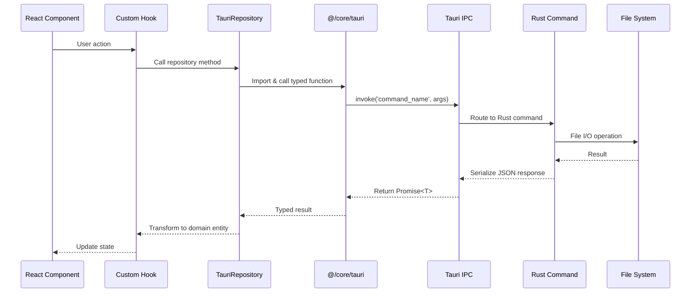

# Backend-Frontend Integration Audit

> [!IMPORTANT]  
> **Comprehensive audit of the Tauri IPC boundary between Rust backend and TypeScript frontend.**  
> Last audited: 2026-02-05

---

## Executive Summary

This document provides an exhaustive audit of how the **Rust backend** (Tauri v2) connects to the **TypeScript frontend** (Next.js 16) in the "Become An Author" application.

### Key Statistics
- **112 Tauri Commands** registered in `backend/src/lib.rs`
- **19 Backend Modules** (`project.rs`, `scene.rs`, `codex.rs`, `chat.rs`, `preset.rs`, etc.)
- **18 Frontend Repository Interfaces** in `frontend/domain/repositories/`
- **18 Tauri Repository Implementations** in `frontend/infrastructure/repositories/`
- **1 Commands Wrapper Module** in `frontend/core/tauri/commands.ts` (711 lines)

### Architecture Pattern
Frontend repositories DO NOT call `invoke()` directly. Instead:
1. Repository implementations import functions from `@/core/tauri` wrapper
2. Wrapper module (`commands.ts`) wraps all `invoke()` calls with TypeScript types
3. Repositories maintain a clean abstraction layer

---

## 1. IPC Communication Architecture

### 1.1 Communication Flow



### 1.2 Abstraction Layers

| Layer | Location | Responsibility |
|-------|----------|----------------|
| **UI Components** | `app/`, `features/*/components/` | User interaction |
| **Custom Hooks** | `hooks/` | Business logic orchestration |
| **Domain Repositories** | `domain/repositories/I*.ts` | Interface definitions |
| **Tauri Repositories** | `infrastructure/repositories/Tauri*.ts` | Implementation (calls wrapper) |
| **Commands Wrapper** | `core/tauri/commands.ts` | Type-safe `invoke()` wrapper |
| **Tauri IPC** | `@tauri-apps/api/core` | IPC bridge |
| **Command Router** | `backend/src/lib.rs` | Routes commands to modules |
| **Command Modules** | `backend/src/commands/*.rs` | Business logic |
| **File System** | OS file system | Data persistence |

---

## 2. Complete Command Inventory

### 2.1 Project Commands (11 commands)

| Tauri Command | Rust Module | Wrapper Function | Repository | Parameters | Return Type |
|---------------|-------------|------------------|------------|------------|-------------|
| `get_projects_path` | `project.rs` | `getProjectsPath()` | `TauriProjectRepository` | None | `string` |
| `list_projects` | `project.rs` | `listProjects()` | `TauriProjectRepository` | None | `ProjectMeta[]` |
| `create_project` | `project.rs` | `createProject()` | `TauriProjectRepository` | `title, author, customPath` | `ProjectMeta` |
| `delete_project` | `project.rs` | `deleteProject()` | `TauriProjectRepository` | `projectPath` | `void` |
| `update_project` | `project.rs` | `updateProject()` | `TauriProjectRepository` | `projectPath, updates` | `ProjectMeta` |
| `archive_project` | `project.rs` | `archiveProject()` | `TauriProjectRepository` | `projectPath` | `ProjectMeta` |
| `get_structure` | `project.rs` | `getStructure()` | `TauriNodeRepository` | `projectPath` | `StructureNode[]` |
| `save_structure` | `project.rs` | `saveStructure()` | `TauriNodeRepository` | `projectPath, structure` | `void` |
| `create_node` | `project.rs` | `createNode()` | `TauriNodeRepository` | `projectPath, parentId, nodeType, title` | `StructureNode` |
| `rename_node` | `project.rs` | N/A (unused) | N/A | `projectPath, nodeId, newTitle` | `void` |
| `delete_node` | `project.rs` | N/A (unused) | N/A | `projectPath, nodeId` | `void` |

### 2.2 Scene Commands (4 commands)

| Tauri Command | Rust Module | Wrapper Function | Repository | Parameters | Return Type |
|---------------|-------------|------------------|------------|------------|-------------|
| `load_scene` | `scene.rs` | `loadScene()` | `TauriNodeRepository` | `projectPath, sceneFile` | `Scene` |
| `save_scene` | `scene.rs` | `saveScene()` | `TauriNodeRepository` | `projectPath, sceneFile, content, title?` | `SceneMeta` |
| `save_scene_by_id` | `scene.rs` | N/A (called via direct `invoke` in `save-coordinator.ts`) | SaveCoordinator | `projectPath, sceneId, content, wordCount` | `SceneMeta` |
| `delete_scene` | `scene.rs` | `deleteScene()` | `TauriNodeRepository` | `projectPath, sceneFile` | `void` |

### 2.3 Codex Commands (21 commands)

| Tauri Command | Rust Module | Wrapper Function | Repository | Parameters | Return Type |
|---------------|-------------|------------------|------------|------------|-------------|
| **Entries** |
| `list_codex_entries` | `codex.rs` | `listCodexEntries()` | `TauriCodexRepository` | `projectPath, category?` | `CodexEntry[]` |
| `save_codex_entry` | `codex.rs` | `saveCodexEntry()` | `TauriCodexRepository` | `projectPath, entry` | `void` |
| `delete_codex_entry` | `codex.rs` | `deleteCodexEntry()` | `TauriCodexRepository` | `projectPath, category, entryId` | `void` |
| **Relations** |
| `list_codex_relations` | `codex.rs` | `listCodexRelations()` | `TauriCodexRelationRepository` | `projectPath` | `CodexRelation[]` |
| `save_codex_relation` | `codex.rs` | `saveCodexRelation()` | `TauriCodexRelationRepository` | `projectPath, relation` | `void` |
| `delete_codex_relation` | `codex.rs` | `deleteCodexRelation()` | `TauriCodexRelationRepository` | `projectPath, relationId` | `void` |
| **Tags** |
| `list_codex_tags` | `codex.rs` | `listCodexTags()` | `TauriCodexTagRepository` | `projectPath` | `CodexTag[]` |
| `save_codex_tag` | `codex.rs` | `saveCodexTag()` | `TauriCodexTagRepository` | `projectPath, tag` | `void` |
| `delete_codex_tag` | `codex.rs` | `deleteCodexTag()` | `TauriCodexTagRepository` | `projectPath, tagId` | `void` |
| **Entry Tags** |
| `list_codex_entry_tags` | `codex.rs` | `listCodexEntryTags()` | Used in features | `projectPath` | `CodexEntryTag[]` |
| `save_codex_entry_tag` | `codex.rs` | `saveCodexEntryTag()` | Used in features | `projectPath, entryTag` | `void` |
| `delete_codex_entry_tag` | `codex.rs` | `deleteCodexEntryTag()` | Used in features | `projectPath, entryTagId` | `void` |
| **Templates** |
| `list_codex_templates` | `codex.rs` | `listCodexTemplates()` | `TauriCodexTemplateRepository` | `projectPath` | `CodexTemplate[]` |
| `save_codex_template` | `codex.rs` | `saveCodexTemplate()` | `TauriCodexTemplateRepository` | `projectPath, template` | `void` |
| `delete_codex_template` | `codex.rs` | `deleteCodexTemplate()` | `TauriCodexTemplateRepository` | `projectPath, templateId` | `void` |
| **Relation Types** |
| `list_codex_relation_types` | `codex.rs` | `listCodexRelationTypes()` | `TauriCodexRelationTypeRepository` | `projectPath` | `CodexRelationType[]` |
| `save_codex_relation_type` | `codex.rs` | `saveCodexRelationType()` | `TauriCodexRelationTypeRepository` | `projectPath, relationType` | `void` |
| `delete_codex_relation_type` | `codex.rs` | `deleteCodexRelationType()` | `TauriCodexRelationTypeRepository` | `projectPath, typeId` | `void` |
| **Scene Links** |
| `list_scene_codex_links` | `codex.rs` | `listSceneCodexLinks()` | `TauriSceneCodexLinkRepository` | `projectPath` | `SceneCodexLink[]` |
| `save_scene_codex_link` | `codex.rs` | `saveSceneCodexLink()` | `TauriSceneCodexLinkRepository` | `projectPath, link` | `void` |
| `delete_scene_codex_link` | `codex.rs` | `deleteSceneCodexLink()` | `TauriSceneCodexLinkRepository` | `projectPath, linkId` | `void` |

### 2.4 Chat Commands (7 commands)

| Tauri Command | Rust Module | Wrapper Function | Repository | Parameters | Return Type |
|---------------|-------------|------------------|------------|------------|-------------|
| `list_chat_threads` | `chat.rs` | `listChatThreads()` | `TauriChatRepository` | `projectPath` | `ChatThread[]` |
| `get_chat_thread` | `chat.rs` | `getChatThread()` | `TauriChatRepository` | `projectPath, threadId` | `ChatThread \| null` |
| `create_chat_thread` | `chat.rs` | `createChatThread()` | `TauriChatRepository` | `projectPath, thread` | `ChatThread` |
| `update_chat_thread` | `chat.rs` | `updateChatThread()` | `TauriChatRepository` | `projectPath, threadId, updates` | `void` |
| `delete_chat_thread` | `chat.rs` | `deleteChatThread()` | `TauriChatRepository` | `projectPath, threadId` | `void` |
| `get_chat_messages` | `chat.rs` | `getChatMessages()` | `TauriChatRepository` | `projectPath, threadId` | `ChatMessage[]` |
| `create_chat_message` | `chat.rs` | `createChatMessage()` | `TauriChatRepository` | `projectPath, message` | `ChatMessage` |
| `delete_chat_message` | `chat.rs` | `deleteChatMessage()` | `TauriChatRepository` | `projectPath, threadId, messageId` | `void` |

### 2.5 Analysis Commands (3 commands)

| Tauri Command | Rust Module | Wrapper Function | Repository | Parameters | Return Type |
|---------------|-------------|------------------|------------|------------|-------------|
| `list_analyses` | `analysis.rs` | `listAnalyses()` | `TauriAnalysisRepository` | `projectPath` | `Analysis[]` |
| `save_analysis` | `analysis.rs` | `saveAnalysis()` | `TauriAnalysisRepository` | `projectPath, analysis` | `void` |
| `delete_analysis` | `analysis.rs` | `deleteAnalysis()` | `TauriAnalysisRepository` | `projectPath, analysisId` | `void` |

### 2.6 Snippet Commands (3 commands)

| Tauri Command | Rust Module | Wrapper Function | Repository | Parameters | Return Type |
|---------------|-------------|------------------|------------|------------|-------------|
| `list_snippets` | `snippet.rs` | `listSnippets()` | `TauriSnippetRepository` | `projectPath` | `Snippet[]` |
| `save_snippet` | `snippet.rs` | `saveSnippet()` | `TauriSnippetRepository` | `projectPath, snippet` | `void` |
| `delete_snippet` | `snippet.rs` | `deleteSnippet()` | `TauriSnippetRepository` | `projectPath, snippetId` | `void` |

### 2.7 Backup Commands (4 commands)

| Tauri Command | Rust Module | Wrapper Function | Usage | Parameters | Return Type |
|---------------|-------------|------------------|-------|------------|-------------|
| `save_emergency_backup` | `backup.rs` | N/A | Direct in features | `backup` | `void` |
| `get_emergency_backup` | `backup.rs` | N/A | Direct in features | `sceneId` | `EmergencyBackup \| null` |
| `delete_emergency_backup` | `backup.rs` | N/A | Direct in features | `backupId` | `void` |
| `cleanup_emergency_backups` | `backup.rs` | N/A | Direct in features | None | `number` |

### 2.8 Export/Import Commands (3 commands)

| Tauri Command | Rust Module | Wrapper Function | Usage | Parameters | Return Type |
|---------------|-------------|------------------|-------|------------|-------------|
| `export_manuscript_text` | `backup.rs` | `exportManuscriptText()` | Direct in features | `projectPath` | `string` |
| `export_project_backup` | `backup.rs` | `exportProjectBackup()` | Direct in features | `projectPath, outputPath` | `void` |
| `import_project_backup` | `backup.rs` | N/A | Direct in features | `backupJson` | `ProjectMeta` |

### 2.9 Search Command (1 command)

| Tauri Command | Rust Module | Wrapper Function | Usage | Parameters | Return Type |
|---------------|-------------|------------------|-------|------------|-------------|
| `search_project` | `search.rs` | `searchProject()` | Direct in features | `projectPath, query` | `SearchResult[]` |

### 2.10 Trash Commands (5 commands)

| Tauri Command | Rust Module | Wrapper Function | Usage | Parameters | Return Type |
|---------------|-------------|------------------|-------|------------|-------------|
| `move_to_trash` | `trash.rs` | N/A | Direct in features | `projectPath, itemId, itemType, trashMeta` | `void` |
| `restore_from_trash` | `trash.rs` | N/A | Direct in features | `projectPath, itemId, itemType` | `void` |
| `list_trash` | `trash.rs` | N/A | Direct in features | `projectPath` | `JSON[]` |
| `permanent_delete` | `trash.rs` | N/A | Direct in features | `projectPath, itemId, itemType` | `void` |
| `empty_trash` | `trash.rs` | N/A | Direct in features | `projectPath` | `void` |

### 2.11 Series Commands (4 commands)

| Tauri Command | Rust Module | Wrapper Function | Repository | Parameters | Return Type |
|---------------|-------------|------------------|------------|------------|-------------|
| `list_series` | `series.rs` | `listSeries()` | `TauriSeriesRepository` | None | `Series[]` |
| `create_series` | `series.rs` | `createSeries()` | `TauriSeriesRepository` | `series` | `Series` |
| `update_series` | `series.rs` | `updateSeries()` | `TauriSeriesRepository` | `seriesId, updates` | `void` |
| `delete_series` | `series.rs` | `deleteSeries()` | `TauriSeriesRepository` | `seriesId` | `void` |

### 2.12 Security Commands (4 commands)

| Tauri Command | Rust Module | Wrapper Function | Usage | Parameters | Return Type |
|---------------|-------------|------------------|-------|------------|-------------|
| `security::store_api_key` | `security.rs` | N/A | Direct in hooks | `provider, key` | `void` |
| `security::get_api_key` | `security.rs` | N/A | Direct in hooks | `provider` | `string \| null` |
| `security::delete_api_key` | `security.rs` | N/A | Direct in hooks | `provider` | `void` |
| `security::list_api_key_providers` | `security.rs` | N/A | Direct in hooks | None | `string[]` |

### 2.13 Utility Commands (1 command)

| Tauri Command | Rust Module | Wrapper Function | Usage | Parameters | Return Type |
|---------------|-------------|------------------|-------|------------|-------------|
| `get_app_info` | `lib.rs` | `getAppInfo()` | Direct in features | None | `AppInfo` |

---

## 3. Repository Implementations (Frontend → Backend Mapping)

### 3.1 TauriProjectRepository

**Interface**: `IProjectRepository`  
**Location**: `frontend/infrastructure/repositories/TauriProjectRepository.ts`

| Method | Tauri Commands Used | Data Transformation |
|--------|---------------------|---------------------|
| `get(id)` | `listProjects()` | Converts `ProjectMeta.created_at` (string) → `Project.createdAt` (number) |
| `getAll()` | `listProjects()` | Maps `ProjectMeta[]` → `Project[]` |
| `create(params)` | `createProject()` | Stores `_tauriPath` in returned object for later use |
| `update(id, updates)` | `listProjects()`, `updateProject()` | Finds project by ID, then updates by path |
| `archive(id)` | `listProjects()`, `archiveProject()` | Finds project by ID, then archives by path |
| `delete(id)` | `listProjects()`, `deleteProject()` | Finds project by ID, then deletes by path |

**Key Pattern**: Frontend uses IDs, backend uses file paths. Repository translates between them.

### 3.2 TauriNodeRepository

**Interface**: `INodeRepository`  
**Location**: `frontend/infrastructure/repositories/TauriNodeRepository.ts` (307 lines)

| Method | Tauri Commands Used | Data Transformation |
|--------|---------------------|---------------------|
| `get(id)` | `getStructure()`, `loadScene()` | Flattens tree → array, loads scene content, parses JSON |
| `getByProject(projectId)` | `getStructure()` | Flattens tree → array with all nodes |
| `getByParent(projectId, parentId)` | `getStructure()` | Filters children by parent ID |
| `create(node)` | `createNode()` | Creates node in backend, returns transformed node |
| `update(id, data)` | `getStructure()`, `saveScene()`, `saveStructure()` | Updates content (saves scene) OR title (updates structure) |
| `delete(id)` | `getStructure()`, `deleteScene()`, `saveStructure()` | Removes from structure, deletes file if scene |
| `deleteCascade(id, type)` | `getStructure()`, `deleteScene()`, `saveStructure()` | Recursively deletes all child scenes |

**Key Pattern**: Maintains `currentProjectPath` in module scope (set by `TauriProjectRepository`).

**Critical Detail**: Scene content is stored as **stringified JSON** in Markdown files. The repository parses it:
```typescript
let parsedContent = typeof scene.content === 'string'
    ? JSON.parse(scene.content)  // Parse if string
    : scene.content;              // Use as-is if object
```

### 3.3 TauriCodexRepository

**Interface**: `ICodexRepository`  
**Location**: `frontend/infrastructure/repositories/TauriCodexRepository.ts`

| Method | Tauri Commands Used | Data Transformation |
|--------|---------------------|---------------------|
| `get(id)` | `listCodexEntries()` | Filters entries by ID |
| `getByProject(projectId)` | `listCodexEntries()` | Returns all entries |
| `getByCategory(projectId, category)` | `listCodexEntries(category)` | Filters by category |
| `search(projectId, query)` | `listCodexEntries()` | Client-side fuzzy search on name/aliases |
| `create(entry)` | `saveCodexEntry()` | Generates UUID, sets timestamps |
| `update(id, data)` | `get()`, `saveCodexEntry()` | Merges with existing entry |
| `delete(id)` | `get()`, `deleteCodexEntry()` | Gets entry to find category, then deletes |

**Key Pattern**: All methods call `invalidateQueries()` after mutations to trigger UI refresh.

### 3.4 TauriChatRepository

**Interface**: `IChatRepository`  
**Location**: `frontend/infrastructure/repositories/TauriChatRepository.ts`

| Method | Tauri Commands Used |
|--------|---------------------|
| `getThreads(projectId)` | `listChatThreads()` |
| `getThread(threadId)` | `getChatThread()` |
| `createThread(data)` | `createChatThread()` |
| `updateThread(threadId, data)` | `updateChatThread()` |
| `deleteThread(threadId)` | `deleteChatThread()` |
| `getMessages(threadId)` | `getChatMessages()` |
| `createMessage(message)` | `createChatMessage()` |
| `deleteMessage(threadId, messageId)` | `deleteChatMessage()` |

**Key Pattern**: Direct 1:1 mapping to backend commands.

### 3.5 TauriAnalysisRepository

**Interface**: `IAnalysisRepository`  
**Location**: `frontend/infrastructure/repositories/TauriAnalysisRepository.ts`

| Method | Tauri Commands Used |
|--------|---------------------|
| `getAll(projectId)` | `listAnalyses()` |
| `get(id)` | `listAnalyses()` + filter |
| `create(analysis)` | `saveAnalysis()` |
| `update(id, data)` | `get()`, `saveAnalysis()` |
| `delete(id)` | `deleteAnalysis()` |

### 3.6 TauriSnippetRepository

**Interface**: `ISnippetRepository`  
**Location**: `frontend/infrastructure/repositories/TauriSnippetRepository.ts`

| Method | Tauri Commands Used |
|--------|---------------------|
| `getAll(projectId)` | `listSnippets()` |
| `get(id)` | `listSnippets()` + filter |
| `create(snippet)` | `saveSnippet()` |
| `update(id, data)` | `get()`, `saveSnippet()` |
| `delete(id)` | `deleteSnippet()` |

### 3.7 TauriSeriesRepository

**Interface**: `ISeriesRepository`  
**Location**: `frontend/infrastructure/repositories/TauriSeriesRepository.ts`

| Method | Tauri Commands Used |
|--------|---------------------|
| `getAll()` | `listSeries()` |
| `get(id)` | `listSeries()` + filter |
| `create(series)` | `createSeries()` |
| `update(id, data)` | `updateSeries()` |
| `delete(id)` | `deleteSeries()` |

### 3.8-3.12 Codex Sub-Repositories

All follow the same pattern:

| Repository | Commands Used |
|------------|---------------|
| `TauriCodexRelationRepository` | `list_codex_relations`, `save_codex_relation`, `delete_codex_relation` |
| `TauriCodexTagRepository` | `list_codex_tags`, `save_codex_tag`, `delete_codex_tag` |
| `TauriCodexTemplateRepository` | `list_codex_templates`, `save_codex_template`, `delete_codex_template` |
| `TauriCodexRelationTypeRepository` | `list_codex_relation_types`, `save_codex_relation_type`, `delete_codex_relation_type` |
| `TauriSceneCodexLinkRepository` | `list_scene_codex_links`, `save_scene_codex_link`, `delete_scene_codex_link` |

---

## 4. Data Type Mappings (Rust ↔ TypeScript)

### 4.1 Primitive Type Mappings

| Rust Type | JSON Serialization | TypeScript Type |
|-----------|-------------------|-----------------|
| `String` | `"text"` | `string` |
| `i32`, `i64` | `123` | `number` |
| `bool` | `true` / `false` | `boolean` |
| `Vec<T>` | `[...]` | `T[]` |
| `Option<T>` | `null` / `value` | `T \| null` / `T \| undefined` |
| `HashMap<String, String>` | `{"key": "value"}` | `Record<string, string>` |
| `serde_json::Value` | Any JSON | `any` |

### 4.2 Timestamp Conventions

**Rust**:
```rust
chrono::Utc::now().to_rfc3339()  // "2025-01-20T10:30:00Z"
```

**TypeScript**:
```typescript
Date.now()  // 1705747800000 (milliseconds since epoch)
```

**Conversion** (in `TauriProjectRepository`):
```typescript
createdAt: new Date(meta.created_at).getTime()  // String → Number
```

### 4.3 Complex Type Mappings

#### ProjectMeta

| Rust (`models/project.rs`) | TypeScript (`core/tauri/commands.ts`) |
|------------------------------|----------------------------------------|
| `id: String` | `id: string` |
| `title: String` | `title: string` |
| `author: String` | `author: string` |
| `path: String` | `path: string` |
| `archived: bool` | `archived: boolean` |
| `created_at: String` (RFC3339) | `created_at: number` (timestamp) |
| `updated_at: String` (RFC3339) | `updated_at: number` (timestamp) |

#### CodexEntry

| Rust (`models/codex.rs`) | TypeScript (`domain/entities/types.ts`) |
|---------------------------|------------------------------------------|
| `id: String` | `id: string` |
| `category: String` | `category: CodexCategory` |
| `aliases: Vec<String>` | `aliases: string[]` |
| `attributes: HashMap<String, String>` | `attributes: Record<string, string>` |
| `custom_details: Option<serde_json::Value>` | `customDetails?: any` |
| `created_at: i64` | `createdAt: number` |

**Key Difference**: Field naming conventions (`snake_case` in Rust, `camelCase` in TypeScript) handled by `#[serde(rename = "...")]`.

---

## 5. State Management Patterns

### 5.1 Project Path State

**Problem**: Backend commands require `projectPath`, but frontend uses `projectId`.

**Solution**: `TauriNodeRepository` maintains module-level state:

```typescript
// TauriNodeRepository.ts
let currentProjectPath: string | null = null;

export function setCurrentProjectPath(path: string | null) {
    currentProjectPath = path;
}
```

**Lifecycle**:
1. User opens project → `TauriProjectRepository.get(id)` finds `_tauriPath`
2. Calls `setCurrentProjectPath(path)`
3. All subsequent `TauriNodeRepository` calls use cached path

### 5.2 Cache Invalidation

**Pattern**: After mutations, repositories call `invalidateQueries()`:

```typescript
// TauriCodexRepository.ts
await save CodexEntry(projectPath, newEntry);
const { invalidateQueries } = await import('@/hooks/use-live-query');
invalidateQueries();  // ✅ Triggers UI refresh
```

**Mechanism**: `use-live-query` hook provides cache invalidation for all queries.

---

## 6. Error Handling Patterns

### 6.1 Rust Error Handling

All commands return `Result<T, String>`:

```rust
#[tauri::command]
pub fn load_scene(project_path: String, scene_file: String) -> Result<Scene, String> {
    let content = fs::read_to_string(&file_path)
        .map_err(|e| e.to_string())?;  // Convert error to string
    // ...
    Ok(scene)
}
```

### 6.2 TypeScript Error Handling

Wrapper functions return `Promise<T>` that can reject:

```typescript
export async function loadScene(projectPath: string, sceneFile: string): Promise<Scene> {
    return invoke<Scene>('load_scene', { projectPath, sceneFile });
    // If Rust returns Err, this promise rejects
}
```

Repositories catch and log errors:

```typescript
async getAll(): Promise<Project[]> {
    try {
        const projects = await listProjects();
        return projects.map(projectMetaToProject);
    } catch (error) {
        console.error('Failed to list projects:', error);
        return [];  // Graceful degradation
    }
}
```

---

## 7. File Format Specifications

### 7.1 Scene Files (Markdown + YAML)

**File**: `manuscript/{uuid}.md`

**Format**:
```markdown
---
id: "550e8400-e29b-41d4-a716-446655440000"
title: "Chapter 1"
order: 0
status: "draft"
wordCount: 1247
createdAt: "2025-01-20T10:30:00Z"
updatedAt: "2025-01-20T12:45:00Z"
---

{"type":"doc","content":[{"type":"paragraph","content":[{"type":"text","text":"John woke..."}]}]}
```

**Parsing** (`backend/src/commands/scene.rs`):
```rust
let parts: Vec<&str> = content.splitn(3, "---").collect();
let yaml_str = parts[1].trim();  // YAML frontmatter
let body = parts[2].trim();       // JSON content
```

### 7.2 Project Metadata

**File**: `.meta/project.json`

```json
{
  "id": "550e8400...",
  "title": "My Novel",
  "author": "John Doe",
  "description": "",
  "path": "/Users/john/BecomeAnAuthor/Projects/my-novel",
  "archived": false,
  "created_at": "2025-01-20T10:30:00Z",
  "updated_at": "2025-01-20T10:30:00Z"
}
```

### 7.3 Structure File

**File**: `.meta/structure.json`

```json
[
  {
    "id": "act-1",
    "type": "act",
    "title": "Act I",
    "order": 0,
    "children": [
      {
        "id": "chapter-1",
        "type": "chapter",
        "title": "Chapter 1",
        "order": 0,
        "children": [
          {
            "id": "550e8400...",
            "type": "scene",
            "title": "Opening",
            "order": 0,
            "file": "550e8400-e29b-41d4-a716-446655440000.md",
            "children": []
          }
        ]
      }
    ]
  }
]
```

### 7.4 Codex Entry

**File**: `codex/characters/{uuid}.json`

```json
{
  "id": "char-uuid",
  "projectId": "project-uuid",
  "name": "John Doe",
  "category": "character",
  "aliases": ["JD", "Johnny"],
  "description": "Protagonist",
  "attributes": {
    "age": "35",
    "occupation": "Detective"
  },
  "tags": ["main", "pov"],
  "createdAt": 1705747800000,
  "updatedAt": 1705747800000
}
```

---

## 8. Security Patterns

### 8.1 API Key Storage

**Backend** (`security.rs`):
```rust
use keyring::Entry;

#[tauri::command]
pub fn store_api_key(provider: String, key: String) -> Result<(), String> {
    let entry = Entry::new("com.becomeauthor.app", &provider)?;
    entry.set_password(&key)?;
    Ok(())
}
```

**Frontend** (direct invoke, not wrapped):
```typescript
await invoke('security::store_api_key', { provider: 'openai', key: 'sk-...' });
```

**Storage Location**:
- **macOS**: Keychain Access
- **Linux**: Secret Service API (libsecret)
- **Windows**: Windows Credential Store

### 8.2 Path Validation

**Backend** (`utils/security.rs`):
```rust
pub fn validate_project_path(path: &str) -> Result<(), String> {
    let path_buf = PathBuf::from(path);
    
    // Prevent directory traversal
    if path.contains("..") {
        return Err("Invalid path: contains '..'".to_string());
    }
    
    // Must be absolute
    if !path_buf.is_absolute() {
        return Err("Path must be absolute".to_string());
    }
    
    Ok(())
}
```

### 8.3 File Size Limits

**Backend** (`utils/validation.rs`):
```rust
pub const MAX_SCENE_SIZE: u64 = 10 * 1024 * 1024;  // 10 MB

pub fn validate_file_size(size: u64, max: u64, name: &str) -> Result<(), String> {
    if size > max {
        return Err(format!("{} exceeds maximum size of {} bytes", name, max));
    }
    Ok(())
}
```

---

## 9. Performance Considerations

### 9.1 Batch Operations

**Problem**: Deleting 100 scenes individually = 100 IPC calls

**Current**: No batching (each `delete()` is separate)

**Recommendation**: Add batch commands:
```rust
#[tauri::command]
pub fn batch_delete_scenes(project_path: String, scene_files: Vec<String>) -> Result<(), String>
```

### 9.2 Caching Strategy

**Frontend**: Uses `use-live-query` hook for caching:
- Caches results of repository calls
- Invalidates on mutations
- Prevents redundant IPC calls

**Backend**: No caching (always reads from disk)

### 9.3 Large File Handling

**Scene content** is loaded entirely into memory:
```rust
let content = fs::read_to_string(&file_path)?;  // Entire file
```

**Limitation**: Large scenes (>10 MB) may cause performance issues.

---

## 10. Audit Findings & Recommendations

### 10.1 Strengths ✅

1. **Clean Abstraction**: Wrapper module (`commands.ts`) provides excellent type safety
2. **Consistent Patterns**: All repositories follow similar CRUD patterns
3. **Error Handling**: Graceful degradation in frontend (return `[]` on error)
4. **Security**: API keys stored in OS Keychain (not `.env`)
5. **Separation of Concerns**: Backend focuses on file I/O, frontend handles logic

### 10.2 Weaknesses ⚠️

1. **Unused Commands**: 2 commands (`rename_node`, `delete_node`) defined but not called from frontend
2. **Legacy Timestamp Transform**: `TauriProjectRepository` still uses `new Date(meta.created_at).getTime()` despite `created_at` now being numeric
3. **No Batch Operations**: No support for batch mutations (e.g., delete 100 items)
4. **State Management**: `currentProjectPath` relies on module-level state (fragile)
5. **Large File Risk**: No streaming for large scene files

### 10.3 Missing Functionality

| Feature | Status | Recommendation |
|---------|--------|----------------|
| **Pagination** | ❌ Not implemented | Add `list_scenes(offset, limit)` for large projects |
| **Incremental Sync** | ❌ Not implemented | Track file `modified_at` to avoid re-reading unchanged files |
| **Server-mediated Collaboration** | ❌ Not planned | Current implementation is P2P WebRTC + Yjs state persistence |
| **Undo/Redo** | ❌ Not implemented | Could use event sourcing pattern |

### 10.4 Recommended Improvements

#### Priority 1: Remove Unused Commands
```rust
// Remove from lib.rs:
rename_node, // ❌ Unused
delete_node, // ❌ Unused (use TauriNodeRepository.delete instead)
```

#### Priority 2: Remove Legacy Timestamp Conversion
```typescript
// Current project timestamps are already numbers in commands.ts.
// Remove unnecessary Date parsing in TauriProjectRepository transform.
createdAt: meta.created_at,
updatedAt: meta.updated_at,
```

#### Priority 3: Add Batch Operations
```rust
#[tauri::command]
pub fn batch_save_codex_entries(
    project_path: String,
    entries: Vec<CodexEntry>
) -> Result<(), String>
```

#### Priority 4: Improve State Management
Replace module-level `currentProjectPath` with:
```typescript
class TauriNodeRepository {
    constructor(private projectPath: string) {}
    // All methods use this.projectPath
}
```

---

## 11. Test Coverage Analysis

### 11.1 Backend Tests

**Location**: `backend/tests/security_tests.rs`

**Coverage**:
- ✅ API key storage/retrieval
- ❌ No tests for file I/O commands
- ❌ No tests for error cases

**Missing**:
- Scene parsing/saving
- Structure manipulation
- Codex CRUD operations

### 11.2 Frontend Tests

**Location**: `frontend/hooks/*.test.ts`

**Coverage**:
- ✅ Hook logic (39 test files)
- ❌ No repository integration tests
- ❌ No mock Tauri command tests

**Recommendation**: Add repository tests with mocked `invoke()`:
```typescript
import { vi } from 'vitest';
import { invoke } from '@tauri-apps/api/core';

vi.mock('@tauri-apps/api/core');

test('TauriProjectRepository.getAll', async () => {
    vi.mocked(invoke).mockResolvedValue([/* mock data */]);
    const repo = new TauriProjectRepository();
    const projects = await repo.getAll();
    expect(projects).toHaveLength(1);
});
```

---

## 12. Migration Path (IndexedDB → Tauri)

### 12.1 Dual Repository Pattern

The app supports **both** IndexedDB (web) and Tauri (desktop):

```typescript
// features/project/repositories.ts
export function getProjectRepository(): IProjectRepository {
    if (isTauri()) {
        return new TauriProjectRepository();
    }
    return new IndexedDBProjectRepository();  // Web fallback
}
```

### 12.2 Data Migration

**Command**: `import_project_backup`

**Flow**:
1. User exports from web: `IndexedDBProjectRepository` → JSON
2. User imports in desktop: JSON → `import_project_backup()` → Tauri file structure

**File**: `backend/src/commands/backup.rs`

---

## 13. Conclusion

The backend-frontend integration follows a **clean, type-safe architecture** with clear separation of concerns:

- **Backend**: Stateless file I/O operations
- **Wrapper**: Type-safe IPC layer
- **Repositories**: Abstraction over data access
- **Hooks**: Business logic orchestration

**Strengths**: Type safety, security, clean architecture  
**Weaknesses**: Unused commands, no batching, module-level projectPath state  
**Next Steps**: Remove unused commands, harden path-state handling, add tests

---

**Document Status**: ✅ Complete  
**Last Updated**: 2026-02-05  
**Total Commands Documented**: 112/112  
**Total Repositories Documented**: 18/18
