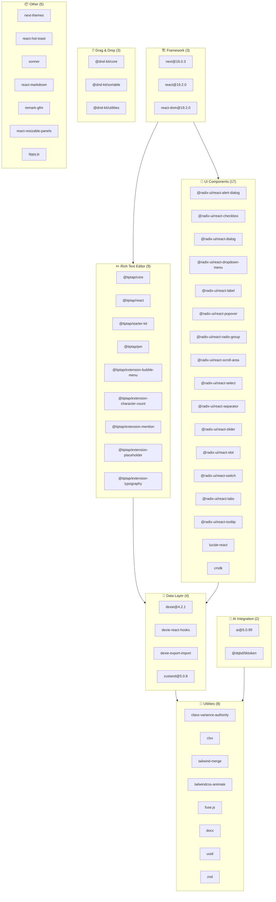
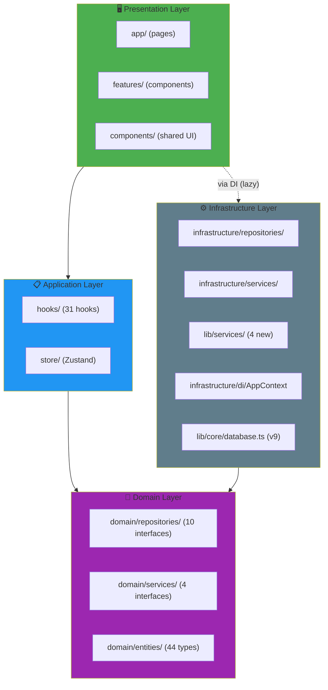
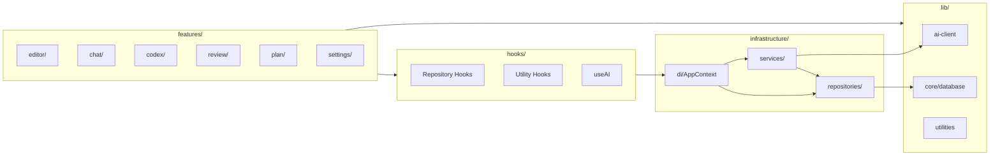
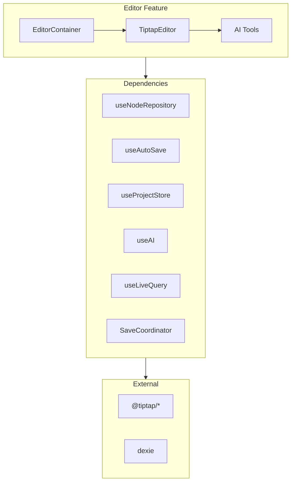
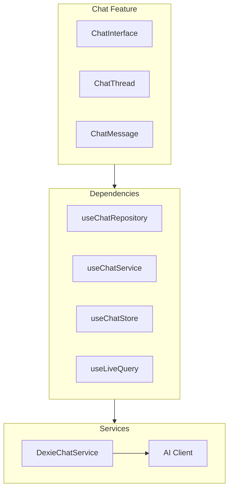
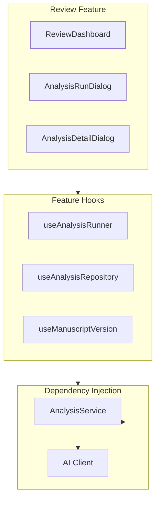
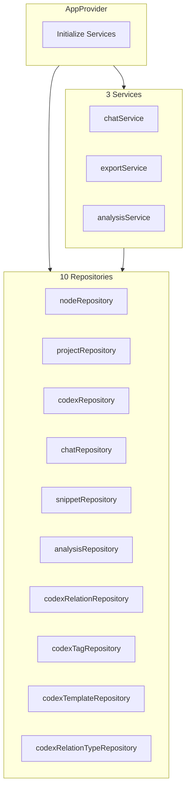

# Dependency Analysis – Become An Author

> **Comprehensive analysis of all project dependencies for the Become An Author novel writing application.**

---

## 1. Executive Summary

| Category | Count |
|----------|-------|
| **Production Dependencies** | 44 |
| **Dev Dependencies** | 11 |
| **Total npm Packages** | 55 |
| **Internal Modules** | 215 source files |
| **Architecture Layers** | 4 (UI → Hooks → Domain → Infrastructure) |
| **Circular Dependencies** | 0 ✅ |
| **Layer Violations** | 0 ✅ |

---

## 2. External Dependencies

### 2.1 Dependency Tree



### 2.2 Production Dependencies by Category

#### Framework & Core (3)
| Package | Version | Purpose |
|---------|---------|---------|
| `next` | 16.0.3 | React framework with App Router |
| `react` | 19.2.0 | UI library |
| `react-dom` | 19.2.0 | DOM rendering |

#### Rich Text Editor - Tiptap (9)
| Package | Version | Purpose |
|---------|---------|---------|
| `@tiptap/core` | 3.11.0 | Core editor framework |
| `@tiptap/react` | 3.11.0 | React integration |
| `@tiptap/starter-kit` | 3.11.0 | Basic extensions bundle |
| `@tiptap/pm` | 3.11.0 | ProseMirror integration |
| `@tiptap/extension-bubble-menu` | 3.11.0 | Floating toolbar |
| `@tiptap/extension-character-count` | 3.11.0 | Word/char counting |
| `@tiptap/extension-mention` | 3.11.0 | @ mentions for codex |
| `@tiptap/extension-placeholder` | 3.11.0 | Empty state placeholder |
| `@tiptap/extension-typography` | 3.11.0 | Smart typography |

#### UI Primitives - Radix (15)
| Package | Version | Purpose |
|---------|---------|---------|
| `@radix-ui/react-alert-dialog` | 1.1.15 | Confirmation dialogs |
| `@radix-ui/react-checkbox` | 1.3.3 | Checkboxes |
| `@radix-ui/react-dialog` | 1.1.15 | Modal dialogs |
| `@radix-ui/react-dropdown-menu` | 2.1.16 | Context menus |
| `@radix-ui/react-label` | 2.1.8 | Form labels |
| `@radix-ui/react-popover` | 1.1.15 | Popover panels |
| `@radix-ui/react-radio-group` | 1.3.8 | Radio buttons |
| `@radix-ui/react-scroll-area` | 1.2.10 | Custom scrollbars |
| `@radix-ui/react-select` | 2.2.6 | Dropdowns |
| `@radix-ui/react-separator` | 1.1.8 | Dividers |
| `@radix-ui/react-slider` | 1.3.6 | Range sliders |
| `@radix-ui/react-slot` | 1.2.4 | Composition utility |
| `@radix-ui/react-switch` | 1.2.6 | Toggle switches |
| `@radix-ui/react-tabs` | 1.1.13 | Tab panels |
| `@radix-ui/react-tooltip` | 1.2.8 | Tooltips |

#### Data & State (4)
| Package | Version | Purpose |
|---------|---------|---------|
| `dexie` | 4.2.1 | IndexedDB wrapper |
| `dexie-react-hooks` | 4.2.0 | useLiveQuery reactive data |
| `dexie-export-import` | 4.1.4 | Backup/restore |
| `zustand` | 5.0.8 | Global state management |

#### Drag & Drop (3)
| Package | Version | Purpose |
|---------|---------|---------|
| `@dnd-kit/core` | 6.3.1 | Core DnD engine |
| `@dnd-kit/sortable` | 10.0.0 | Sortable lists |
| `@dnd-kit/utilities` | 3.2.2 | DnD helpers |

#### AI Integration (2)
| Package | Version | Purpose |
|---------|---------|---------|
| `ai` | 5.0.99 | Vercel AI SDK |
| `@dqbd/tiktoken` | 1.0.22 | Token counting |

#### Utilities (6)
| Package | Version | Purpose |
|---------|---------|---------|
| `class-variance-authority` | 0.7.1 | Variant styling |
| `clsx` | 2.1.1 | Class name merging |
| `tailwind-merge` | 3.4.0 | Tailwind class deduplication |
| `fuse.js` | 7.1.0 | Fuzzy search |
| `docx` | 9.5.1 | DOCX export |
| `uuid` | 13.0.0 | Unique IDs |
| `zod` | 4.1.13 | Schema validation |

### 2.3 Dev Dependencies (11)
| Package | Version | Purpose |
|---------|---------|---------|
| `typescript` | 5.x | Type checking |
| `eslint` | 9.x | Linting |
| `vitest` | 4.0.14 | Unit testing |
| `@testing-library/react` | 16.3.0 | React testing |
| `@testing-library/jest-dom` | 6.9.1 | DOM assertions |
| `fake-indexeddb` | 6.2.5 | IndexedDB mocking |
| `happy-dom` | 20.0.10 | DOM simulation |
| `tailwindcss` | 4.x | CSS framework |
| `@tailwindcss/typography` | 0.5.19 | Prose styling |
| `@vitejs/plugin-react` | 5.1.1 | Vite React plugin |

---

## 3. Internal Module Dependencies

### 3.1 Clean Architecture Layers



### 3.2 Dependency Rules (Clean Architecture)

| From Layer | May Depend On | Violation Count |
|------------|---------------|-----------------|
| Presentation | Application, Domain | 0 ✅ |
| Application | Domain | 0 ✅ |
| Infrastructure | Domain | 0 ✅ |
| Domain | Nothing (pure) | 0 ✅ |

### 3.3 Module Import Graph



---

## 4. Feature Dependencies

### 4.1 Editor Feature



### 4.2 Chat Feature



### 4.3 Review Feature



---

## 5. Dependency Injection Container

### 5.1 AppContext Services



### 5.2 Service Dependencies

| Service | Depends On |
|---------|------------|
| `DexieChatService` | nodeRepository, codexRepository, chatRepository |
| `DocumentExportService` | nodeRepository |
| `AnalysisService` | nodeRepository, codexRepository, analysisRepository |
| `CodexSeedService` | codexTemplateRepository, codexRelationTypeRepository |

### 5.3 Utility Services (lib/services/)

| Service | Purpose |
|---------|---------|
| `EmergencyBackupService` | IndexedDB-based emergency backup (replaces localStorage) |
| `TabLeaderService` | BroadcastChannel leader election for multi-tab |
| `StorageQuotaService` | Monitor IndexedDB storage usage |
| `TrashService` | Soft-delete with 30-day retention |

---

## 6. Bundle Size Analysis

### 6.1 Largest Dependencies

| Package | Approx. Size | Category |
|---------|--------------|----------|
| `@tiptap/*` (9 packages) | ~150KB | Editor |
| `docx` | ~100KB | Export |
| `dexie` | ~40KB | Database |
| `@radix-ui/*` (15 packages) | ~80KB | UI |
| `react-markdown` | ~30KB | Rendering |
| `fuse.js` | ~25KB | Search |
| `@dnd-kit/*` (3 packages) | ~20KB | DnD |

### 6.2 Tree-Shaking Opportunities

| Package | Tree-Shakeable | Notes |
|---------|----------------|-------|
| Radix UI | ✅ Yes | Individual imports |
| Lucide React | ✅ Yes | Icon-by-icon imports |
| Tiptap | ⚠️ Partial | Extensions are separate |
| Dexie | ❌ No | Core required |

---

## 7. Circular Dependency Check

### 7.1 Analysis Results

```
✅ No circular dependencies detected
```

### 7.2 Import Direction Verification

| Direction | Status |
|-----------|--------|
| features → hooks | ✅ Clean |
| hooks → infrastructure | ✅ Clean |
| infrastructure → domain | ✅ Clean |
| domain → (none) | ✅ Pure |
| lib → (external only) | ✅ Clean |

---

## 8. Recommendations

### 8.1 Current Strengths

- ✅ Clean Architecture strictly followed
- ✅ No circular dependencies
- ✅ Proper DI pattern via React Context
- ✅ Type-safe interfaces for all repositories
- ✅ Layer boundaries respected

### 8.2 Optimization Opportunities

| Area | Current | Recommendation |
|------|---------|----------------|
| Bundle Size | ~500KB | Lazy load Tiptap extensions |
| Code Splitting | Basic | Add route-based splitting |
| Dependency Updates | Mixed versions | Unified Radix versions |

---

## 9. Version Compatibility Matrix

| Core Package | Version | React Compat | Notes |
|--------------|---------|--------------|-------|
| Next.js | 16.0.3 | React 19 | Latest stable |
| React | 19.2.0 | - | Latest stable |
| Tiptap | 3.11.0 | React 18+ | Compatible |
| Dexie | 4.2.1 | Any | Browser only |
| Zustand | 5.0.8 | React 18+ | Latest stable |
| Radix UI | 1.x–2.x | React 18+ | Mixed versions |

---

**Document Version**: 1.0  
**Last Updated**: 2025-12-05  
**Generated From**: package.json + source analysis
