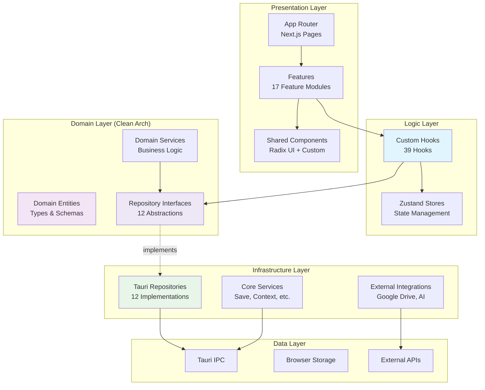
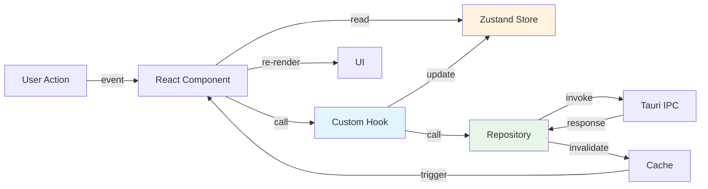
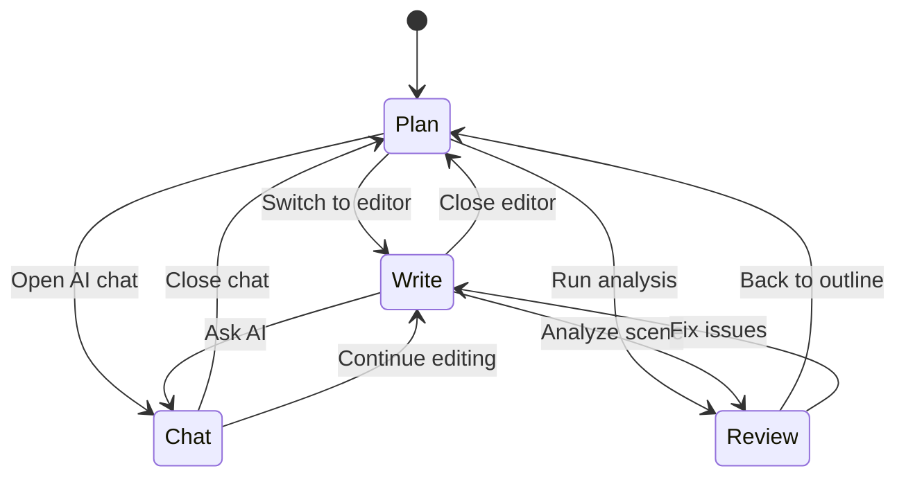

# Frontend High-Level Design

> [!IMPORTANT]
> **Comprehensive architectural documentation for the Next.js 16 frontend.**  
> Last updated: 2025-12-28

---

## Executive Summary

This document provides an exhaustive analysis of the frontend architecture for the "Become An Author" application—a **local-first, AI-assisted writing studio** built with **Next.js 16**, **React 19**, and **Tauri v2**.

### Key Statistics
- **192 Files** across **82 Directories**
- **18 Features** (Feature-Sliced Design)
- **18 Repository Interfaces** (Clean Architecture)
- **40+ Custom Hooks** (Business Logic Layer)
- **4 Zustand Stores** (State Management)
- **35+ Domain Entities** (Type-Safe Data Model)


### Architecture Philosophy
The frontend follows a **Hybrid Architecture** combining:
1. **Feature-Sliced Design** (FSD) — UI organization
2. **Clean Architecture** — Dependency management
3. **Repository Pattern** — Data abstraction

---

## Table of Contents

1. [Architecture Overview](#1-architecture-overview)
2. [Directory Structure](#2-directory-structure)
3. [Domain Layer](#3-domain-layer)
4. [Features Layer (FSD)](#4-features-layer-fsd)
5. [Infrastructure Layer](#5-infrastructure-layer)
6. [Hooks Layer](#6-hooks-layer)
7. [State Management](#7-state-management)
8. [Routing & Navigation](#8-routing--navigation)
9. [UI Patterns & Components](#9-ui-patterns--components)
10. [Core Systems](#10-core-systems)
11. [Design Decisions & Principles](#11-design-decisions--principles)
12. [Testing Strategy](#12-testing-strategy)

---

## 1. Architecture Overview

### 1.1 Layered Architecture Diagram



### 1.2 Dependency Flow Rules

| Layer | Can Import From | Cannot Import From |
|-------|----------------|-------------------|
| **App Router** | Features (public API only) | Feature internals, Infrastructure |
| **Features** | Shared Components, Hooks, Domain | Other Features, Infrastructure |
| **Hooks** | Domain, Services | Infrastructure, Features |
| **Domain** | Nothing (pure types) | All |
| **Infrastructure** | Domain | Features, Hooks, App Router |

**Enforcement**: ESLint with `import/no-cycle` and custom boundary rules.

---

## 2. Directory Structure

### 2.1 Complete Layout

```
frontend/
├── core/                      # Core infrastructure
│   ├── api/                   # Generic API wrappers
│   ├── storage/               # Safe storage (localStorage wrapper)
│   │   └── api-keys.ts        # Encrypted API key management
│   ├── tauri/                 # Tauri commands wrapper
│   │   ├── commands.ts        # Type-safe invoke() wrappers (502 lines)
│   │   └── provider.ts        # Tauri detection
│   ├── logger.ts              # Logging service
│   └── tab-coordinator.ts     # Multi-tab sync
│
├── domain/                    # Clean Architecture - Domain Layer
│   ├── entities/
│   │   └── types.ts           # All domain entities (402 lines)
│   ├── repositories/          # Repository interfaces (Abstractions)
│   │   ├── IProjectRepository.ts
│   │   ├── INodeRepository.ts
│   │   ├── ICodexRepository.ts
│   │   ├── IChatRepository.ts
│   │   ├── IAnalysisRepository.ts
│   │   ├── ISnippetRepository.ts
│   │   ├── ISeriesRepository.ts
│   │   ├── ICodexTagRepository.ts
│   │   ├── ICodexTemplateRepository.ts
│   │   ├── ICodexRelationRepository.ts
│   │   ├── ICodexRelationTypeRepository.ts
│   │   └── ISceneCodexLinkRepository.ts
│   └── services/              # Domain services
│       ├── IAnalysisService.ts
│       ├── IChatService.ts
│       ├── IExportService.ts
│       ├── IModelDiscoveryService.ts  # Dynamic model fetching
│       └── NodeDeletionService.ts
│
├── infrastructure/            # Implementations
│   ├── di/
│   │   └── AppContext.tsx     # Dependency injection provider
│   ├── migrations/
│   │   ├── codexArcsMigration.ts
│   │   └── codexSeriesMigration.ts
│   ├── repositories/          # Tauri implementations
│   │   └── Tauri*.ts          # 12 repository implementations
│   └── services/
│       ├── AnalysisService.ts
│       ├── ChatService.ts
│       ├── DocumentExportService.ts
│       └── ModelDiscoveryService.ts  # Fetches models from 12 provider APIs
│
├── features/                  # Feature-Sliced Design (17 features)
│   ├── editor/               # Scene editor (23 components)
│   ├── codex/                # World-building wiki (18 components)
│   ├── chat/                 # AI conversations (16 components)
│   ├── plan/                 # Story planning (14 components)
│   ├── review/               # Manuscript analysis (11 components)
│   ├── dashboard/            # Project overview (5 components)
│   ├── navigation/           # Tree navigation (3 components)
│   ├── search/               # Global search (7 components)
│   ├── settings/             # User preferences (9 components)
│   ├── snippets/             # Text templates (4 components)
│   ├── series/               # Multi-book management (5 components)
│   ├── google-drive/         # Cloud backup (5 components)
│   ├── migration/            # Data migration UI (7 components)
│   ├── data-management/      # Import/Export (2 components)
│   ├── project/              # Project CRUD (4 components)
│   ├── ai/                   # AI integration components (3 components)
│   └── shared/               # Shared feature utilities (6 components)
│
├── hooks/                    # Custom React Hooks (39 hooks)
│   ├── use-ai.ts             # AI interaction orchestration
│   ├── use-auto-save.ts      # Debounced auto-save
│   ├── use-context-assembly.ts  # AI context builder
│   ├── use-live-query.ts     # Cache & query invalidation
│   ├── use-dialog-state.ts   # Dialog state machine
│   ├── use-confirmation.tsx  # Confirmation dialogs
│   ├── use-prompt.tsx        # Input prompts
│   ├── use-*-repository.ts   # Repository hooks (12 files)
│   ├── use-model-discovery.ts # Dynamic model fetching from provider APIs
│   └── ... (27 more hooks)
│
├── lib/                      # Shared libraries
│   ├── ai/                   # ✅ AI module (consolidated)
│   │   ├── client.ts         # AI SDK wrapper (Google, OpenAI, etc.)
│   │   ├── token-calculator.ts # Token budget calculations
│   │   └── index.ts          # Public API exports
│   ├── config/               # Configuration
│   │   ├── ai-vendors.ts     # AI provider configurations
│   │   ├── model-specs.ts    # Model capabilities
│   │   └── constants.ts      # App constants
│   ├── core/
│   │   └── save-coordinator.ts  # Save queue manager
│   ├── tiptap-extensions/
│   │   ├── section-node.ts   # Custom Tiptap node
│   │   ├── slash-commands.ts # Slash command handler
│   │   └── slash-commands-list.tsx
│   └── utils/
│       └── editor.ts         # Tiptap utilities
│
├── shared/                   # Truly shared utilities
│   ├── constants/
│   ├── prompts/
│   ├── schemas/
│   ├── seed-data/
│   ├── types/
│   ├── utils/
│   │   ├── ai-utils.ts
│   │   ├── context-assembler.ts  # AI context prioritization
│   │   ├── context-engine.ts
│   │   ├── token-counter.ts      # Tiktoken integration
│   │   ├── toast-service.ts
│   │   └── type-guards.ts
│   └── validations.ts
│
├── store/                    # Zustand state stores
│   ├── use-project-store.ts  # Project-level state
│   ├── editor-ui-store.ts    # Editor UI state
│   ├── use-chat-store.ts     # Chat state
│   └── use-format-store.ts   # Format preferences
│
├── components/               # Shared UI components (36 components)
│   └── ui/                   # Radix UI wrappers
│
└── test/
    ├── setup.ts
    └── test-utils.tsx
```

### 2.2 Feature Module Pattern

Every feature follows this structure:

```
features/[feature-name]/
├── components/           # UI components (private)
│   └── *.tsx
├── hooks/                # Feature-specific hooks (private)
│   └── use-*.ts
├── utils/                # Feature-specific utilities (private)
│   └── *.ts
└── index.ts              # Public API (ONLY export point)
```

**Enforcement**: ESLint blocks deep imports (`@/features/editor/components/*` → ❌)

---

## 3. Domain Layer

### 3.1 Core Domain Entities

| Entity | Purpose | Key Fields |
|--------|---------|------------|
| **DocumentNode** | Manuscript structure | `type`, `parentId`, `order`, `expanded` |
| **Act** | Top-level structure | Extends `BaseNode` |
| **Chapter** | Mid-level structure | Extends `BaseNode` |
| **Scene** | Editable content unit | `content (Tiptap JSON)`, `wordCount`, `status`, `beats` |
| **Project** | Novel project | `title`, `author`, `seriesId` **(REQUIRED)**, `seriesIndex` **(REQUIRED)**, `archived` |
| **Series** | Multi-book series | `title`, `createdAt` |
| **CodexEntry** | World-building entry | `category`, `name`, `aliases`, `attributes`, `tags`, `customFields`, `gallery` |
| **CodexRelation** | Entry connections | `parentId`, `childId`, `typeId`, `strength` |
| **CodexTag** | Tagging system | `name`, `color`, `category` |
| **CodexTemplate** | Entry templates | `fields`, `isBuiltIn` |
| **CodexRelationType** | Relation definitions | `name`, `category`, `isDirectional` |
| **SceneCodexLink** | Scene-entry links | `sceneId`, `codexId`, `role`, `autoDetected` |
| **ChatThread** | AI conversation | `name`, `pinned`, `defaultModel` |
| **ChatMessage** | Single message | `role`, `content`, `context` |
| **StoryAnalysis** | AI analysis result | `analysisType`, `scope`, `insights`, `metrics` |
| **Snippet** | Reusable text | `title`, `content`, `pinned` |

**File**: [`frontend/domain/entities/types.ts`](file:///Users/sairoopesh/Documents/becomeAnAuthor/frontend/domain/entities/types.ts) (402 lines)

### 3.2 Repository Interfaces

All repositories extend the pattern:

```typescript
export interface IRepository<T> {
    get(id: string): Promise<T | undefined>;
    getAll(projectId?: string): Promise<T[]>;
    create(data: Partial<T>): Promise<T>;
    update(id: string, data: Partial<T>): Promise<void>;
    delete(id: string): Promise<void>;
}
```

**18 Repository Interfaces**:
1. `IProjectRepository` — Project CRUD (requires `seriesId`, `seriesIndex`)
2. `INodeRepository` — Acts/Chapters/Scenes
3. `ICodexRepository` — Codex entries **(series-scoped via `seriesId`)**
4. `ICodexTagRepository` — Tags
5. `ICodexTemplateRepository` — Templates
6. `ICodexRelationRepository` — Relations
7. `ICodexRelationTypeRepository` — Relation types
8. `ISceneCodexLinkRepository` — Scene-codex links
9. `IChatRepository` — Chat threads/messages
10. `IAnalysisRepository` — Analysis results
11. `ISnippetRepository` — Snippets
12. `ISeriesRepository` — Series
13. `IIdeaRepository` — Brainstorm/Ideas storage
14. `IMapRepository` — Story world maps
15. `IMentionRepository` — Cross-reference tracking
16. `ICollaborationRepository` — Multi-user collaboration features
17. `ISceneNoteRepository` — Scene annotations
18. `IWorldTimelineRepository` — Timeline events

**Location**: `frontend/domain/repositories/`

### 3.3 Domain Services

| Service | Responsibility |
|---------|---------------|
| `IAnalysisService` | Orchestrate AI analysis workflows |
| `IChatService` | Manage chat context assembly |
| `IExportService` | Handle manuscript export |
| `NodeDeletionService` | Cascade delete nodes with children |

### 3.4 Type Guards

```typescript
export function isAct(node: DocumentNode): node is Act;
export function isChapter(node: DocumentNode): node is Chapter;
export function isScene(node: DocumentNode): node is Scene;
```

**Usage**: Type-safe conditional logic in components.

---

## 4. Features Layer (FSD)

### 4.1 Feature Inventory

| Feature | Components | Purpose | Key Dependencies |
|---------|------------|---------|-----------------|
| **editor** | 24 | Tiptap scene editor with AI tools | `use-auto-save`, `use-ai`, `TauriNodeRepository` |
| **codex** | 19 | World-building wiki system | `TauriCodexRepository`, `use-codex-repository` |
| **chat** | 16 | AI chat interface | `use-ai`, `use-context-assembly`, `TauriChatRepository` |
| **plan** | 19 | Story planning & outlining | `use-project-store`, `TauriNodeRepository` |
| **review** | 13 | AI-powered manuscript analysis | `use-ai`, `TauriAnalysisRepository` |
| **dashboard** | 7 | Project overview & stats | `use-project-repository`, word count aggregation |
| **navigation** | 5 | Tree-based navigation sidebar | `useProjectStore`, drag-and-drop |
| **search** | 8 | Global fuzzy search | `fuse.js`, `TauriNodeRepository` |
| **settings** | 10 | User preferences & AI config | `localStorage`, `security::store_api_key` |
| **snippets** | 4 | Reusable text templates | `TauriSnippetRepository` |
| **series** | 6 | Multi-book series management | `TauriSeriesRepository` |
| **google-drive** | 5 | Google OAuth + Drive backup | `google-auth-service`, `google-drive-service` |
| **data-management** | 4 | Import/Export flows | `export_project_backup`, `import_project_backup` |
| **project** | 4 | Project CRUD dialogs | `TauriProjectRepository` |
| **ai** | 4 | AI integration components | `Vercel AI SDK` |
| **export** | 5 | Document export with templates | `DocumentExportService`, presets |
| **collaboration** | 2 | Multi-user collaboration | `TauriCollaborationRepository` |
| **shared** | 6 | Cross-feature utilities | N/A |

### 4.2 Feature Dependency Graph

```mermaid
graph TD
    Dashboard[Dashboard] --> ProjectRepo[Project Repository]
    Dashboard --> NodeRepo[Node Repository]
    
    Editor[Editor] --> AutoSave[use-auto-save]
    Editor --> AI[use-ai]
    Editor --> NodeRepo
    
    Codex[Codex] --> CodexRepo[Codex Repository]
    Codex --> TagRepo[Tag Repository]
    
    Chat[Chat] --> AI
    Chat --> ContextAssembly[use-context-assembly]
    Chat --> ChatRepo[Chat Repository]
    
    Review[Review] --> AI
    Review --> ContextAssembly
    Review --> AnalysisRepo[Analysis Repository]
    
    Search[Search] --> Fuse[fuse.js]
    Search --> NodeRepo
    
    Settings[Settings] --> Security[security::store_api_key]
    
    style AI fill:#ffe0b2
    style ContextAssembly fill:#ffe0b2
```



### 4.3 Feature Public API Example

```typescript
// features/editor/index.ts
export { EditorContainer } from './components/EditorContainer';
export { StoryTimeline } from './components/story-timeline';
export { FocusModeToggle } from './components/FocusModeToggle';
// ❌ Internal components NOT exported
```

**Consumer** (in `app/`):

```typescript
import { EditorContainer } from '@/features/editor';
// ✅ Allowed

import { TiptapEditor } from '@/features/editor/components/tiptap-editor';
// ❌ Blocked by ESLint
```

---

## 5. Infrastructure Layer

### 5.1 Repository Implementations

All repositories follow this pattern:

```typescript
export class TauriCodexRepository implements ICodexRepository {
    async get(id: string): Promise<CodexEntry | undefined> {
        const projectPath = getCurrentProjectPath();
        const entries = await listCodexEntries(projectPath);
        return entries.find(e => e.id === id);
    }
    
    async create(entry: Partial<CodexEntry>): Promise<CodexEntry> {
        const projectPath = getCurrentProjectPath();
        const newEntry = { ...entry, id: crypto.randomUUID() };
        await saveCodexEntry(projectPath, newEntry);
        
        // ✅ Invalidate cache
        const { invalidateQueries } = await import('@/hooks/use-live-query');
        invalidateQueries();
        
        return newEntry;
    }
}
```

**Key Pattern**: Always call `invalidateQueries()` after mutations.

### 5.2 Dependency Injection

**Provider**: `AppContext.tsx`

```typescript
<AppContext.Provider value={{ repositories, services }}>
    {children}
</AppContext.Provider>
```

**Consumer Hook**:

```typescript
export function useProjectRepository() {
    if (isTauri()) {
        return new TauriProjectRepository();
    }
    return new IndexedDBProjectRepository();  // Web fallback
}
```

### 5.3 Service Layer

| Service | Purpose |
|---------|---------|
| `AnalysisService` | Orchestrates AI analysis workflows |
| `ChatService` | Manages chat thread lifecycle |
| `DocumentExportService` | Exports to `.docx` format |
| `EmergencyBackupService` | Auto-saves drafts every N minutes |
| `GoogleAuthService` | OAuth 2.0 flow |
| `GoogleDriveService` | Upload/download project backups |
| `AIRateLimiter` | Rate-limits AI API calls |
| `TabLeaderService` | Elects leader tab for sync |
| `TrashService` | Soft-delete with restore |

---

## 6. Hooks Layer

### 6.1 Hook Categories

| Category | Hooks | Purpose |
|----------|-------|---------|
| **AI** | `use-ai`, `use-context-assembly` | AI interaction & context |
| **Repository** | `use-*-repository` (12 hooks) | Dependency injection for repos |
| **State** | `use-live-query`, `use-dialog-state` | Query caching, UI state machines |
| **Save** | `use-auto-save` | Debounced save coordination |
| **UI** | `use-confirmation`, `use-prompt` | Modal dialogs |
| **Export** | `use-document-export`, `use-import-export` | File export/import |
| **Google** | `use-google-auth`, `use-google-drive` | OAuth & Drive integration |
| **Utilities** | `use-debounce`, `use-mobile`, `use-error-handler` | General utilities |

### 6.2 Key Hook Patterns

#### `use-live-query.ts` — Query Caching

```typescript
export function useLiveQuery<T>(
    queryFn: () => Promise<T>,
    deps: any[]
): { data: T | undefined; loading: boolean; error: Error | undefined } {
    const [data, setData] = useState<T>();
    const [loading, setLoading] = useState(true);
    
    useEffect(() => {
        queryFn().then(setData).finally(() => setLoading(false));
    }, deps);
    
    // Subscribe to cache invalidation
    useEffect(() => {
        const unsubscribe = subscribeToInvalidation(() => {
            queryFn().then(setData);
        });
        return unsubscribe;
    }, []);
    
    return { data, loading, error };
}
```

#### `use-auto-save.ts` — Debounced Save

```typescript
export function useAutoSave(sceneId: string, getContent: () => any) {
    const debouncedSave = useMemo(
        () => debounce(async () => {
            await saveCoordinator.scheduleSave(sceneId, getContent);
        }, 2000),
        [sceneId]
    );
    
    return { save: debouncedSave };
}
```

**Flow**: User types → debounce 2s → save via `SaveCoordinator` → invalidate cache → UI updates

#### `use-dialog-state.ts` — State Machine

```typescript
type DialogState = 'closed' | 'opening' | 'open' | 'closing';

export function useDialogState() {
    const [state, setState] = useState<DialogState>('closed');
    
    const open = () => setState('opening');
    const close = () => setState('closing');
    
    useEffect(() => {
        if (state === 'opening') setTimeout(() => setState('open'), 10);
        if (state === 'closing') setTimeout(() => setState('closed'), 300);
    }, [state]);
    
    return { isOpen: state === 'open', open, close };
}
```

### 6.3 Repository Hooks Pattern

All 12 repository hooks follow this DI pattern:

```typescript
export function useCodexRepository(): ICodexRepository {
    if (isTauri()) {
        return new TauriCodexRepository();
    }
    return new IndexedDBCodexRepository();
}
```

**Usage in components**:

```typescript
function CodexList({ seriesId }: { seriesId: string }) {
    const repo = useCodexRepository();
    const { data: entries } = useLiveQuery(
        () => repo.getBySeries(seriesId),  // Series-first architecture
        [seriesId]
    );
}
```

---

## 7. State Management

### 7.1 Zustand Stores

#### `use-project-store.ts` — Project State

```typescript
export const useProjectStore = create<ProjectStore>()(
    persist(
        (set) => ({
            activeSceneId: null,
            activeProjectId: null,
            viewMode: 'plan',  // 'plan' | 'write' | 'chat' | 'review'
            showSidebar: true,
            showTimeline: true,
            
            setViewMode: (mode) => set({ viewMode: mode }),
            setActiveSceneId: async (id) => set({ activeSceneId: id }),
            toggleSidebar: () => set((s) => ({ showSidebar: !s.showSidebar })),
        }),
        {
            name: 'project-store',
            partialize: (state) => ({
                showSidebar: state.showSidebar,  // Persist UI state
                showTimeline: state.showTimeline,
            }),
        }
    )
);
```

**Persistence**: `localStorage` via Zustand middleware

#### `editor-ui-store.ts` — Editor UI State

```typescript
export const useEditorUIStore = create<EditorUIState>()(
    devtools(
        persist(
            (set) => ({
                showLeftPanel: true,
                showRightPanel: true,
                focusMode: false,
                
                toggleFocusMode: () => set((state) => ({
                    focusMode: !state.focusMode,
                    showLeftPanel: state.focusMode,  // Restore panels
                    showRightPanel: state.focusMode,
                })),
            }),
            { name: 'editor-ui-storage' }
        ),
        { name: 'EditorUI' }  // Redux DevTools
    )
);
```

**Features**:
- Focus Mode (hides all panels)
- Per-panel visibility toggles
- Redux DevTools integration

#### `use-chat-store.ts` — Chat State

```typescript
export const useChatStore = create<ChatStore>((set) => ({
    activeThreadId: null,
    streaming: false,
    
    setActiveThread: (id) => set({ activeThreadId: id }),
    setStreaming: (streaming) => set({ streaming }),
}));
```

#### `use-format-store.ts` — Text Formatting

```typescript
export const useFormatStore = create<FormatStore>()(
    persist(
        (set) => ({
            fontSize: 16,
            lineHeight: 1.6,
            fontFamily: 'Georgia',
            
            setFontSize: (size) => set({ fontSize: size }),
        }),
        { name: 'format-preferences' }
    )
);
```

### 7.2 State Flow Diagram



---

## 8. Routing & Navigation

### 8.1 App Router Structure

```
app/
├── layout.tsx                 # Root layout (global CSS, fonts)
├── page.tsx                   # Landing page (project list)
├── not-found.tsx              # 404 page
├── auth/
│   └── callback/
│       └── page.tsx           # OAuth callback handler
└── project/
    └── [id]/
        ├── page.tsx           # Project workspace (main editor)
        └── client.tsx         # Client-side logic
```

### 8.2 Route Patterns

**Static Export Workaround** (for Tauri):

```typescript
// app/project/[id]/page.tsx
export function generateStaticParams() {
    return [{ id: '_' }];  // Placeholder for static export
}

export default async function ProjectPage({ params }: { params: Promise<{ id: string }> }) {
    const { id } = await params;
    return <ProjectPageClient id={id} />;
}
```

**Client-Side Routing**:

```typescript
// app/project/[id]/client.tsx
'use client';

export function ProjectPageClient({ id }: { id: string }) {
    const { data: project } = useLiveQuery(
        () => projectRepo.get(id),
        [id]
    );
    
    return <WorkspaceLayout project={project} />;
}
```

### 8.3 View Mode State Machine



**Implementation**: `useProjectStore().viewMode`

---

## 9. UI Patterns & Components

### 9.1 Component Hierarchy

```
Shared Components (frontend/components/)
├── ui/                        # Radix UI wrappers
│   ├── button.tsx
│   ├── dialog.tsx
│   ├── dropdown-menu.tsx
│   ├── input.tsx
│   ├── select.tsx
│   ├── tabs.tsx
│   ├── tooltip.tsx
│   └── ... (30+ components)
└── [custom components]
```

### 9.2 Design System (Radix UI + Tailwind)

| Component | Radix Primitive | Purpose |
|-----------|----------------|---------|
| `Button` | `@radix-ui/react-slot` | Action triggers |
| `Dialog` | `@radix-ui/react-dialog` | Modals, confirmations |
| `DropdownMenu` | `@radix-ui/react-dropdown-menu` | Context menus |
| `Popover` | `@radix-ui/react-popover` | Inline popovers |
| `Select` | `@radix-ui/react-select` | Dropdowns |
| `Tooltip` | `@radix-ui/react-tooltip` | Hover hints |
| `Tabs` | `@radix-ui/react-tabs` | Tab panels |
| `Slider` | `@radix-ui/react-slider` | Range inputs |
| `Switch` | `@radix-ui/react-switch` | Toggles |
| `ScrollArea` | `@radix-ui/react-scroll-area` | Custom scrollbars |

**Accessibility**: All Radix primitives are WAI-ARIA compliant.

### 9.3 Tiptap Editor Architecture

**Extensions**:
- `@tiptap/starter-kit` (basic formatting)
- `@tiptap/extension-typography` (smart quotes, etc.)
- `@tiptap/extension-mention` (codex entry mentions)
- `@tiptap/extension-character-count` (word count)
- `@tiptap/extension-placeholder` (empty state)
- **Custom**: `section-node.ts` (collapsible sections)
- **Custom**: `slash-commands.ts` (AI commands via `/`)

**Bubble Menu Components**:
1. **Text Selection Menu** — Format text (bold, italic, etc.)
2. **Format Menu** — Headings, lists, quotes
3. **Rewrite Menu** — AI text rewriting
4. **Continue Writing Menu** — AI text generation
5. **Tweak/Generate Dialog** — Advanced AI options

**Data Format**: Tiptap JSON (ProseMirror Document)

```json
{
  "type": "doc",
  "content": [
    {
      "type": "paragraph",
      "content": [
        { "type": "text", "text": "John woke to the sound of thunder." }
      ]
    }
  ]
}
```

---

## 10. Core Systems

### 10.1 Save Coordination System

**Problem**: Prevent race conditions between auto-save and AI-generation saves.

**Solution**: `SaveCoordinator` (singleton)

```typescript
class SaveCoordinator {
    private saveQueue: Map<string, Promise<void>> = new Map();
    
    async scheduleSave(sceneId: string, getContent: () => any): Promise<void> {
        const existingSave = this.saveQueue.get(sceneId);
        
        const saveOperation = (async () => {
            if (existingSave) await existingSave;  // Wait for previous save
            
            const content = getContent();
            await invoke('save_scene_by_id', { sceneId, content });
            
            // Invalidate cache
            const { invalidateQueries } = await import('@/hooks/use-live-query');
            invalidateQueries();
        })();
        
        this.saveQueue.set(sceneId, saveOperation);
        saveOperation.finally(() => this.saveQueue.delete(sceneId));
        
        return saveOperation;
    }
}
```

**Flow**:
1. User types → `use-auto-save` debounces (2s)
2. AI generates text → immediate save
3. If collision: AI save waits for auto-save to complete
4. Save → invalidate cache → UI updates

### 10.2 AI Context Assembly System

**Problem**: AI models have token limits. Need to prioritize what to include.

**Solution**: `ContextAssembler`

```typescript
class ContextAssembler {
    assembleContext(
        items: ContextItem[],
        modelKey: string,
        systemPrompt: string
    ): {
        context: ContextItem[];
        truncated: boolean;
        totalTokens: number;
    } {
        const modelConfig = MODEL_CONFIGS[modelKey];
        const maxTokens = modelConfig.maxTokens - modelConfig.responseTokens;
        
        // Sort by priority (high → low)
        const sorted = [...items].sort((a, b) => b.priority - a.priority);
        
        const included = [];
        let tokenCount = this.estimateTokens(systemPrompt);
        
        for (const item of sorted) {
            if (tokenCount + item.tokens <= maxTokens) {
                included.push(item);
                tokenCount += item.tokens;
            } else if (item.priority >= 7) {
                // High priority: truncate to fit
                const truncated = this.truncateText(item.content, maxTokens - tokenCount);
                included.push({ ...item, content: truncated });
                break;
            } else {
                // Skip low priority items
                break;
            }
        }
        
        return { context: included, truncated: sorted.length > included.length, totalTokens: tokenCount };
    }
}
```

**Priority Levels**:
- **10**: Current scene
- **8**: Scenes in current chapter
- **7**: Codex entries mentioned in scene
- **5**: Other scenes in project
- **3**: Codex entries not mentioned

### 10.3 Multi-Tab Synchronization

**Problem**: User opens project in 2 tabs. Edits in both. Data conflicts.

**Solution**: `TabLeaderService` + `tab-coordinator.ts`

```typescript
// tab-leader-service.ts
class TabLeaderService {
    private isLeader = false;
    private channel = new BroadcastChannel('tab-leader');
    
    electLeader() {
        this.channel.postMessage({ type: 'ELECTION' });
        
        // If no response in 100ms, become leader
        setTimeout(() => {
            if (!this.isLeader) {
                this.isLeader = true;
                this.channel.postMessage({ type: 'LEADER_ELECTED' });
            }
        }, 100);
    }
    
    onMessage(msg) {
        if (msg.type === 'ELECTION' && this.isLeader) {
            this.channel.postMessage({ type: 'LEADER_EXISTS' });
        }
    }
}
```

**Rules**:
1. **Leader tab**: Performs auto-saves, background sync
2. **Follower tabs**: Read-only mode (UI warning)
3. **Leader closes**: New election

### 10.4 Emergency Backup System

**Problem**: Auto-save fails (network issue, backend crash). Data loss risk.

**Solution**: Dual-layer backup

```typescript
// Primary: Tauri emergency backup (filesystem)
await invoke('save_emergency_backup', {
    sceneId,
    content: JSON.stringify(content),
    timestamp: Date.now(),
    expiresAt: Date.now() + (24 * 60 * 60 * 1000)  // 24h
});

// Fallback: localStorage
storage.setItem(`backup_scene_${sceneId}`, {
    content,
    timestamp: Date.now(),
});
```

**Cleanup**: `cleanup_emergency_backups()` runs on app start (deletes expired backups).

---

## 11. Design Decisions & Principles

### 11.1 Why Feature-Sliced Design?

**Problem**: Traditional folder-by-type (`components/`, `hooks/`, `utils/`) doesn't scale for 17 features.

**Solution**: Feature-Sliced Design (FSD)

**Benefits**:
- **Isolation**: Features don't depend on each other
- **Scalability**: Add new features without refactoring
- **Team Velocity**: Different devs work on different features
- **Code Splitting**: Each feature can be lazy-loaded

**Trade-off**: More boilerplate (`index.ts` public API for each feature)

### 11.2 Why Clean Architecture in Domain Layer?

**Problem**: Tightly coupling to Tauri makes web version impossible.

**Solution**: Repository Pattern + Dependency Injection

**Benefits**:
- **Testability**: Mock repositories in tests
- **Portability**: Swap Tauri for HTTP API without changing features
- **Clarity**: Business logic doesn't know about implementation details

**Trade-off**: More files (interface + implementation for each repository)

### 11.3 Why Zustand Over Redux?

**Problem**: Redux is verbose (actions, reducers, middleware).

**Solution**: Zustand (simpler state management)

**Benefits**:
- **Less Boilerplate**: No actions/reducers
- **TypeScript-First**: Full type inference
- **Middleware**: Built-in `persist`, `devtools`
- **Performance**: Selective subscriptions (no unnecessary re-renders)

**Trade-off**: Less opinionated (need to create own patterns)

### 11.4 Why Next.js Static Export?

**Problem**: Tauri requires static files (no server).

**Solution**: `output: 'export'` in `next.config.ts`

**Benefits**:
- **File Protocol**: Works with `file://` URLs
- **Performance**: No server overhead
- **Security**: No exposed API routes

**Trade-off**: No Server Components, no API routes, no ISR

### 11.5 Why Tiptap Over Lexical/Slate?

**Comparison**:

| Editor | Pros | Cons |
|--------|------|------|
| **Tiptap** | ProseMirror-based (battle-tested), excellent extensibility, active community | Larger bundle size |
| **Lexical** | Meta-backed, modern architecture | Newer (less stable), smaller ecosystem |
| **Slate** | Lightweight, flexible | Lower-level API (more work) |

**Decision**: Tiptap for **extensibility** (custom nodes, commands) and **ecosystem** (many plugins).

### 11.6 Architectural Principles

#### Principle 1: **Dependency Inversion**

```
❌ Bad:
Features → TauriRepository (tight coupling)

✅ Good:
Features → IRepository ← TauriRepository
```

#### Principle 2: **Public APIs Only**

```
❌ Bad:
import { CodexList } from '@/features/codex/components/codex-list';

✅ Good:
import { CodexList } from '@/features/codex';
```

#### Principle 3: **State Locality**

- **Global State**: Project ID, active scene ID, view mode
- **Feature State**: Inside feature modules (not in global store)
- **UI State**: Component-local (`useState`)

#### Principle 4: **Save Coordination**

```
❌ Bad:
Multiple components call save() → race conditions

✅ Good:
All saves go through SaveCoordinator → queued
```

#### Principle 5: **Cache Invalidation**

```
❌ Bad:
Repository saves data, UI doesn't update

✅ Good:
Repository saves data → invalidateQueries() → useLiveQuery re-fetches
```

---

## 12. Testing Strategy

### 12.1 Test Coverage

**39 Test Files**:
- `use-*.test.ts` — Hook unit tests
- `ai-utils.test.ts` — Utility tests

**Missing**:
- Feature component tests
- Integration tests
- E2E tests (only 1 file: `character-arc.spec.ts`)

### 12.2 Test Setup

**Framework**: Vitest + Happy-DOM

```typescript
// vitest.config.ts
export default defineConfig({
    test: {
        globals: true,
        environment: 'happy-dom',
        setupFiles: './frontend/vitest.setup.ts',
    },
});
```

**Test Utilities**: `@testing-library/react`

### 12.3 Example Hook Test

```typescript
// use-ai.test.ts
import { renderHook, waitFor } from '@testing-library/react';
import { useAI } from './use-ai';

test('useAI streams response', async () => {
    const { result } = renderHook(() => useAI());
    
    act(() => {
        result.current.sendMessage('Write a scene');
    });
    
    await waitFor(() => {
        expect(result.current.streaming).toBe(true);
    });
    
    await waitFor(() => {
        expect(result.current.response).toContain('scene');
    }, { timeout: 5000 });
});
```

### 12.4 Recommended Test Additions

1. **Component Tests**: Test each feature's public components
2. **Integration Tests**: Test repository → Tauri flow (mocked `invoke()`)
3. **E2E Tests**: Playwright tests for critical flows
4. **Visual Regression**: Screenshot tests for UI components

---

## Conclusion

The frontend architecture is a **well-structured, scalable system** built on modern principles:

- **Feature-Sliced Design** for UI organization
- **Clean Architecture** for domain modeling
- **Repository Pattern** for data abstraction
- **Zustand** for simple, type-safe state management
- **Tiptap** for extensible rich text editing
- **Radix UI** for accessible component primitives

**Strengths**:
- ✅ Clear separation of concerns
- ✅ Type-safe throughout (TypeScript strict mode)
- ✅ Testable architecture (repositories are mockable)
- ✅ ESLint enforces architectural boundaries
- ✅ Save coordination prevents race conditions
- ✅ AI context assembly handles token limits

**Weaknesses**:
- ~~⚠️ Duplicate folders (`lib/services` vs `lib/integrations`)~~ ✅ Resolved - Consolidated to `infrastructure/services/`
- ⚠️ Insufficient test coverage
- ⚠️ No E2E tests
- ⚠️ Some technical debt in legacy code

**Recommended Next Steps**:
1. ~~**Consolidate** `lib/services` and `lib/integrations`~~ ✅ Done
2. **Add** integration tests for repositories
3. **Write** E2E tests for critical user flows
4. **Document** public APIs for each feature

---

**Document Status**: ✅ Complete  
**Last Updated**: 2025-12-25  
**Total Features Documented**: 17/17  
**Total Hooks Documented**: 39/39  
**Total Stores Documented**: 4/4
