# Become An Author — High Level Design Document

> **Version:** 1.0.0  
> **Last Updated:** February 16, 2026  
> **Status:** Living Document

---

## Table of Contents

1. [Executive Summary](#1-executive-summary)
2. [System Context & Goals](#2-system-context--goals)
3. [High-Level Architecture](#3-high-level-architecture)
4. [Technology Decisions & Rationale](#4-technology-decisions--rationale)
5. [Feature Domains](#5-feature-domains)
6. [System Architecture Diagram](#6-system-architecture-diagram)
7. [Frontend Architecture](#7-frontend-architecture)
8. [Backend Architecture](#8-backend-architecture)
9. [AI Subsystem Architecture](#9-ai-subsystem-architecture)
10. [Data Architecture](#10-data-architecture)
11. [Communication Patterns](#11-communication-patterns)
12. [Security Architecture](#12-security-architecture)
13. [Collaboration Architecture](#13-collaboration-architecture)
14. [Export & Backup Architecture](#14-export--backup-architecture)
15. [User Interface Architecture](#15-user-interface-architecture)
16. [Configuration & Feature Flags](#16-configuration--feature-flags)
17. [Error Handling & Resilience](#17-error-handling--resilience)
18. [Quality Assurance Strategy](#18-quality-assurance-strategy)
19. [Deployment Architecture](#19-deployment-architecture)
20. [Non-Functional Requirements](#20-non-functional-requirements)

---

## 1. Executive Summary

**Become An Author** is a **local-first, AI-assisted desktop novel-writing application** built with Tauri v2. It provides professional authors with a complete writing environment that includes:

- Rich text editing with AI-powered content generation and rewriting
- World-building tools (codex, maps, timelines, ideas)
- Project and series organization with manuscript structure management
- Multi-format export (DOCX, EPUB, PDF, Markdown)
- Real-time collaboration via Yjs + WebRTC
- Integration with 14 AI providers for intelligent writing assistance
- Google Drive cloud backup

The application prioritizes **data privacy** (all data stays local, API keys in OS keychain), **offline capability** (full functionality without internet), and **creative focus** (distraction-free writing modes, typewriter scrolling).

---

## 2. System Context & Goals

### 2.1 Problem Statement

Authors need a dedicated writing environment that combines the organizational power of project management, the creative assistance of AI, and the reliability of local-first data storage — without the privacy concerns of cloud-based writing tools.

### 2.2 Design Goals

| Goal | Description |
|---|---|
| **Local-First** | All data persisted on the user's filesystem; zero cloud dependency for core features |
| **Privacy-First** | API keys stored in OS keychain; no telemetry; AI calls made directly from client |
| **Offline-Capable** | Full editing, organizing, and exporting without internet; AI features degrade gracefully |
| **AI-Integrated** | Deep integration with 14 AI providers for writing, rewriting, summarizing, and brainstorming |
| **Professional Authoring** | Support full novel lifecycle: ideation → drafting → revision → export/publish |
| **Extensible** | Clean architecture enabling new features, AI providers, and export formats |

### 2.3 Target Users

- Independent authors writing novels, novellas, and short stories
- Series authors managing multi-book projects with shared world-building
- Collaborative writers working on shared manuscripts

### 2.4 Key Constraints

| Constraint | Impact |
|---|---|
| Desktop-only (macOS, Windows, Linux) | No web or mobile deployment |
| File-based storage (no database) | Simplifies deployment; limits concurrent access |
| Client-side AI calls | Requires user's own API keys; no server costs |
| Tauri v2 runtime | WebView-based UI; Rust-only backend |

---

## 3. High-Level Architecture

The system follows a **two-tier architecture** with a clear separation between the web-based UI layer and the native OS layer:

```
┌─────────────────────────────────────────────────────────────┐
│                     Desktop Application                      │
│                        (Tauri Shell)                          │
│                                                              │
│  ┌────────────────────────────────────────────────────────┐  │
│  │              FRONTEND (Presentation Tier)               │  │
│  │         Next.js 16 / React 19 / TypeScript              │  │
│  │                                                          │  │
│  │  ┌──────────┐  ┌──────────┐  ┌──────────┐  ┌────────┐  │  │
│  │  │ Features │  │  Hooks   │  │  Stores  │  │   UI   │  │  │
│  │  │ (18 mod) │  │ (33 hks) │  │(3 Zustand)│ │(37 cmp)│  │  │
│  │  └────┬─────┘  └────┬─────┘  └────┬─────┘  └────────┘  │  │
│  │       └──────────────┴─────────────┘                     │  │
│  │                      │                                    │  │
│  │  ┌───────────────────▼────────────────────────────────┐  │  │
│  │  │          Infrastructure Layer (DI + Repos)          │  │  │
│  │  │   17 Repository Interfaces + 17 Implementations     │  │  │
│  │  │   6 Infrastructure Services                         │  │  │
│  │  └───────────────────┬────────────────────────────────┘  │  │
│  │                      │                                    │  │
│  │  ┌───────────────────▼────────────────────────────────┐  │  │
│  │  │              IPC Bridge (commands.ts)                │  │  │
│  │  │         130+ typed Tauri invoke wrappers             │  │  │
│  │  └───────────────────┬────────────────────────────────┘  │  │
│  └──────────────────────┼────────────────────────────────────┘  │
│                         │ Tauri IPC (invoke / events)           │
│  ┌──────────────────────▼────────────────────────────────────┐  │
│  │               BACKEND (Native OS Tier)                     │  │
│  │                  Rust / Tauri v2                            │  │
│  │                                                            │  │
│  │  ┌──────────┐  ┌──────────┐  ┌──────────┐                │  │
│  │  │ Commands │  │  Models  │  │  Utils   │                │  │
│  │  │ (18 mod) │  │ (11 mod) │  │ (7 mod)  │                │  │
│  │  └────┬─────┘  └──────────┘  └──────────┘                │  │
│  │       │                                                    │  │
│  │  ┌────▼─────────────────────────────────────────────────┐ │  │
│  │  │     OS APIs: Filesystem, Keychain, Dialogs, Shell    │ │  │
│  │  └──────────────────────────────────────────────────────┘ │  │
│  └────────────────────────────────────────────────────────────┘  │
│                                                              │
│  ┌────────────────────────────────────────────────────────┐  │
│  │              EXTERNAL SERVICES (Optional)               │  │
│  │                                                          │  │
│  │  ┌──────────┐  ┌──────────┐  ┌──────────────────────┐  │  │
│  │  │  14 AI   │  │  Google  │  │  WebRTC Signaling    │  │  │
│  │  │ Providers│  │  Drive   │  │  Servers (Yjs)       │  │  │
│  │  └──────────┘  └──────────┘  └──────────────────────┘  │  │
│  └────────────────────────────────────────────────────────┘  │
└─────────────────────────────────────────────────────────────┘
```

### 3.1 Architectural Principles

| Principle | How It's Implemented |
|---|---|
| **Clean Architecture** | Domain entities → Repository interfaces → Infrastructure implementations |
| **Dependency Inversion** | All data access through repository interfaces; DI container provides concrete implementations |
| **Feature Modules** | Each feature self-contained with its own components, hooks, and public API |
| **Series-First** | All data scoped to series; projects belong to a series; codex shared at series level |
| **Unidirectional Data Flow** | React state → UI → User action → Hook → Repository → IPC → Backend → Filesystem |

---

## 4. Technology Decisions & Rationale

### 4.1 Core Stack

| Decision | Choice | Rationale |
|---|---|---|
| **App Framework** | Tauri v2 (Rust) | Native performance, small binary (~15MB vs 150MB+ Electron), OS-level APIs, security sandbox |
| **Frontend Framework** | Next.js 16 + React 19 | Server components, file-based routing, built-in optimization; React 19 concurrent features |
| **Language** | TypeScript + Rust | Type safety across both tiers; Rust for memory safety and performance in file operations |
| **State Management** | Zustand 5 | Lightweight (2KB), hook-first API, built-in persistence middleware; simpler than Redux |
| **Rich Text Editor** | TipTap 3 (ProseMirror) | Extensible, schema-based; supports custom extensions for AI, slash commands, mentions |
| **Styling** | TailwindCSS 4 | Utility-first with design tokens; consistent theming; dark/light mode support |
| **UI Primitives** | Radix UI | Accessible, unstyled headless components; WAI-ARIA compliant |
| **AI Integration** | Vercel AI SDK 6 | Unified streaming API across 14+ providers; structured output with Zod schemas |
| **Collaboration** | Yjs + y-webrtc | CRDT-based conflict-free real-time editing; peer-to-peer via WebRTC |

### 4.2 Backend Stack

| Decision | Choice | Rationale |
|---|---|---|
| **Storage** | File-based (JSON + YAML/Markdown) | No database installation; human-readable; easy backup/migration; Git-friendly |
| **Serialization** | serde (JSON/YAML) | Rust ecosystem standard; zero-cost abstractions; type-safe |
| **Secret Storage** | OS Keychain (keyring crate) | macOS Keychain, Windows Credential Manager, Linux Secret Service; encrypted at rest |
| **Document Export** | docx-rs + epub-builder | Native Rust libraries for document generation; no external dependencies |
| **Search** | Full-text scan + Fuse.js | Simple file-based search; Fuse.js for fuzzy matching on frontend |

---

## 5. Feature Domains

The application is organized into **18 feature domains**, each encapsulated as a self-contained module:

```mermaid
graph TB
    subgraph "Core Writing"
        EDITOR["📝 Editor<br/>TipTap rich text<br/>AI generation<br/>Slash commands"]
        PLAN["📋 Plan<br/>Outline / Grid<br/>Timeline view<br/>Drag & drop"]
    end

    subgraph "AI & Intelligence"
        CHAT["💬 Chat<br/>AI assistant<br/>Context-aware<br/>Multi-model"]
        AI["🤖 AI<br/>14 providers<br/>Streaming<br/>Token mgmt"]
    end

    subgraph "World Building"
        CODEX["📚 Codex<br/>Characters<br/>Locations<br/>Items / Lore"]
        WMAP["🗺️ World Maps<br/>Image pins<br/>Location links"]
        WTIMELINE["📅 Timelines<br/>World events<br/>Scene linking"]
        IDEAS["💡 Ideas<br/>Quick capture<br/>Categories"]
    end

    subgraph "Organization"
        DASH["🏠 Dashboard<br/>Project grid<br/>Recent projects<br/>Series mgmt"]
        SERIES["📖 Series<br/>Multi-book<br/>Shared codex<br/>Book ordering"]
        NAV["🧭 Navigation<br/>Sidebar tree<br/>Breadcrumbs"]
        SEARCH["🔍 Search<br/>Full-text<br/>Scenes + Codex"]
    end

    subgraph "Authoring Tools"
        SNIPPETS["✂️ Snippets<br/>Reusable text<br/>Pinned items"]
        EXPORT["📤 Export<br/>DOCX / EPUB<br/>PDF / MD"]
        DATAMGMT["💾 Data Mgmt<br/>Import / Export<br/>Backup"]
    end

    subgraph "Infrastructure"
        SETTINGS["⚙️ Settings<br/>AI connections<br/>Preferences"]
        COLLAB["👥 Collaboration<br/>Yjs / WebRTC<br/>Real-time"]
        GDRIVE["☁️ Google Drive<br/>Cloud backup<br/>OAuth 2.0"]
    end

    EDITOR --> AI
    CHAT --> AI
    CODEX --> SERIES
    DASH --> SERIES
    COLLAB --> EDITOR
```



### 5.1 Feature Domain Summary

| Domain | Components | Hooks | Description |
|---|---|---|---|
| **Editor** | 22 | 2 | TipTap-based writing with AI generation, slash commands, @mentions, sections, focus mode, typewriter scroll |
| **Chat** | 10 | 1 | AI chat threads with context-aware manuscript knowledge, multi-model support |
| **Codex** | 14 | 0 | Character/location/item/lore/subplot encyclopedia with relations, tags, templates |
| **Plan** | 15 | 2 | Manuscript structure views: outline tree, card grid, timeline, world map, world timeline |
| **Dashboard** | 6 | 0 | Project listing, series cards, recently opened, trash management |
| **Series** | 5 | 0 | Multi-book series management, shared codex, book ordering |
| **Settings** | 13 | 2 | AI connection management, editor preferences, appearance settings |
| **Search** | 6 | 1 | Full-text search across scenes and codex entries with relevance scoring |
| **Navigation** | 3 | 1 | Sidebar manuscript tree, codex browser, snippet list, breadcrumbs |
| **Snippets** | 3 | 0 | Reusable text blocks with pinning and rich text editing |
| **Export** | 1 | 2 | Multi-format manuscript export (DOCX, EPUB, PDF, Markdown, plain text) |
| **Data Management** | 2 | 0 | Series backup import/export, novel archive conversion |
| **Google Drive** | 2 | 2 | OAuth 2.0 sign-in, cloud backup upload/download/restore |
| **Collaboration** | 1 | 0 | Yjs CRDT document, WebRTC peer-to-peer sync, IndexedDB persistence |
| **AI** | 1 | 0 | AI-specific UI components |
| **Project** | 2 | 0 | Project-level settings and metadata editing |
| **Shared** | 5 | 0 | ErrorBoundary, ThemeProvider, LoadingSpinner, withErrorBoundary HOC, ContextSelector |

---

## 6. System Architecture Diagram

### 6.1 Component Interaction Flow

```mermaid
flowchart LR
    subgraph User["🧑 User"]
        Browser["WebView Window"]
    end

    subgraph Frontend["Frontend (Next.js)"]
        Pages["App Routes<br/>(Dashboard, Project, Series)"]
        Features["Feature Modules<br/>(18 features)"]
        Hooks["Custom Hooks<br/>(33 hooks)"]
        Stores["Zustand Stores<br/>(3 stores)"]
        DI["DI Container<br/>(AppContext)"]
        Repos["Repositories<br/>(17 interfaces)"]
        Services["Services<br/>(6 services)"]
        IPC["IPC Bridge<br/>(commands.ts)"]
    end

    subgraph Backend["Backend (Rust)"]
        Commands["Tauri Commands<br/>(18 modules, 130+ cmds)"]
        Models["Data Models<br/>(11 modules)"]
        Utils["Utilities<br/>(7 modules)"]
    end

    subgraph OS["Operating System"]
        FS["File System"]
        Keychain["OS Keychain"]
        Dialog["Native Dialogs"]
    end

    subgraph External["External Services"]
        AIProviders["14 AI Providers"]
        GDrive["Google Drive API"]
        Signaling["WebRTC Signaling"]
    end

    Browser --> Pages --> Features --> Hooks
    Hooks --> Stores
    Hooks --> DI --> Repos --> IPC
    DI --> Services
    IPC -->|"Tauri invoke"| Commands
    Commands --> Models
    Commands --> Utils
    Utils --> FS
    Utils --> Keychain
    Commands --> Dialog
    Services -->|"HTTPS"| AIProviders
    Services -->|"HTTPS"| GDrive
    Features -->|"WebRTC"| Signaling
```



### 6.2 View Architecture

The application uses three primary views, controlled by `useProjectStore.viewMode`:

```
┌──────────────────────────────────────────────────────────┐
│                    Dashboard (/)                          │
│  Series Grid → Project Cards → Actions (Open/Trash)      │
└────────────────────────┬─────────────────────────────────┘
                         │ Navigate to /project?id=xxx
┌────────────────────────▼─────────────────────────────────┐
│              Project Workspace (/project)                 │
│                                                           │
│  ┌────────┐  ┌────────────────────────────────────────┐  │
│  │Sidebar │  │            Main Content                 │  │
│  │        │  │                                          │  │
│  │ Tree   │  │  "write" → EditorContainer + TipTap     │  │
│  │ Codex  │  │  "plan"  → PlanView (Outline/Grid/etc)  │  │
│  │ Snippts│  │  "chat"  → ChatInterface + Threads       │  │
│  │        │  │                                          │  │
│  └────────┘  └────────────────────────────────────────┘  │
│                                                           │
│  Footer: Word Count | View Switcher | Settings            │
└──────────────────────────────────────────────────────────┘
```

---

## 7. Frontend Architecture

### 7.1 Layer Architecture (8 Layers)

The frontend follows a strict 8-layer Clean Architecture with enforced dependency rules:


**Dependency Rule:** Each layer may only depend on layers below it (higher number). UI → Features → Hooks → Domain → Infrastructure → Core.

### 7.2 Dependency Injection

The `AppProvider` component creates a React Context providing singleton instances of all 17 repositories and services. This enables:

- **Testability** — Mock repositories can be injected in tests
- **Decoupling** — Components depend on interfaces, not implementations
- **Configurability** — Swap implementations without changing consumers

### 7.3 State Management Strategy

| Store | Scope | Persistence | Purpose |
|---|---|---|---|
| `useProjectStore` | App-wide | localStorage | Active scene, view mode, panel visibility, sidebar tabs |
| `useChatStore` | App-wide | None | Active chat thread, thread list |
| `useFormatStore` | App-wide | localStorage | Font size, line height, page width, focus mode, typewriter mode |

**Data fetching** uses the `useLiveQuery` custom hook for reactive repository queries that auto-refresh when dependencies change.

### 7.4 Routing Structure

```
app/
├── page.tsx              # Dashboard — project/series listing
├── project/page.tsx      # Project workspace — editor/plan/chat views
├── series/page.tsx       # Series detail — book listing + codex
└── auth/callback/page.tsx # Google OAuth callback handler
```

---

## 8. Backend Architecture

### 8.1 Module Organization

The Rust backend is organized into three top-level module groups:

| Module Group | Modules | Purpose |
|---|---|---|
| **commands/** | 18 modules | Tauri command handlers — the API surface exposed to frontend |
| **models/** | 11 modules | Data structure definitions (serde-serializable types) |
| **utils/** | 7 modules | Shared utility functions (paths, I/O, validation, text, timestamps, security) |

### 8.2 Command Categories

| Category | Module | Commands | Key Responsibilities |
|---|---|---|---|
| **Project** | `project.rs` (976 lines) | 18 | CRUD, structure tree, recent projects, registry, trash, recovery series |
| **Scene** | `scene.rs` | 5 | Load/save scenes with YAML frontmatter parsing, metadata updates |
| **Codex** | `codex.rs` | 18 | Entries, relations, tags, templates, relation types, scene links (all series-scoped) |
| **Series** | `series.rs` | 15 | Series lifecycle, series codex, codex migration between projects/series |
| **Chat** | `chat.rs` | 8 | Thread CRUD, message persistence, thread listing |
| **Backup** | `backup.rs` (1083 lines) | 15 | Emergency backup, manuscript export (text/DOCX/EPUB), series/project backup & restore |
| **Search** | `search.rs` | 1 | Full-text search across scenes + codex with relevance scoring |
| **Security** | `security.rs` | 4 | OS keychain CRUD for API keys |
| **Trash** | `trash.rs` | 5 | Soft delete, restore, permanent delete, list, empty |
| **Mention** | `mention.rs` | 2 | Cross-content @mention tracking |
| **Collaboration** | `collaboration.rs` | 4 | Yjs binary state persistence |
| **Other** | 6 modules | ~12 | Snippets, ideas, scene notes, world maps, world events, presets |

### 8.3 Backend Design Patterns

- **Command Pattern**: Every function exposed via `#[tauri::command]` returns `Result<T, String>`
- **File-Based Persistence**: All data stored as JSON/YAML/Markdown files
- **Input Validation**: Centralized `validation.rs` with 16 validators (path traversal prevention, size limits, null byte checks, UUID format)
- **Path Resolution**: `paths.rs` provides safe path construction for app dir, projects dir, series dir, codex dir
- **Timestamp Normalization**: `timestamp.rs` handles RFC 3339 ↔ Unix millisecond conversion

---

## 9. AI Subsystem Architecture

### 9.1 Provider Architecture


### 9.2 Supported Providers (14)

| Provider | Default Models | Custom Endpoint |
|---|---|---|
| OpenAI | gpt-4.1, gpt-4.1-mini, o3, o4-mini | ✅ (LM Studio, Ollama) |
| Anthropic | claude-sonnet-4, claude-3-7-sonnet, claude-3-5-haiku | ❌ |
| Google | gemini-2.5-flash, gemini-2.5-pro, gemini-2.5-flash-thinking | ❌ |
| Mistral | mistral-large, mistral-medium, mistral-small, codestral | ❌ |
| DeepSeek | deepseek-chat, deepseek-reasoner | ❌ |
| Groq | llama-3.3-70b, llama-3.1-8b, mixtral-8x7b | ❌ |
| OpenRouter | Dynamic (100+ models fetched at runtime) | ❌ |
| xAI (Grok) | grok-2, grok-2-mini | ❌ |
| Azure OpenAI | User-configured deployments | ✅ |
| Together.ai | llama-3.1-70b, llama-3.1-8b, mixtral-8x7b | ❌ |
| Fireworks | llama-v3p1-70b, llama-v3p1-8b | ❌ |
| Perplexity | sonar-small, sonar-large, sonar-huge (online) | ❌ |
| Cohere | command-r-plus, command-r | ❌ |
| Kimi (Moonshot) | moonshot-v1-8k/32k/128k | Hardcoded |

### 9.3 AI Usage Patterns

| Pattern | Where Used | Description |
|---|---|---|
| **Continue Writing** | Editor (TipTap) | Stream AI-generated continuation from cursor position |
| **Text Rewriting** | Editor (Selection Menu) | Expand, rephrase, or shorten selected text |
| **Spark Suggestions** | Editor (Slash Commands) | Creative prompts for overcoming writer's block |
| **Scene Beat Generation** | Editor | Auto-generate content following scene beat structure |
| **Chat Assistant** | Chat Feature | Multi-turn conversation with manuscript context |
| **Codex Progression** | Editor | Generate text that progresses codex entry storylines |

### 9.4 Context Assembly

The `useContextAssembly` hook builds AI context by:

1. **Gathering sources**: Acts, chapters, scenes, codex entries, snippets
2. **Formatting content**: Converting TipTap JSON to plain text
3. **Scoring relevance**: Based on AI context setting (always/detected/never)
4. **Packing by budget**: Token calculator estimates tokens; packs by relevance until budget exhausted
5. **Building prompt**: Assembles system + context + user message

---

## 10. Data Architecture

### 10.1 Data Hierarchy


### 10.2 Data Format Strategy

| Data Type | Format | Rationale |
|---|---|---|
| Scene content | YAML frontmatter + Markdown | Human-readable; Git-friendly; metadata in frontmatter |
| Structural data | JSON | Fast parsing; type-safe serialization; programmatic access |
| Entity data | JSON (individual files) | One file per entity; atomic writes; easy backup |
| Collection data | JSON (arrays in single file) | Simple for small datasets (ideas, world events) |
| Collaboration state | Binary (Yjs) | CRDT encoding requires binary format |

### 10.3 Entity Relationships


---

## 11. Communication Patterns

### 11.1 Frontend ↔ Backend IPC

All communication between frontend and backend uses Tauri's `invoke` mechanism:

```
Frontend (TypeScript)                Backend (Rust)
─────────────────────                ───────────────
invoke("cmd", {args})  ──────────►  #[tauri::command]
                                    fn cmd(args) -> Result<T, String>
Promise<T>             ◄──────────  Ok(T) | Err(String)
```

- **Synchronous semantics**: Each `invoke()` returns a `Promise` that resolves with the Rust return value
- **Error handling**: Rust errors marshalled as `String`; frontend catches and displays via toast
- **Type safety**: TypeScript interfaces mirror Rust structs (manually maintained)

### 11.2 Frontend ↔ AI Providers

```
useAI() hook
    │
    ▼
AI Client (lib/ai/client.ts)
    │ Create provider instance from connection config
    ▼
Vercel AI SDK (streamText / generateText)
    │ HTTPS request with API key
    ▼
AI Provider API (OpenAI, Anthropic, etc.)
    │ Server-Sent Events (streaming)
    ▼
onChunk callbacks → UI updates
```

### 11.3 Frontend ↔ Google Drive

```
OAuth 2.0 PKCE flow:
1. User clicks "Sign In" → GoogleAuthService.signIn()
2. Opens browser → Google consent screen
3. Redirect to /auth/callback with authorization code
4. Exchange code for access token (client-side)
5. Store tokens in localStorage
6. Use tokens for Drive API calls
```

---

## 12. Security Architecture

### 12.1 Threat Model

| Threat | Mitigation |
|---|---|
| API key exposure | Stored in OS keychain (encrypted at rest); never in filesystem or localStorage |
| Path traversal | `validate_path_within_app_dir()` + `sanitize_path_component()` in every file operation |
| Malicious input | Input validation (null bytes, size limits, format checks) on all Tauri commands |
| XSS in editor | DOMPurify sanitization; Tauri CSP headers |
| Oversized payloads | `validate_json_size()` + `validate_scene_content()` enforce limits (10MB JSON, 50MB scene) |
| Data loss | Emergency backup system; auto-save with debounce; trash with soft delete |

### 12.2 API Key Flow

```
Settings UI → store_api_key(provider, key) → OS Keychain
                                              ↓ (encrypted)
AI Request  → get_api_key(provider)         → OS Keychain
                                              ↓ (decrypted)
              → AI Provider API (HTTPS)
```

---

## 13. Collaboration Architecture

### 13.1 Yjs + WebRTC Architecture

```
┌────────────────┐         WebRTC          ┌────────────────┐
│   User A        │ ◄─────────────────────► │   User B        │
│                 │    Peer-to-Peer          │                 │
│  Yjs Doc        │    (y-webrtc)            │  Yjs Doc        │
│  TipTap Editor  │                          │  TipTap Editor  │
│  IndexedDB      │                          │  IndexedDB      │
│  Backend (Yjs)  │                          │  Backend (Yjs)  │
└────────────────┘                          └────────────────┘
         │                                            │
         │          Signaling Server                   │
         └──────────► (yjs.dev) ◄──────────────────────┘
```

- **CRDT**: Yjs provides conflict-free replicated data types — no merge conflicts
- **Persistence**: Yjs state saved to filesystem via `save_yjs_state` command + IndexedDB
- **Signaling**: Public Yjs signaling servers for WebRTC peer discovery
- **Room ID**: Generated per scene (`becomeauthor-{projectId}-{sceneId}`)

---

## 14. Export & Backup Architecture

### 14.1 Export Formats

| Format | Engine | Output |
|---|---|---|
| **DOCX** | Rust `docx-rs` | Native Word document with headings, paragraphs |
| **EPUB** | Rust `epub-builder` | eBook with chapters, metadata, CSS styling |
| **PDF** | Frontend `html2pdf.js` | Browser-rendered PDF from HTML |
| **Markdown** | Rust string assembly | Plain markdown with scene concatenation |
| **Plain Text** | Rust string assembly | Scene content with act/chapter headers |

### 14.2 Backup Strategy

| Level | Scope | Mechanism |
|---|---|---|
| **Emergency Backup** | Per-scene | Auto-save on write failure; `.backups/` directory |
| **Series Backup** | Full series + all projects | JSON export/import via Tauri command |
| **Google Drive** | Full series | OAuth 2.0 upload/download |
| **Trash** | Project-level | Soft delete with 30-day retention |

---

## 15. User Interface Architecture

### 15.1 Component Hierarchy

```
ThemeProvider (dark/light/system)
└── TooltipProvider (Radix UI)
    └── AppProvider (DI Container)
        └── ErrorBoundary (Global)
            └── Pages
                ├── Dashboard (/)
                │   └── ProjectGrid → ProjectCard
                ├── ProjectWorkspace (/project)
                │   ├── Sidebar (ProjectNavigation)
                │   │   ├── ManuscriptTree (drag & drop)
                │   │   ├── CodexList
                │   │   └── SnippetList
                │   └── MainContent
                │       ├── EditorContainer → TipTapEditor
                │       │   ├── EditorToolbar
                │       │   ├── TextSelectionMenu (AI rewrite)
                │       │   ├── ContinueWritingMenu
                │       │   ├── SparkPopover (AI suggestions)
                │       │   └── SceneNotesPanel
                │       ├── PlanView
                │       │   ├── OutlineView / GridView / TimelineView
                │       │   ├── WorldMapView
                │       │   └── WorldTimelineView
                │       └── ChatInterface
                │           ├── ChatThread
                │           └── ChatMessage
                └── SeriesDetail (/series)
                    └── BookGrid → ExportDialog
```

### 15.2 Responsive Design

| Mode | Trigger | Layout |
|---|---|---|
| **Desktop** | Screen width ≥ 768px | ResizablePanels (sidebar + editor + timeline) |
| **Mobile** | Screen width < 768px | Sheet overlays for sidebar and timeline |
| **Focus Mode** | Cmd+Shift+F toggle | Full-screen editor, no chrome |

### 15.3 UI Component Library (37+ components)

Built on **Radix UI** primitives with **class-variance-authority** for variant styling:

| Category | Components |
|---|---|
| **Form Controls** | Button, Input, Textarea, Select, Checkbox, Switch, Slider, Label, RadioGroup |
| **Overlays** | Dialog, AlertDialog, Sheet, Popover, Tooltip, DropdownMenu |
| **Layout** | Card, Tabs, Collapsible, CollapsibleSection, ScrollArea, Resizable, Separator |
| **Display** | Badge, Progress, Skeleton, EmptyState, SaveStatusIndicator |
| **Specialized** | TagInput, TimeWheelPicker, QuickCaptureModal, CommandPalette |
| **Composite** | Sidebar (5-part system), VendorLogo (AI provider icons) |

---

## 16. Configuration & Feature Flags

### 16.1 Application Constants

All magic numbers and configuration values are centralized in `lib/config/constants.ts`:

| Category | Examples |
|---|---|
| **AI Defaults** | Temperature: 0.7, Max tokens: 2000, Context window: 4000 tokens |
| **Debounce** | Auto-save: 1000ms, Search: 300ms |
| **Rate Limits** | 20 req/min, 200 req/hour, 80% warning threshold |
| **Editor** | Font size: 12-24px, Page width: 400-1000px, Line height: 1.2-2.5 |
| **Collaboration** | Room prefix: "becomeauthor-", 3 signaling servers, 3 reconnect attempts |
| **Backup** | Intervals: 15min / 1hour / daily |

### 16.2 Feature Flags

Currently controlled via `FEATURE_FLAGS` constant:

| Flag | Status | Description |
|---|---|---|
| `CHARACTER_DETECTION` | 🔴 Off | Auto-detect characters in scene text |
| `CHAT_WITH_SCENE` | 🔴 Off | Chat about specific scene content |
| `SAVE_AS_SNIPPET` | 🔴 Off | Save chat responses as snippets |
| `RETRY_MESSAGE` | 🔴 Off | Retry failed AI messages |
| `DISSOLVE_SECTION` | 🔴 Off | Merge section blocks into body |

---

## 17. Error Handling & Resilience

### 17.1 Frontend Error Strategy

| Layer | Strategy | Implementation |
|---|---|---|
| **Global** | ErrorBoundary | Catches unhandled React errors; displays fallback UI |
| **Feature** | withErrorBoundary HOC | Wraps each feature with named boundary + retry logic |
| **Hook** | try/catch + toast | User-facing errors shown as toast notifications |
| **AI** | AbortController + retry | Streaming cancellation; 3 retry attempts with backoff |
| **Background** | Emergency backup | On save failure, content persisted to `.backups/` |

### 17.2 Backend Error Strategy

- All commands return `Result<T, String>` — errors are user-friendly strings
- Input validation catches dangerous inputs before file operations
- File I/O errors wrapped with context (attempted path, operation type)
- Graceful degradation: missing files return defaults (empty arrays, default configs)

### 17.3 Data Recovery

```
Save failure → Emergency Backup Service
                ├── Auto-save to .backups/{timestamp}.json
                ├── Cleanup old backups on successful save
                └── Prompt recovery on next app launch

Accidental delete → Trash System
                    ├── Move to .trash/ with metadata
                    ├── 30-day retention
                    ├── Restore to original series
                    └── Permanent delete requires confirmation
```

---

## 18. Quality Assurance Strategy

### 18.1 Testing Approach

| Level | Tool | Coverage |
|---|---|---|
| **Unit Tests** | Vitest 4 | Hooks, services, utilities, validators |
| **Component Tests** | Testing Library | UI components with mocked DI context |
| **Integration Tests** | Vitest + Tauri mock | Repository → IPC → mock backend |
| **Backend Tests** | Rust `#[cfg(test)]` | Validation logic, path sanitization |
| **E2E** | Manual UAT | UAT test cases document (50+ scenarios) |

### 18.2 Code Quality

| Tool | Purpose |
|---|---|
| ESLint | TypeScript linting with strict rules |
| TypeScript strict mode | Compile-time type checking |
| Zod schemas | Runtime validation for forms and imports |
| Rust compiler | Memory safety, type checking, exhaustive pattern matching |
| CI pipeline | GitHub Actions for linting and build verification |

---

## 19. Deployment Architecture

### 19.1 Build Pipeline

```
Source Code
    │
    ▼
npm run tauri:build
    ├── Next.js static export (frontend)
    │   └── Compiled to HTML/JS/CSS
    └── Cargo build --release (backend)
        └── Compiled to native binary
            │
            ▼
    Tauri Bundle
    ├── macOS: .dmg / .app
    ├── Windows: .msi / .exe
    └── Linux: .AppImage / .deb
```

### 19.2 Update Strategy

- Tauri's built-in updater plugin for auto-updates
- Updates delivered as full binary replacements
- User data is never modified during updates (stored in user's documents directory)

---

## 20. Non-Functional Requirements

| Requirement | Target | Implementation |
|---|---|---|
| **Startup Time** | < 3 seconds | Tauri cold start; Next.js SSG |
| **Save Latency** | < 100ms | Debounced file writes; JSON serialization |
| **Memory Usage** | < 300MB | Tauri WebView (not Chromium); lazy-loaded features |
| **Binary Size** | < 30MB | Tauri v2 (vs 150MB+ Electron) |
| **Offline Support** | 100% core features | File-based storage; AI degrades gracefully |
| **Data Privacy** | Zero telemetry | No analytics; no cloud dependency; local-first |
| **Accessibility** | WCAG 2.1 AA | Radix UI primitives; keyboard navigation |
| **Cross-Platform** | macOS, Windows, Linux | Tauri multi-platform builds |
| **Scalability** | 1000+ scenes per project | File-based with lazy loading; indexed search |

---

*End of High Level Design Document*
